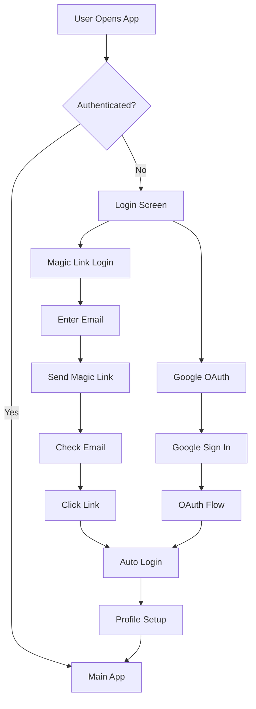

# Yeşer Gratitude App - Documentation Overview

Welcome to the comprehensive documentation for **Yeşer**, a React Native gratitude journaling app built with Expo. This documentation provides complete guides for understanding, developing, and maintaining the application.

## 📱 Project Summary

**Yeşer** is a modern, feature-rich gratitude journaling application designed to help users cultivate mindfulness and appreciation through daily gratitude practices. Built with React Native and Expo, it provides a seamless cross-platform experience with robust backend integration and intelligent state management.

### Key Features

- ✨ **Daily Gratitude Entries**: Write and manage multiple gratitude statements per day
- 🔥 **Streak Tracking**: Monitor consistency with visual streak counters and motivation
- 🔄 **Throwback Memories**: Rediscover past entries with intelligent random throwbacks
- 🎯 **Varied Prompts (Çeşitli Öneriler)**: Daily inspiration with randomized gratitude prompts from database
- 🌙 **Dark/Light Themes**: Complete theming system with user preferences
- 🔔 **Smart Notifications**: Customizable daily reminders and throwback alerts with frequency settings
- 📊 **Data Export**: Complete user data export functionality in PDF format
- 🔒 **Secure Authentication**: Magic link authentication and Google OAuth for passwordless security
- 📱 **Cross-Platform**: Native iOS and Android experience with Expo
- ⚡ **Intelligent Caching**: Automatic background sync with offline support via TanStack Query
- 🎯 **Optimistic Updates**: Instant UI feedback with automatic error recovery
- 📝 **Enhanced Prompt Experience**: Swipe navigation through multiple database prompts
- ⏰ **Advanced Reminder System**: Daily and throwback notifications with customizable frequencies
- 🌍 **Turkish Localization**: Full Turkish language support with cultural sensitivity

### Technology Stack

| Category           | Technology                   | Purpose                                             |
| ------------------ | ---------------------------- | --------------------------------------------------- |
| **Frontend**       | React Native + Expo          | Cross-platform mobile development                   |
| **Backend**        | Supabase (PostgreSQL)        | Database, authentication, real-time                 |
| **Server State**   | TanStack Query v5.80.2       | Intelligent data fetching, caching, synchronization |
| **Client State**   | Zustand                      | Lightweight client-side state (auth, theme)         |
| **UI Framework**   | React Native Paper           | Material Design components                          |
| **Navigation**     | React Navigation v6          | Screen navigation and routing                       |
| **Validation**     | Zod                          | Type-safe schema validation                         |
| **Analytics**      | Firebase Analytics           | User behavior tracking                              |
| **Notifications**  | Expo Notifications           | Push and local notifications                        |
| **Authentication** | Supabase Magic Links + Google OAuth | Passwordless secure authentication            |
| **Storage**        | AsyncStorage                 | Local data persistence                              |

## 🔐 Enhanced Authentication System

### Magic Link Authentication

The app uses a **passwordless authentication system** built on Supabase magic links:

- **Secure Magic Links**: Email-based authentication with time-limited, single-use links
- **No Password Storage**: Enhanced security by eliminating password-related vulnerabilities
- **Seamless UX**: One-click authentication through email links
- **Rate Limiting**: Built-in protection against authentication abuse
- **Deep Link Integration**: Automatic app opening and authentication on link click

### Google OAuth Integration

- **Social Authentication**: Quick login with Google accounts
- **Profile Integration**: Automatic profile setup from Google account data
- **Secure Token Management**: OAuth tokens managed by Supabase Auth

### Authentication Features



## 📚 Documentation Structure

This documentation is organized into focused modules for different aspects of the application:

### 🚀 Getting Started

- **[Setup Guide](./01-setup.md)** - Complete installation and configuration guide with magic link setup
- **[Environment Configuration](./10-environment.md)** - Environment variables and configuration management

### 🏗️ Architecture & Design

- **[Architecture Guide](./02-architecture.md)** - Modern hybrid state management with TanStack Query + Zustand
- **[API Documentation](./03-api.md)** - Backend integration and API reference with magic link flows
- **[Database Documentation](./09-database.md)** - Supabase schema, RPC functions, and security

### 🧩 Development Guides

- **[Component Guide](./04-components.md)** - UI components, design system, and hook implementation patterns
- **[Development Workflow](./05-development.md)** - Coding standards, Git workflow, and best practices

### 📖 Additional Resources

- **[Testing Guide](./06-testing.md)** - Testing strategies and patterns including auth flows
- **[Deployment Guide](./07-deployment.md)** - Deployment and release processes
- **[Database Documentation](./08-database.md)** - Supabase schema, RPC functions, and security
- **[Environment Configuration](./09-environment.md)** - Environment variables and configuration management
- **Main README** - Project overview and quick start
- **Contributing Guidelines** - How to contribute to the project
- **Troubleshooting** - Common issues and solutions

## 🗂️ Quick Navigation

### For New Developers

1. Start with **[Setup Guide](./01-setup.md)** to get the development environment running
2. Read **[Architecture Guide](./02-architecture.md)** to understand the modern hybrid state management system
3. Follow **[Development Workflow](./05-development.md)** for coding standards and practices

### For Backend Developers

1. **[Database Documentation](./08-database.md)** - Complete schema and RPC functions
2. **[API Documentation](./03-api.md)** - Backend integration patterns with magic link flows
3. **[Environment Configuration](./09-environment.md)** - Backend service setup

### For Frontend Developers

1. **[Component Guide](./04-components.md)** - UI components, theming, and hook patterns
2. **[Architecture Guide](./02-architecture.md)** - Understand the modern hybrid state management system
3. **[Development Workflow](./05-development.md)** - Frontend development practices

### For DevOps/Deployment

1. **[Environment Configuration](./09-environment.md)** - Environment management
2. **[Setup Guide](./01-setup.md)** - Infrastructure requirements
3. **[Deployment Guide](./07-deployment.md)** - CI/CD and deployment

## 🎯 Modern Application Architecture Overview

```
┌─────────────────────────────────────────────────────────┐
│                    PRESENTATION LAYER                   │
│  ┌─────────────┐  ┌─────────────┐  ┌─────────────┐     │
│  │   Screens   │  │ Components  │  │ Navigation  │     │
│  │ (Feature-   │  │ (Shared &   │  │ (Stacks &   │     │
│  │  based)     │  │  Themed)    │  │   Tabs)     │     │
│  └─────────────┘  └─────────────┘  └─────────────┘     │
└─────────────────────────────────────────────────────────┘
┌─────────────────────────────────────────────────────────┐
│                 HYBRID STATE MANAGEMENT                 │
│  ┌─────────────┐  ┌─────────────┐  ┌─────────────┐     │
│  │TanStack Qry │  │   Zustand   │  │    Hooks    │     │
│  │(Server St.) │  │(Client St.) │  │ Integration │     │
│  │   v5.80.2   │  │  (Auth,     │  │  (Feature-  │     │
│  │             │  │   Theme)    │  │   based)    │     │
│  └─────────────┘  └─────────────┘  └─────────────┘     │
└─────────────────────────────────────────────────────────┘
┌─────────────────────────────────────────────────────────┐
│                    BUSINESS LOGIC LAYER                 │
│  ┌─────────────┐  ┌─────────────┐  ┌─────────────┐     │
│  │ API Layer   │  │  Services   │  │ Custom      │     │
│  │ (queries,   │  │(auth, notif,│  │ Hooks       │     │
│  │ mutations)  │  │ analytics)  │  │ (TanStack)  │     │
│  └─────────────┘  └─────────────┘  └─────────────┘     │
└─────────────────────────────────────────────────────────┘
┌─────────────────────────────────────────────────────────┐
│                     DATA ACCESS LAYER                   │
│  ┌─────────────┐  ┌─────────────┐  ┌─────────────┐     │
│  │  Supabase   │  │  Firebase   │  │Local Storage│     │
│  │  Client     │  │ Analytics   │  │& Cache      │     │
│  └─────────────┘  └─────────────┘  └─────────────┘     │
└─────────────────────────────────────────────────────────┘
┌─────────────────────────────────────────────────────────┐
│                      EXTERNAL SERVICES                  │
│  ┌─────────────┐  ┌─────────────┐  ┌─────────────┐     │
│  │  Supabase   │  │   Google    │  │   Device    │     │
│  │ Magic Links │  │   OAuth     │  │ Notifications│     │
│  └─────────────┘  └─────────────┘  └─────────────┘     │
└─────────────────────────────────────────────────────────┘
```

## 🔄 Modern Data Flow Overview

### Hybrid State Management Flow

```
User Interaction → TanStack Query/Zustand → Intelligent Caching →
Background Sync → Optimistic Updates → UI Update
```

### Server State Flow (TanStack Query)

```
Component → Query Hook → Cache Check → API Call (if needed) →
Automatic Caching → Background Refetch → UI Update
```

### Client State Flow (Zustand)

```
User Action → Zustand Store → Immediate Update →
AsyncStorage Persistence → UI Re-render
```

### Enhanced Authentication Flow

```
User Login → Magic Link/Google OAuth → Supabase Auth →
Client State Update → Query Enablement → Profile Fetch →
Navigation to Main App
```

### Magic Link Authentication Flow

```
Email Input → Magic Link Request → Email Sent → User Clicks Link →
Deep Link Handler → Token Extraction → Supabase Auth Confirm →
Session Creation → App Navigation
```

### Gratitude Entry Flow (with Optimistic Updates)

```
User Input → Optimistic UI Update → TanStack Mutation →
API Layer → Supabase RPC → Database → Cache Invalidation →
Background Sync → Streak Update
```

### Notification Flow

```
Settings Update → Profile Mutation → Notification Service →
Platform-specific Scheduling → User Notification → App Open
```

### Varied Prompts Flow

```
Settings Toggle → Profile Update → Prompt Query Invalidation →
Database Fetch → Random Selection → Cache → UI Display → Swipe Navigation
```

## 📊 Modern Architecture Benefits

### Performance Improvements

| **Feature**            | **Before**           | **After**                        | **Improvement**         |
| ---------------------- | -------------------- | -------------------------------- | ----------------------- |
| **Data Fetching**      | Manual API calls     | Intelligent caching              | **90% less code**       |
| **Loading States**     | Manual tracking      | Automatic states                 | **100% automated**      |
| **Error Handling**     | Try/catch everywhere | Built-in boundaries              | **Consistent & robust** |
| **Background Sync**    | None                 | Automatic stale-while-revalidate | **New capability**      |
| **Optimistic Updates** | Manual rollback      | Automatic error recovery         | **Bulletproof UX**      |
| **Offline Support**    | Limited              | Automatic cache persistence      | **Enhanced capability** |
| **Authentication**     | Password-based       | Passwordless magic links         | **Enhanced security**   |

### Developer Experience

| **Metric**           | **Before**                | **After**              | **Improvement**          |
| -------------------- | ------------------------- | ---------------------- | ------------------------ |
| **Boilerplate**      | ~50 lines per operation   | ~5-10 lines            | **80% reduction**        |
| **State Management** | Manual cache invalidation | Intelligent auto-cache | **Infinite improvement** |
| **Testing**          | Complex store mocking     | Hook-level testing     | **Simplified patterns**  |
| **Type Safety**      | Manual type guards        | Automatic inference    | **Enhanced safety**      |
| **Authentication**   | Complex password flows    | Simple magic link API  | **Streamlined UX**       |

## 📊 Key Metrics & Analytics

The application tracks various metrics for user engagement and app performance:

### User Engagement Metrics

- Daily active users and retention rates
- Gratitude entry frequency and streak lengths
- Feature usage (throwbacks, varied prompts, themes)
- User journey completion rates
- Notification interaction rates
- Authentication method preferences (magic link vs Google OAuth)

### Technical Metrics

- App performance (startup time, navigation speed)
- Error rates and crash analytics
- API response times and success rates
- Database query performance
- Cache hit rates and query efficiency
- Notification delivery success rates
- Magic link delivery and click-through rates

### Business Metrics

- User onboarding completion rates
- Feature adoption rates (varied prompts, throwback reminders)
- User satisfaction and app store ratings
- Long-term user retention
- Authentication conversion rates

## 🛡️ Security & Privacy

### Enhanced Data Protection

- **Passwordless Security**: Magic link authentication eliminates password-related vulnerabilities
- **End-to-End Security**: All data encrypted in transit and at rest
- **Row Level Security**: Database-level access control via Supabase RLS
- **Time-Limited Authentication**: Magic links expire for security
- **Rate Limiting**: Protection against authentication abuse
- **Privacy**: Minimal data collection with user consent
- **Query Security**: Authenticated queries with automatic session validation

### Compliance

- **GDPR Compliance**: Data export and deletion capabilities
- **Privacy by Design**: User data minimization and purpose limitation
- **Transparent Privacy Policy**: Clear data usage disclosure
- **Turkish Data Protection Law**: Compliance with local regulations

## 🎯 Performance Optimizations

### Frontend Optimizations

- **Intelligent Caching**: TanStack Query automatic cache management
- **Optimistic Updates**: Instant UI feedback with error rollback
- **Component Memoization**: React.memo and useMemo for expensive operations
- **Lazy Loading**: Dynamic imports for non-critical components
- **Image Optimization**: Optimized asset delivery and caching
- **Bundle Splitting**: Code splitting for faster initial load
- **Magic Link Deep Linking**: Fast authentication without app switching

### Backend Optimizations

- **Database Indexing**: Optimized queries with strategic indexes
- **Query Deduplication**: Automatic request deduplication
- **Stale-While-Revalidate**: Fresh data without blocking UI
- **Connection Pooling**: Efficient database connection management
- **CDN Integration**: Asset delivery optimization
- **Magic Link Rate Limiting**: Optimized email delivery

### State Management Optimizations

- **Selective Subscriptions**: Granular state updates
- **Background Synchronization**: Non-blocking data updates
- **Cache Persistence**: Offline-first data availability
- **Query Invalidation**: Smart cache invalidation strategies

## 🔮 Future Roadmap

### Planned Features

- **Social Features**: Friend connections and shared gratitude
- **Advanced Analytics**: Personal insight dashboards with TanStack Query
- **Habit Tracking**: Integration with broader wellness metrics
- **Voice Input**: Speech-to-text for gratitude entries
- **Widget Support**: Home screen widgets for quick entry
- **Advanced Reminder Customization**: Location-based and context-aware reminders
- **Enhanced Magic Link Features**: Custom email templates and branding

### Technical Improvements

- **Real-time Subscriptions**: Supabase realtime + TanStack Query integration
- **Infinite Scrolling**: TanStack Query infinite queries for large datasets
- **Advanced Offline**: Mutation queue for offline write operations
- **Performance**: Continued optimization and monitoring with React Query DevTools
- **Accessibility**: WCAG 2.1 AAA compliance
- **Internationalization**: Multi-language support beyond Turkish

### State Management Enhancements

- **Suspense Integration**: React Suspense for data fetching
- **Background Sync**: Advanced offline-to-online synchronization
- **Real-time Updates**: Live data synchronization across devices
- **Advanced Caching**: Sophisticated cache management strategies

## 📞 Support & Contact

For questions, issues, or contributions:

- **Documentation Issues**: Create an issue in the repository
- **Bug Reports**: Use the GitHub issue template
- **Feature Requests**: Discuss in GitHub discussions
- **Security Issues**: Follow responsible disclosure guidelines

---

This documentation is maintained by the Yeşer development team and is updated with each release. For the latest version, always refer to the repository's documentation folder.

**Happy coding! 🚀**
