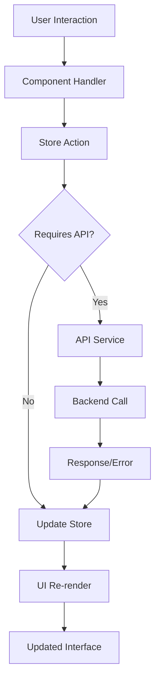
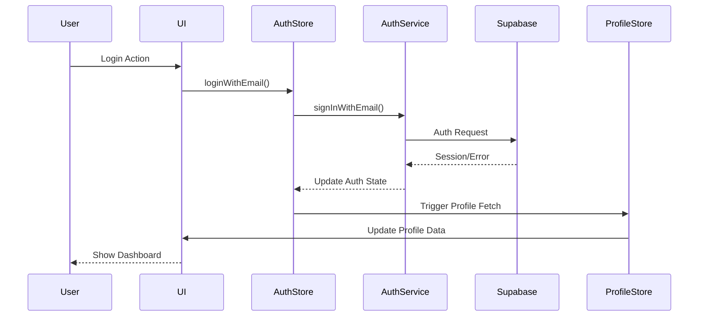

# Architecture Guide

This document provides a comprehensive overview of the Yeser app's architecture, design patterns, and architectural decisions.

## 🏗️ System Overview

Yeser follows a **layered architecture** with clear separation of concerns, promoting maintainability, testability, and scalability.

```
┌─────────────────────────────────────────────────────────┐
│                    Presentation Layer                   │
│  ┌─────────────┐  ┌─────────────┐  ┌─────────────┐     │
│  │   Screens   │  │ Components  │  │ Navigation  │     │
│  └─────────────┘  └─────────────┘  └─────────────┘     │
└─────────────────────────────────────────────────────────┘
┌─────────────────────────────────────────────────────────┐
│                    State Management                     │
│  ┌─────────────┐  ┌─────────────┐  ┌─────────────┐     │
│  │ Auth Store  │  │Gratitude St.│  │Profile Store│     │
│  └─────────────┘  └─────────────┘  └─────────────┘     │
└─────────────────────────────────────────────────────────┘
┌─────────────────────────────────────────────────────────┐
│                     Business Logic                      │
│  ┌─────────────┐  ┌─────────────┐  ┌─────────────┐     │
│  │   Services  │  │    Hooks    │  │    Utils    │     │
│  └─────────────┘  └─────────────┘  └─────────────┘     │
└─────────────────────────────────────────────────────────┘
┌─────────────────────────────────────────────────────────┐
│                     Data Access                         │
│  ┌─────────────┐  ┌─────────────┐  ┌─────────────┐     │
│  │  API Layer  │  │   Schemas   │  │ Validation  │     │
│  └─────────────┘  └─────────────┘  └─────────────┘     │
└─────────────────────────────────────────────────────────┘
┌─────────────────────────────────────────────────────────┐
│                       Backend                           │
│  ┌─────────────┐  ┌─────────────┐  ┌─────────────┐     │
│  │  Supabase   │  │  Firebase   │  │    Expo     │     │
│  │ (Database)  │  │ (Analytics) │  │(Notifications)│    │
│  └─────────────┘  └─────────────┘  └─────────────┘     │
└─────────────────────────────────────────────────────────┘
```

## 📁 Project Structure

```
src/
├── api/                    # Backend integration layer
│   ├── gratitudeApi.ts    # Gratitude CRUD operations
│   ├── profileApi.ts      # User profile management
│   ├── streakApi.ts       # Streak calculations
│   ├── userDataApi.ts     # Data export functionality
│   └── promptApi.ts       # Daily prompts
├── components/             # Reusable UI components
│   ├── features/          # Feature-specific components
│   ├── daily-entries/     # Daily entry components
│   ├── past-entries/      # Past entries components
│   ├── home-screen/       # Home screen components
│   ├── settings/          # Settings components
│   └── states/            # State-based components
├── hooks/                  # Custom React hooks
│   └── useStreak.ts       # Streak management hook
├── navigation/             # App navigation structure
│   ├── RootNavigator.tsx  # Main navigation container
│   └── AuthNavigator.tsx  # Authentication flow
├── providers/              # Context providers
│   └── ThemeProvider.tsx  # Theme management
├── schemas/                # Zod validation schemas
│   ├── gratitudeEntrySchema.ts
│   ├── profileSchema.ts
│   ├── streakSchema.ts
│   └── authSchemas.ts
├── screens/                # App screens/pages
│   ├── onboarding/        # Onboarding flow
│   └── *.tsx              # Main app screens
├── services/               # Business logic services
│   ├── authService.ts     # Authentication logic
│   ├── analyticsService.ts # Analytics integration
│   └── notificationService.ts # Push notifications
├── store/                  # Zustand state stores
│   ├── authStore.ts       # Authentication state
│   ├── gratitudeStore.ts  # Gratitude entries state
│   ├── profileStore.ts    # User profile state
│   ├── streakStore.ts     # Streak tracking state
│   ├── throwbackStore.ts  # Throwback feature state
│   ├── promptStore.ts     # Daily prompts state
│   └── themeStore.ts      # Theme preferences
├── themes/                 # UI theme definitions
│   ├── lightTheme.ts      # Light theme colors
│   ├── darkTheme.ts       # Dark theme colors
│   └── types.ts           # Theme type definitions
├── types/                  # TypeScript type definitions
│   ├── navigation.ts      # Navigation types
│   └── supabase.types.ts  # Generated Supabase types
├── utils/                  # Utility functions
│   ├── supabaseClient.ts  # Supabase client configuration
│   ├── dateUtils.ts       # Date formatting utilities
│   └── hapticFeedback.ts  # Haptic feedback utilities
└── App.tsx                 # Main application component
```

## 🔄 Data Flow Architecture

### 1. Unidirectional Data Flow

The app follows a **unidirectional data flow** pattern:

```
User Action → Store Action → API Call → Backend → Response → Store Update → UI Update
```

### 2. State Management Flow



### 3. Authentication Flow



## 🏪 State Management Strategy

### Zustand Store Pattern

Each store follows a consistent pattern:

```typescript
// Store Structure
interface StoreState {
  // Data
  data: DataType | null;
  
  // Loading states
  isLoading: boolean;
  error: string | null;
  
  // Flags
  initialFetchAttempted: boolean;
}

interface StoreActions {
  // CRUD operations
  fetch: () => Promise<void>;
  create: (data: CreateData) => Promise<void>;
  update: (id: string, data: UpdateData) => Promise<void>;
  delete: (id: string) => Promise<void>;
  
  // State management
  setLoading: (loading: boolean) => void;
  setError: (error: string | null) => void;
  reset: () => void;
}
```

### Store Interaction Patterns

1. **Independent Stores**: Each store manages its own domain
2. **Cross-Store Communication**: Stores can subscribe to other stores
3. **Persistence**: Critical data persisted with AsyncStorage
4. **Optimistic Updates**: UI updates immediately, syncs with backend

### Example Store Implementation

```typescript
export const useGratitudeStore = create<GratitudeStoreState>()(
  persist(
    (set, get) => ({
      // Initial state
      entries: {},
      isLoading: false,
      error: null,
      
      // Optimistic update pattern
      addStatement: async (date, statement) => {
        // 1. Optimistic UI update
        const optimisticEntry = { /* updated entry */ };
        set(state => ({ 
          entries: { ...state.entries, [date]: optimisticEntry }
        }));
        
        try {
          // 2. Backend call
          const result = await apiAddStatement(date, statement);
          
          // 3. Sync with backend response
          set(state => ({ 
            entries: { ...state.entries, [date]: result }
          }));
        } catch (error) {
          // 4. Rollback on error
          set(state => ({ 
            entries: { ...state.entries, [date]: originalEntry }
          }));
        }
      }
    }),
    {
      name: 'gratitude-storage',
      storage: createJSONStorage(() => AsyncStorage),
    }
  )
);
```

## 🔌 Backend Integration Architecture

### API Layer Design

The API layer provides a clean abstraction over Supabase:

```typescript
// API Function Pattern
export const apiFunction = async (params): Promise<ReturnType> => {
  // 1. Authentication check
  const session = await supabase.auth.getSession();
  if (!session) throw new Error('No session');
  
  // 2. Input validation
  const validation = schema.safeParse(params);
  if (!validation.success) throw validation.error;
  
  // 3. API call
  const { data, error } = await supabase
    .from('table')
    .operation(params);
    
  // 4. Error handling
  if (error) throw error;
  
  // 5. Response validation
  return validateResponse(data);
};
```

### Supabase Integration Patterns

1. **RPC Functions**: Complex operations handled server-side
2. **Row Level Security**: Data access controlled at database level
3. **Real-time Subscriptions**: Live updates for collaborative features
4. **Edge Functions**: Custom backend logic for data processing

## 🎨 UI Architecture

### Component Hierarchy

```
App
├── ThemeProvider
│   ├── NavigationContainer
│   │   ├── RootNavigator
│   │   │   ├── AuthNavigator (when not authenticated)
│   │   │   │   ├── LoginScreen
│   │   │   │   └── SignUpScreen
│   │   │   └── MainAppNavigator (when authenticated)
│   │   │       ├── HomeTab
│   │   │       ├── DailyEntryTab
│   │   │       ├── PastEntriesTab
│   │   │       └── SettingsTab
│   │   └── Modals (Global)
│   │       ├── ThrowbackModal
│   │       └── ErrorModal
│   └── StatusBar
```

### Component Design Patterns

#### 1. Themed Components
All UI components extend base themed components:

```typescript
// Base themed component
const ThemedButton: React.FC<Props> = ({ style, ...props }) => {
  const { theme } = useTheme();
  
  return (
    <Pressable
      style={[
        {
          backgroundColor: theme.colors.primary,
          borderRadius: theme.borderRadius.medium,
        },
        style
      ]}
      {...props}
    />
  );
};
```

#### 2. Composition Pattern
Complex components composed from smaller ones:

```typescript
const GratitudeEntry = () => (
  <ThemedCard>
    <GratitudeHeader />
    <GratitudeStatements />
    <GratitudeActions />
  </ThemedCard>
);
```

#### 3. Container/Presenter Pattern
Separation of logic and presentation:

```typescript
// Container (logic)
const GratitudeEntryContainer = () => {
  const { entries, addStatement } = useGratitudeStore();
  const handleAdd = useCallback(/* logic */, []);
  
  return (
    <GratitudeEntryPresenter
      entries={entries}
      onAdd={handleAdd}
    />
  );
};

// Presenter (UI)
const GratitudeEntryPresenter = ({ entries, onAdd }) => (
  <View>
    {/* Pure UI rendering */}
  </View>
);
```

## 🔐 Security Architecture

### Data Security

1. **Row Level Security (RLS)**: All tables protected with RLS policies
2. **Authentication Required**: All API calls require valid session
3. **Input Validation**: Zod schemas validate all inputs
4. **Sanitization**: User inputs sanitized before storage

### Privacy Protection

1. **Local Storage**: Sensitive data encrypted in AsyncStorage
2. **Analytics**: No PII sent to analytics services
3. **Data Export**: User controls their data export
4. **Minimal Permissions**: App requests only necessary permissions

## 📊 Performance Architecture

### Optimization Strategies

1. **Lazy Loading**: Screens and components loaded on demand
2. **Memoization**: React.memo and useMemo prevent unnecessary renders
3. **Virtualization**: Large lists use FlatList with optimization
4. **Image Optimization**: Images cached and optimized
5. **Bundle Splitting**: Code split by features

### Caching Strategy

```typescript
// Multi-level caching
const getCachedData = async (key: string) => {
  // 1. Memory cache (fastest)
  if (memoryCache.has(key)) {
    return memoryCache.get(key);
  }
  
  // 2. AsyncStorage cache (fast)
  const cached = await AsyncStorage.getItem(key);
  if (cached && !isExpired(cached)) {
    return JSON.parse(cached);
  }
  
  // 3. Network request (slowest)
  const fresh = await fetchFromAPI(key);
  await AsyncStorage.setItem(key, JSON.stringify(fresh));
  memoryCache.set(key, fresh);
  
  return fresh;
};
```

## 🔄 Error Handling Architecture

### Error Handling Strategy

1. **Global Error Boundary**: Catches unhandled React errors
2. **API Error Handling**: Consistent error handling in API layer
3. **User-Friendly Messages**: Technical errors translated to user messages
4. **Retry Logic**: Automatic retry for transient failures
5. **Offline Handling**: Graceful degradation when offline

### Error Flow

```typescript
// Error handling pattern
const handleOperation = async () => {
  try {
    setLoading(true);
    const result = await apiCall();
    setData(result);
  } catch (error) {
    if (error instanceof NetworkError) {
      setError('Please check your internet connection');
    } else if (error instanceof ValidationError) {
      setError('Please check your input');
    } else {
      setError('Something went wrong. Please try again.');
      // Log to analytics
      analyticsService.logError(error);
    }
  } finally {
    setLoading(false);
  }
};
```

## 🧪 Testing Architecture

### Testing Strategy

1. **Unit Tests**: Individual functions and components
2. **Integration Tests**: Store and API integration
3. **E2E Tests**: Critical user journeys
4. **Visual Tests**: Component visual regression
5. **Performance Tests**: Memory and render performance

### Test Structure

```
__tests__/
├── api/              # API layer tests
├── components/       # Component tests
├── hooks/           # Custom hook tests
├── services/        # Service layer tests
├── store/           # Store tests
├── utils/           # Utility function tests
└── e2e/             # End-to-end tests
```

## 🔮 Future Architecture Considerations

### Scalability Improvements

1. **Micro-frontends**: Split into independent modules
2. **GraphQL**: Replace REST API with GraphQL
3. **React Query**: Add server state management
4. **Web Support**: Progressive Web App capabilities
5. **Offline-First**: Robust offline functionality

### Performance Enhancements

1. **Code Splitting**: Dynamic imports for features
2. **Bundle Analysis**: Regular bundle size monitoring
3. **Memory Profiling**: Identify memory leaks
4. **Rendering Optimization**: Virtual lists and windowing

---

This architecture provides a solid foundation for building a scalable, maintainable, and performant gratitude journaling app while following React Native and mobile development best practices. 