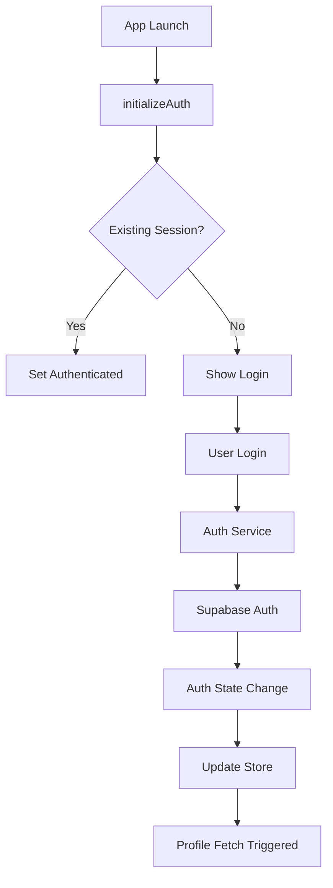

# State Management Guide

This document provides comprehensive documentation for the state management architecture in the Yeser gratitude app, built with Zustand.

## 🏪 State Management Overview

Yeser uses **Zustand** as its primary state management solution, chosen for its:
- **Simplicity**: Minimal boilerplate and intuitive API
- **Performance**: Efficient re-renders with shallow equality checks
- **TypeScript Support**: Excellent type safety and inference
- **Persistence**: Built-in AsyncStorage integration
- **Flexibility**: No providers or context wrapping required

## 🏗️ Store Architecture

### Store Organization

```
State Stores
├── authStore.ts           # Authentication & user session
├── profileStore.ts        # User profile & preferences
├── gratitudeStore.ts      # Gratitude entries & CRUD operations
├── streakStore.ts         # Streak tracking & calculations
├── throwbackStore.ts      # Random entry throwbacks
├── promptStore.ts         # Daily prompts & variations
└── themeStore.ts          # UI theme preferences
```

### Store Pattern

Each store follows a consistent pattern:

```typescript
interface StoreState {
  // Core data
  data: DataType | null;
  
  // Loading & error states
  isLoading: boolean;
  error: string | null;
  
  // Operational flags
  initialFetchAttempted: boolean;
}

interface StoreActions {
  // Data operations
  fetch: () => Promise<void>;
  create: (data: CreateData) => Promise<void>;
  update: (id: string, data: UpdateData) => Promise<void>;
  delete: (id: string) => Promise<void>;
  
  // State management
  setLoading: (loading: boolean) => void;
  setError: (error: string | null) => void;
  reset: () => void;
}

type Store = StoreState & StoreActions;
```

## 🔐 Authentication Store

**Location**: `src/store/authStore.ts`

### State Structure

```typescript
interface AuthState {
  isAuthenticated: boolean;
  user: SupabaseUser | null;
  isLoading: boolean;
  error: string | null;
  // Actions...
}
```

### Key Actions

#### `initializeAuth()`
```typescript
initializeAuth: async () => {
  set({ isLoading: true, error: null });
  
  try {
    // Check existing session
    const session = await authService.getCurrentSession();
    
    // Set up auth state listener
    authListenerSubscription = authService.onAuthStateChange(
      (event, session) => {
        // Handle auth state changes
        switch (event) {
          case 'SIGNED_IN':
            set({ isAuthenticated: true, user: session.user });
            break;
          case 'SIGNED_OUT':
            set({ isAuthenticated: false, user: null });
            break;
        }
      }
    );
  } catch (error) {
    set({ error: error.message, isLoading: false });
  }
}
```

#### `loginWithEmail()` & `loginWithGoogle()`
```typescript
loginWithEmail: async (credentials) => {
  set({ isLoading: true, error: null });
  
  const { user, error } = await authService.signInWithEmail(credentials);
  
  if (error) {
    set({ error: error.message, isLoading: false });
  }
  // Success handled by auth state listener
}
```

### Auth State Flow



## 👤 Profile Store

**Location**: `src/store/profileStore.ts`

### State Structure

```typescript
interface ProfileState {
  // Profile data
  id: string | null;
  username: string | null;
  onboarded: boolean;
  reminder_enabled: boolean;
  reminder_time: string | null;
  throwback_reminder_enabled: boolean;
  throwback_reminder_frequency: string;
  daily_gratitude_goal: number;
  useVariedPrompts: boolean;
  
  // Client-side preferences
  theme: 'light' | 'dark' | 'system';
  
  // Operational state
  loading: boolean;
  error: string | null;
  initialProfileFetchAttempted: boolean;
}
```

### Key Features

#### Profile Sync with Backend
```typescript
fetchProfile: async (retryCount = 0) => {
  const authUserId = useAuthStore.getState().user?.id;
  
  if (!authUserId) return;
  
  try {
    const profileData = await fetchProfileApi();
    
    if (profileData) {
      // Compare with current state to avoid unnecessary updates
      if (!areProfilesEqual(currentProfile, profileData)) {
        set(state => ({ ...state, ...profileData }));
      }
    }
  } catch (error) {
    if (retryCount < MAX_RETRIES) {
      setTimeout(() => fetchProfile(retryCount + 1), RETRY_DELAY);
    } else {
      set({ error: error.message });
    }
  }
}
```

#### Settings Updates with Notifications
```typescript
updateDailyReminderSettings: async (prefs) => {
  // Optimistic update
  set(state => ({ ...state, ...prefs }));
  
  try {
    // Update backend
    await updateProfileApi(prefs);
    
    // Handle notification scheduling
    if (prefs.reminder_enabled && prefs.reminder_time) {
      const date = parseTimeStringToValidDate(prefs.reminder_time);
      await scheduleDailyReminder(
        date.getHours(),
        date.getMinutes(),
        'Günlük Minnet',
        'Bugün neler için minnettarsın?'
      );
    } else {
      await cancelAllScheduledNotifications();
    }
  } catch (error) {
    // Rollback on error
    set(state => ({ ...state, error: error.message }));
  }
}
```

### Persistence Strategy

Profile store persists critical data to AsyncStorage:

```typescript
export const useProfileStore = create<ProfileState & ProfileActions>()(
  persist(
    (set, get) => ({ /* store implementation */ }),
    {
      name: 'profile-storage',
      storage: createJSONStorage(() => AsyncStorage),
      // Partial persistence - only essential data
      partialize: (state) => ({
        id: state.id,
        username: state.username,
        theme: state.theme,
        onboarded: state.onboarded,
        // Exclude loading states and errors
      }),
    }
  )
);
```

## 📝 Gratitude Store

**Location**: `src/store/gratitudeStore.ts`

### State Structure

```typescript
interface GratitudeStoreState {
  entries: Record<string, GratitudeEntry | null>; // Date-keyed entries
  isLoading: boolean;
  error: string | null;
  totalEntries: number | null;
  totalEntriesLoading: boolean;
  totalEntriesError: string | null;
}
```

### Optimistic Updates Pattern

The gratitude store implements optimistic updates for better UX:

```typescript
addStatement: async (date, statementText) => {
  const originalEntry = get().entries[date];
  
  // 1. Create optimistic entry
  const optimisticEntry = originalEntry 
    ? { ...originalEntry, statements: [...originalEntry.statements, statementText] }
    : createNewEntry(date, [statementText]);
  
  // 2. Immediate UI update
  set(state => ({
    entries: { ...state.entries, [date]: optimisticEntry },
    error: null
  }));
  
  try {
    // 3. Backend call
    const backendEntry = await apiAddStatement(date, statementText);
    
    // 4. Sync with backend response
    if (backendEntry) {
      set(state => ({
        entries: { ...state.entries, [date]: backendEntry }
      }));
      return backendEntry;
    }
  } catch (error) {
    // 5. Rollback on error
    set(state => ({
      entries: { ...state.entries, [date]: originalEntry },
      error: error.message
    }));
    return null;
  }
}
```

### Data Validation

All entry data is validated using Zod schemas:

```typescript
fetchEntry: async (date) => {
  try {
    const rawEntry = await getGratitudeDailyEntryByDate(date);
    
    if (rawEntry) {
      // Validate with Zod schema
      const parsedEntry = gratitudeEntrySchema.parse(rawEntry);
      set(state => ({ 
        entries: { ...state.entries, [date]: parsedEntry }
      }));
    }
  } catch (error) {
    if (error instanceof ZodError) {
      const errorMessage = 'Data validation failed: ' + 
        error.errors.map(err => `${err.path.join('.')} (${err.message})`).join(', ');
      set({ error: errorMessage });
    }
  }
}
```

### Persistence Configuration

```typescript
persist(
  (set, get) => ({ /* store logic */ }),
  {
    name: 'gratitude-storage',
    storage: createJSONStorage(() => AsyncStorage),
    // Persist all entries for offline access
    partialize: (state) => ({
      entries: state.entries,
      totalEntries: state.totalEntries,
    }),
  }
)
```

## 🔥 Streak Store

**Location**: `src/store/streakStore.ts`

### State Structure

```typescript
interface StreakState {
  streakData: Streak | null;
  streakDataLoading: boolean;
  streakDataError: string | null;
  initialStreakFetchAttempted: boolean;
}
```

### Smart Refresh Logic

```typescript
refreshStreak: async (retryCount = 0) => {
  const { initialStreakFetchAttempted, streakDataLoading } = get();
  
  // Prevent duplicate calls
  if (retryCount === 0 && initialStreakFetchAttempted && !streakDataLoading) {
    return;
  }
  
  // Prevent stacking calls
  if (streakDataLoading && retryCount === 0) {
    return;
  }
  
  set({ streakDataLoading: true, initialStreakFetchAttempted: true });
  
  try {
    const newStreakData = await getStreakData();
    const currentStreakData = get().streakData;
    
    // Only update if data changed
    if (!areStreaksEqual(currentStreakData, newStreakData)) {
      set({ streakData: newStreakData, streakDataLoading: false });
    } else {
      set({ streakDataLoading: false });
    }
  } catch (error) {
    if (retryCount < MAX_RETRIES) {
      setTimeout(() => refreshStreak(retryCount + 1), RETRY_DELAY);
    } else {
      set({ streakDataError: error.message, streakDataLoading: false });
    }
  }
}
```

### Cross-Store Subscriptions

Streak store subscribes to auth changes:

```typescript
// Auto-reset on logout
useAuthStore.subscribe(
  (state, prevState) => {
    if (prevState.user && !state.user) {
      useStreakStore.getState().resetStreak();
    }
    
    if ((!prevState.user && state.user) || 
        (prevState.user?.id !== state.user?.id)) {
      useStreakStore.getState().setInitialStreakFetchAttempted(false);
    }
  }
);
```

## 🔄 Throwback Store

**Location**: `src/store/throwbackStore.ts`

### State Structure

```typescript
interface ThrowbackState {
  lastThrowbackShownAt: number | null;
  randomEntry: GratitudeEntry | null;
  isThrowbackVisible: boolean;
  isLoading: boolean;
  error: string | null;
}
```

### Intelligent Throwback Logic

```typescript
checkAndShowThrowbackIfNeeded: async ({ isEnabled, frequency, totalEntryCount }) => {
  if (!isEnabled) return;
  
  // Minimum entry requirements
  const minEntries = {
    daily: 1,
    weekly: 7,
    monthly: 15
  };
  
  if (totalEntryCount < minEntries[frequency]) return;
  
  const { lastThrowbackShownAt } = get();
  const now = Date.now();
  
  // Time thresholds
  const timeThresholds = {
    daily: 23 * 60 * 60 * 1000,     // 23 hours
    weekly: 7 * 24 * 60 * 60 * 1000, // 1 week
    monthly: 30 * 24 * 60 * 60 * 1000 // 30 days
  };
  
  const threshold = timeThresholds[frequency];
  
  if (!lastThrowbackShownAt || (now - lastThrowbackShownAt > threshold)) {
    await fetchRandomEntry();
  }
}
```

### Partial Persistence

```typescript
persist(
  (set, get) => ({ /* store logic */ }),
  {
    name: 'throwback-storage',
    storage: createJSONStorage(() => AsyncStorage),
    // Only persist timestamp, not transient state
    partialize: (state) => ({
      lastThrowbackShownAt: state.lastThrowbackShownAt,
    }),
  }
)
```

## 🎨 Theme Store

**Location**: `src/store/themeStore.ts`

### Simple Theme Management

```typescript
interface ThemeState {
  activeThemeName: 'light' | 'dark';
  activeTheme: AppTheme;
  setTheme: (themeName: ThemeName) => void;
  toggleTheme: () => void;
}

export const useThemeStore = create<ThemeState>()(
  persist(
    (set, get) => ({
      activeThemeName: 'light',
      activeTheme: lightTheme,
      
      setTheme: (themeName) => {
        set({
          activeThemeName: themeName,
          activeTheme: getThemeObjectByName(themeName),
        });
      },
      
      toggleTheme: () => {
        const currentTheme = get().activeThemeName;
        const newTheme = currentTheme === 'light' ? 'dark' : 'light';
        get().setTheme(newTheme);
      },
    }),
    {
      name: 'app-theme-storage',
      storage: createJSONStorage(() => AsyncStorage),
      partialize: (state) => ({ activeThemeName: state.activeThemeName }),
      onRehydrateStorage: () => (state) => {
        if (state) {
          state.activeTheme = getThemeObjectByName(state.activeThemeName);
        }
      },
    }
  )
);
```

## 🔄 Data Flow Patterns

### 1. Component → Store → API → Backend

```typescript
// Component
const handleAddStatement = async (statement: string) => {
  const result = await addStatement(currentDate, statement);
  if (result) {
    hapticFeedback.success();
    analyticsService.logEvent('statement_added');
  }
};

// Store
addStatement: async (date, statement) => {
  // Optimistic update
  updateUIImmediately();
  
  try {
    // API call
    const result = await apiAddStatement(date, statement);
    syncWithBackend(result);
  } catch (error) {
    rollbackOptimisticUpdate();
    handleError(error);
  }
}
```

### 2. Cross-Store Communication

```typescript
// Auth store triggers profile fetch
useAuthStore.subscribe(
  (state, prevState) => {
    if (!prevState.user && state.user) {
      useProfileStore.getState().fetchProfile();
    }
  }
);

// Profile changes trigger notification updates
useProfileStore.subscribe(
  (state, prevState) => {
    if (state.reminder_enabled !== prevState.reminder_enabled) {
      updateNotificationSettings(state);
    }
  }
);
```

### 3. Component State Synchronization

```typescript
// Using shallow equality for performance
const { entries, isLoading, addStatement } = useGratitudeStore(
  useShallow((state) => ({
    entries: state.entries,
    isLoading: state.isLoading,
    addStatement: state.addStatement,
  }))
);
```

## 🎯 Performance Optimizations

### 1. Shallow Equality Checks

```typescript
// Prevent unnecessary re-renders
const selector = useShallow((state: GratitudeStoreState) => ({
  todaysEntry: state.entries[currentDate],
  isLoading: state.isLoading,
}));
```

### 2. Memoized Selectors

```typescript
// Complex derived state
const gratitudeStats = useGratitudeStore(
  useCallback(
    (state) => {
      const entries = Object.values(state.entries).filter(Boolean);
      return {
        totalStatements: entries.reduce((sum, entry) => sum + entry.statements.length, 0),
        avgStatementsPerDay: entries.length > 0 ? totalStatements / entries.length : 0,
        longestEntry: Math.max(...entries.map(entry => entry.statements.length)),
      };
    },
    []
  )
);
```

### 3. Batched Updates

```typescript
// Batch multiple state changes
set((state) => ({
  ...state,
  isLoading: false,
  error: null,
  data: newData,
  lastUpdated: Date.now(),
}));
```

## 🔄 State Persistence Strategy

### What Gets Persisted

| Store | Persisted Data | Reasoning |
|-------|----------------|-----------|
| **Auth** | None | Session managed by Supabase |
| **Profile** | Core profile data | User preferences offline access |
| **Gratitude** | All entries | Offline reading and writing |
| **Streak** | None | Always fetch fresh for accuracy |
| **Throwback** | Last shown timestamp | Prevent spam |
| **Theme** | Theme preference | UI consistency |

### Hydration Handling

```typescript
// Wait for hydration before rendering
const [hydrated, setHydrated] = useState(false);

useEffect(() => {
  const unsubscribe = useProfileStore.persist.onFinishHydration(() => {
    setHydrated(true);
  });
  
  return unsubscribe;
}, []);

if (!hydrated) {
  return <SplashScreen />;
}
```

## 🐛 Error Handling Patterns

### 1. Store-Level Error Handling

```typescript
// Consistent error handling across stores
const handleStoreError = (error: unknown, operation: string) => {
  const errorMessage = error instanceof Error 
    ? error.message 
    : `${operation} failed`;
    
  set({ error: errorMessage, isLoading: false });
  
  // Log to analytics
  analyticsService.logError(error, { operation });
};
```

### 2. Retry Logic

```typescript
// Exponential backoff retry
const retryWithBackoff = async (fn: () => Promise<any>, maxRetries = 3) => {
  for (let i = 0; i < maxRetries; i++) {
    try {
      return await fn();
    } catch (error) {
      if (i === maxRetries - 1) throw error;
      
      const delay = Math.pow(2, i) * 1000; // 1s, 2s, 4s
      await new Promise(resolve => setTimeout(resolve, delay));
    }
  }
};
```

## 🔮 Advanced Patterns

### 1. Computed Values

```typescript
// Derived state with useMemo
const useGratitudeInsights = () => {
  const entries = useGratitudeStore(state => state.entries);
  
  return useMemo(() => {
    const allEntries = Object.values(entries).filter(Boolean);
    
    return {
      totalDays: allEntries.length,
      totalStatements: allEntries.reduce((sum, entry) => sum + entry.statements.length, 0),
      averagePerDay: allEntries.length > 0 ? totalStatements / allEntries.length : 0,
      longestStreak: calculateLongestStreak(allEntries),
    };
  }, [entries]);
};
```

### 2. Action Composers

```typescript
// Combine multiple store actions
const useCompleteOnboarding = () => {
  const updateProfile = useProfileStore(state => state.updateProfile);
  const logEvent = analyticsService.logEvent;
  
  return useCallback(async (profileData: ProfileData) => {
    await updateProfile({ ...profileData, onboarded: true });
    logEvent('onboarding_completed');
    hapticFeedback.success();
  }, [updateProfile]);
};
```

### 3. State Middleware

```typescript
// Dev tools integration
const storeWithDevtools = (config) => {
  return devtools(
    config,
    { name: 'GratitudeStore', serialize: true }
  );
};
```

---

This state management documentation provides a complete guide to understanding and working with the Zustand-based state architecture in the Yeser gratitude app, enabling efficient and maintainable state management patterns. 