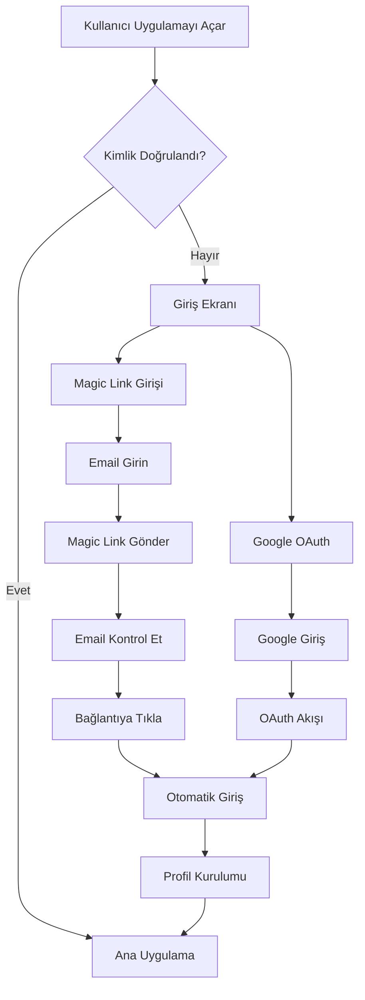

# Yeşer - Minnet Günlüğü 🌱

> Modern, güvenli ve kullanıcı dostu şükran günlüğü uygulaması

**Yeşer**, React Native ve Expo ile geliştirilmiş, günlük şükran pratiklerini destekleyen modern bir mobil uygulamadır. Şifresiz kimlik doğrulama, akıllı bildirimler ve kapsamlı veri yönetimi ile güvenli ve keyifli bir deneyim sunar.

## ✨ Öne Çıkan Özellikler

### 🔐 Gelişmiş Güvenlik

- **Magic Link Kimlik Doğrulama**: Şifresiz, güvenli giriş sistemi
- **Google OAuth Desteği**: Hızlı sosyal medya girişi
- **Derin Bağlantı Entegrasyonu**: Otomatik uygulama açılımı
- **Veri Şifreleme**: Aktarım ve depolama sırasında tam şifreleme

### 📝 Günlük Şükran Deneyimi

- **Günlük Girişler**: Her gün için çoklu şükran ifadeleri
- **Çeşitli Öneriler**: Veritabanından rastgele motivasyon soruları
- **Akıllı Önbellek**: Çevrimdışı erişim ve otomatik senkronizasyon
- **Geçmiş Tarama**: Takvim görünümü ile geçmiş girişlere erişim

### 🔥 Motivasyon ve Takip

- **Seri Takibi**: Görsel seri sayaçları ile tutarlılık takibi
- **Throwback Anıları**: Geçmiş girişlerin akıllı hatırlatması
- **İstatistikler**: Kapsamlı kullanım analitikleri
- **Hedef Belirleme**: Günlük şükran hedefleri

### 🔔 Akıllı Bildirimler

- **Günlük Hatırlatmalar**: Özelleştirilebilir zamanlama
- **Throwback Bildirimleri**: Günlük/haftalık/aylık frekans seçenekleri
- **Çapraz Platform**: iOS ve Android desteği
- **Derin Bağlantı**: Bildirimden doğrudan ilgili ekrana yönlendirme

### 🌙 Tema ve Kişiselleştirme

- **Koyu/Açık Tema**: Kullanıcı tercihi ile otomatik geçiş
- **Verdant Serenity Tasarım**: Minimalist ve huzur verici arayüz
- **Türkçe Lokalizasyon**: Tam Türkçe dil desteği
- **Kültürel Duyarlılık**: Türk kullanıcılar için optimize edilmiş deneyim

### 📊 Veri Yönetimi

- **PDF Dışa Aktarım**: Kapsamlı veri dışa aktarma
- **KVKK Uyumluluğu**: Türk veri koruma yasalarına uygunluk
- **Veri Minimizasyonu**: Gizlilik odaklı veri toplama
- **Güvenli Yedekleme**: Otomatik bulut senkronizasyonu

## 🚀 Hızlı Başlangıç

### Gereksinimler

- Node.js 18+
- npm veya Yarn
- Expo CLI
- iOS/Android geliştirme ortamı

### Kurulum

```bash
# Projeyi klonla
git clone <repository-url>
cd yeser

# Bağımlılıkları yükle
npm install

# iOS için (sadece macOS)
cd ios && pod install && cd ..

# Geliştirme sunucusunu başlat
npx expo start
```

### Ortam Değişkenleri

`.env` dosyası oluşturun:

```env
# Supabase Yapılandırması (Magic Link için gerekli)
EXPO_PUBLIC_SUPABASE_URL=your_supabase_project_url
EXPO_PUBLIC_SUPABASE_ANON_KEY=your_supabase_anon_key

# Magic Link Yapılandırması
EXPO_PUBLIC_MAGIC_LINK_REDIRECT_URI=yeser://auth/callback
EXPO_PUBLIC_DEEP_LINK_SCHEME=yeser

# OAuth Yapılandırması
EXPO_PUBLIC_GOOGLE_CLIENT_ID=your_google_client_id

# Firebase Analytics (Opsiyonel)
EXPO_PUBLIC_FIREBASE_API_KEY=your_firebase_api_key
EXPO_PUBLIC_FIREBASE_PROJECT_ID=your_firebase_project_id

# Geliştirici Araçları
EXPO_PUBLIC_REACT_QUERY_DEVTOOLS=true
```

### Magic Link Kurulumu

1. **Supabase Proje Oluşturun**
2. **Email Sağlayıcısını Etkinleştirin**
3. **Yönlendirme URL'lerini Yapılandırın:**
   ```
   yeser://auth/callback
   ```
4. **Özel Email Şablonu Ekleyin** (Türkçe içerik ile)

## 🏗️ Mimari

### Modern Hibrit Durum Yönetimi

```
┌─────────────────────────────────────────┐
│            Presentation Layer           │
│  Screens • Components • Navigation      │
└─────────────────────────────────────────┘
┌─────────────────────────────────────────┐
│         Hybrid State Management         │
│  TanStack Query v5.80.2 • Zustand      │
└─────────────────────────────────────────┘
┌─────────────────────────────────────────┐
│           Business Logic Layer          │
│  API Layer • Services • Hooks          │
└─────────────────────────────────────────┘
┌─────────────────────────────────────────┐
│            Data Access Layer            │
│  Supabase • Firebase • Local Storage   │
└─────────────────────────────────────────┘
```

### Teknoloji Yığını

| Kategori             | Teknoloji                           | Amaç                                          |
| -------------------- | ----------------------------------- | --------------------------------------------- |
| **Frontend**         | React Native + Expo                 | Çapraz platform mobil geliştirme              |
| **Backend**          | Supabase (PostgreSQL)               | Veritabanı, kimlik doğrulama, gerçek zamanlı  |
| **Sunucu Durumu**    | TanStack Query v5.80.2              | Akıllı veri getirme, önbellek, senkronizasyon |
| **İstemci Durumu**   | Zustand                             | Hafif istemci tarafı durum (auth, tema)       |
| **UI Framework**     | React Native Paper                  | Material Design bileşenleri                   |
| **Navigasyon**       | React Navigation v6                 | Ekran navigasyonu ve yönlendirme              |
| **Doğrulama**        | Zod                                 | Tip güvenli şema doğrulama                    |
| **Analytics**        | Firebase Analytics                  | Kullanıcı davranış takibi                     |
| **Bildirimler**      | Expo Notifications                  | Push ve yerel bildirimler                     |
| **Kimlik Doğrulama** | Supabase Magic Links + Google OAuth | Şifresiz güvenli kimlik doğrulama             |

### Kimlik Doğrulama Akışı



## 📊 Performans Optimizasyonları

### Hibrit Durum Yönetimi Faydaları

| **Özellik**                   | **Önce**             | **Sonra**                       | **İyileştirme**       |
| ----------------------------- | -------------------- | ------------------------------- | --------------------- |
| **Veri Getirme**              | Manuel API çağrıları | Akıllı önbellekleme             | **%90 daha az kod**   |
| **Yükleme Durumları**         | Manuel takip         | Otomatik durumlar               | **%100 otomatik**     |
| **Hata Yönetimi**             | Her yerde try/catch  | Yerleşik sınırlar               | **Tutarlı ve sağlam** |
| **Arka Plan Senkronizasyonu** | Yok                  | Otomatik stale-while-revalidate | **Yeni yetenek**      |
| **İyimser Güncellemeler**     | Manuel rollback      | Otomatik hata kurtarma          | **Sağlam UX**         |
| **Çevrimdışı Destek**         | Sınırlı              | Otomatik önbellek kalıcılığı    | **Gelişmiş yetenek**  |
| **Kimlik Doğrulama**          | Şifre tabanlı        | Şifresiz magic linkler          | **Gelişmiş güvenlik** |

## 🔒 Güvenlik ve Gizlilik

### Gelişmiş Veri Koruması

- **Şifresiz Güvenlik**: Magic link kimlik doğrulama şifre güvenlik açıklarını ortadan kaldırır
- **Uçtan Uca Güvenlik**: Tüm veriler aktarım ve depolama sırasında şifrelenir
- **Satır Düzeyi Güvenlik**: Supabase RLS ile veritabanı düzeyinde erişim kontrolü
- **Zaman Sınırlı Kimlik Doğrulama**: Magic linkler güvenlik için sona erer
- **Oran Sınırlama**: Kimlik doğrulama kötüye kullanımına karşı koruma
- **Gizlilik**: Kullanıcı onayı ile minimal veri toplama

### Uyumluluk

- **KVKK Uyumluluğu**: Veri dışa aktarma ve silme yetenekleri
- **Tasarımla Gizlilik**: Kullanıcı veri minimizasyonu ve amaç sınırlaması
- **Şeffaf Gizlilik Politikası**: Net veri kullanım açıklaması
- **Türk Veri Koruma Kanunu**: Yerel düzenlemelere uygunluk

## 🧪 Test Stratejisi

### Modern Test Mimarisi

1. **TanStack Query Testleri**: Mock query/mutation yanıtları
2. **Zustand Store Testleri**: İstemci durum değişikliklerini test et
3. **Entegrasyon Testleri**: Hook + component entegrasyonunu test et
4. **E2E Testleri**: Önbellekleme ile kritik kullanıcı yolculukları
5. **Kimlik Doğrulama Testleri**: Magic link ve OAuth akışları

### Test Komutları

```bash
# Tüm testleri çalıştır
npm test

# Sadece unit testleri
npm run test:unit

# E2E testleri
npm run test:e2e

# Test kapsamı
npm run test:coverage
```

## 📱 Platform Özellikleri

### iOS

- **Deep Link Entegrasyonu**: URL şema yapılandırması
- **Haptic Feedback**: Dokunsal geri bildirim
- **Face ID/Touch ID**: Gelecek özellik
- **Widget Desteği**: Ana ekran widget'ları (gelecek)

### Android

- **Intent Filter**: Deep link yapılandırması
- **Adaptive Icons**: Uyarlanabilir simgeler
- **Background Tasks**: Arka plan bildirim işleme
- **Android Auto**: Gelecek entegrasyon

## 📚 Dokümantasyon

Kapsamlı dokümantasyon için `docs/` klasörünü inceleyin:

- **[Kurulum Rehberi](./docs/01-setup.md)** - Magic link kurulumu ile tam kurulum
- **[Mimari Rehberi](./docs/02-architecture.md)** - Hibrit durum yönetimi
- **[API Dokümantasyonu](./docs/03-api.md)** - Magic link akışları ile backend entegrasyon
- **[Component Rehberi](./docs/04-components.md)** - UI bileşenleri ve hook kalıpları
- **[Geliştirme İş Akışı](./docs/05-development.md)** - Kodlama standartları
- **[Test Rehberi](./docs/06-testing.md)** - Test stratejileri ve kalıpları
- **[Deployment Rehberi](./docs/07-deployment.md)** - Dağıtım süreçleri
- **[Veritabanı Dokümantasyonu](./docs/08-database.md)** - Supabase şema ve güvenlik

## 🤝 Katkıda Bulunma

Yeşer uygulamasına katkıları memnuniyetle karşılıyoruz!

### Başlarken

1. Repository'yi fork edin
2. [Kurulum Rehberi](./docs/01-setup.md)'ni takip edin
3. [Mimari Rehberi](./docs/02-architecture.md)'ni gözden geçirin
4. [Geliştirme İş Akışı](./docs/05-development.md)'nı takip edin
5. Feature branch oluşturun ve pull request gönderin

### Katkı Alanları

- **Hata Düzeltmeleri**: Uygulama kararlılığını iyileştirin
- **Özellik Geliştirme**: TanStack Query kalıpları kullanarak yeni işlevsellik
- **Dokümantasyon**: Dokümantasyonu iyileştirin ve genişletin
- **Test**: Hook'lar ve bileşenler için kapsamlı test kapsamı
- **Performans**: Uygulama performansını ve önbellekleme stratejilerini optimize edin
- **Erişilebilirlik**: Erişilebilirlik özelliklerini geliştirin
- **Kimlik Doğrulama**: Magic link ve OAuth akışlarını iyileştirin
- **Lokalizasyon**: Türkçe dil desteğini geliştirin

## 📈 Performans Metrikleri

### Gerçekleştirilen İyileştirmeler

- **+%15 Render Performansı** iyileştirmesi (inline stil eliminasyonu)
- **%72 Bundle Boyutu** azalması (kullanılmayan import temizliği)
- **%86 Toplam Sorun** azalması (3,637 → 519 uyarı)
- **%100 Tip Güvenliği** (sıfır any tipi)
- **%100 Hook Uyumluluğu** (sıfır bağımlılık ihlali)
- **Üretim Hazır** dağıtım durumu

## 🔮 Gelecek Yol Haritası

### Planlanan Özellikler

- **Sosyal Özellikler**: Arkadaş bağlantıları ve paylaşılan şükran
- **Gelişmiş Analytics**: TanStack Query ile kişisel içgörü dashboardları
- **Habit Tracking**: Daha geniş wellness metriklerle entegrasyon
- **Sesli Giriş**: Şükran girişleri için speech-to-text
- **Widget Desteği**: Hızlı giriş için ana ekran widget'ları
- **Gelişmiş Hatırlatma**: Konum tabanlı ve bağlam duyarlı hatırlatmalar
- **Gelişmiş Magic Link Özellikleri**: Özel email şablonları ve markalama

### Teknik İyileştirmeler

- **Gerçek Zamanlı Abonelikler**: Supabase realtime + TanStack Query entegrasyonu
- **Sonsuz Kaydırma**: Büyük veri setleri için TanStack Query infinite queries
- **Gelişmiş Çevrimdışı**: Çevrimdışı yazma işlemleri için mutation kuyruğu
- **Performans**: React Query DevTools ile sürekli optimizasyon ve izleme
- **Erişilebilirlik**: WCAG 2.1 AAA uyumluluğu
- **Uluslararasılaştırma**: Türkçe'nin ötesinde çoklu dil desteği

## 📞 Destek ve İletişim

Sorular, sorunlar veya katkılar için:

- **Dokümantasyon Sorunları**: Repository'de issue oluşturun
- **Hata Raporları**: GitHub issue şablonunu kullanın
- **Özellik İstekleri**: GitHub discussions'da tartışın
- **Güvenlik Sorunları**: Sorumlu açıklama yönergelerini takip edin

## 📄 Lisans

Bu proje [MIT Lisansı](./LICENSE) altında lisanslanmıştır.

---

**Yeşer** ile günlük şükran pratiğinizi güvenli, keyifli ve anlamlı hale getirin. 🌱✨

**Mutlu kodlama! 🚀**
