# Application Flow

## 🔄 Complete User Journey

This document outlines the complete user journey through the Yeser gratitude journaling app, from first launch to daily usage.

## 📱 App Launch Flow

### 1. Cold Start Initialization

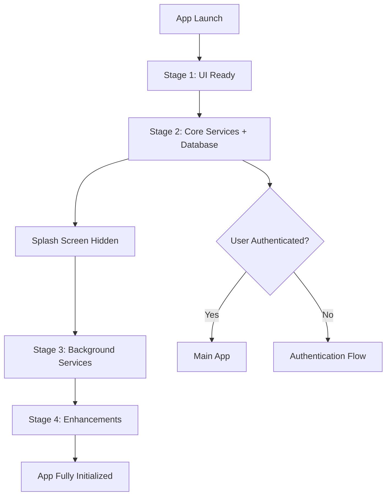

### 2. Initialization Stages

- **Stage 1 (0ms)**: UI providers ready, splash screen visible
- **Stage 2 (500ms)**: Database connection, auth service, core functionality
- **Stage 3 (2000ms)**: Background sync, notifications, network monitoring
- **Stage 4 (5000ms)**: Analytics, performance monitoring, optimizations

## 🔐 Authentication Flow

### Magic Link Authentication

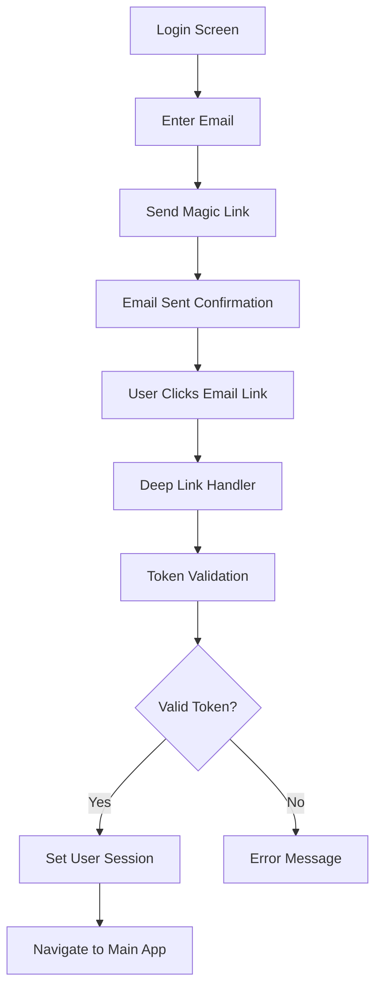

### Authentication States

1. **Unauthenticated**: Login screen visible
2. **Magic Link Sent**: Waiting for email verification
3. **Authenticating**: Processing magic link callback
4. **Authenticated**: User session established
5. **Error**: Authentication failed

### Deep Link Handling

- **Auth Callbacks**: `/auth/callback`, `/auth/confirm`, `/confirm`, `/callback`
- **Token Processing**: OTP tokens extracted from URL parameters
- **Race Condition Prevention**: Atomic URL processing with duplicate prevention
- **Database Ready Check**: Ensures Supabase client is initialized before token processing

## 🏠 Main App Navigation Flow

### Bottom Tab Navigation

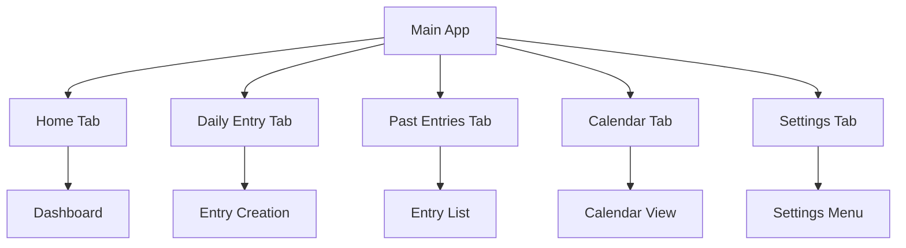

### Tab Features

1. **Home Tab**: Dashboard with streaks, insights, and quick actions
2. **Daily Entry Tab**: Create new gratitude entries
3. **Past Entries Tab**: Browse historical entries
4. **Calendar Tab**: Calendar view of entries
5. **Settings Tab**: App configuration and user preferences

## ✍️ Entry Creation Flow

### Daily Entry Process

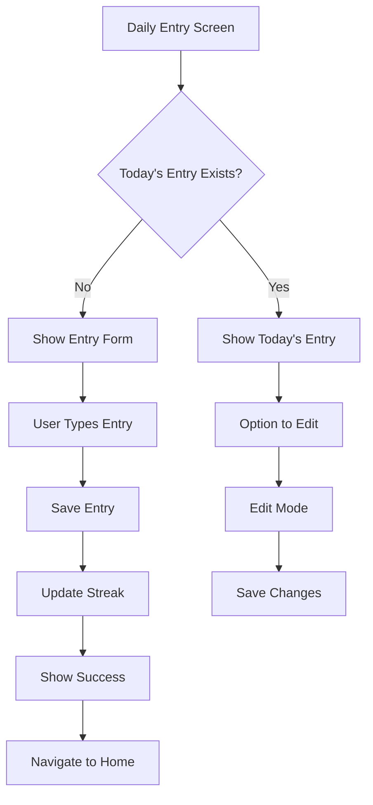

### Past Entry Creation

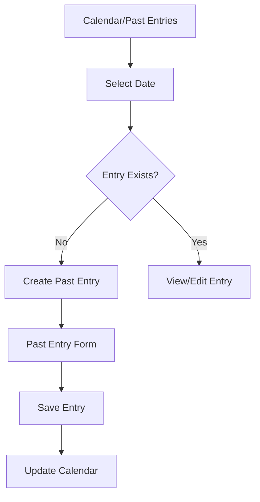

## 📅 Calendar & History Flow

### Calendar Navigation

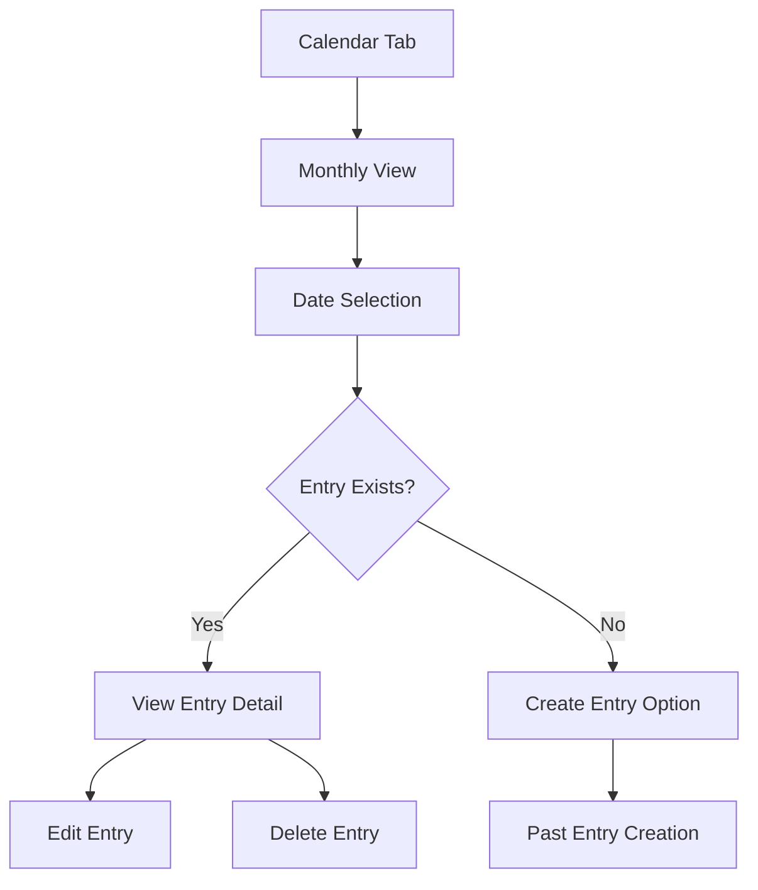

### Past Entries Browser

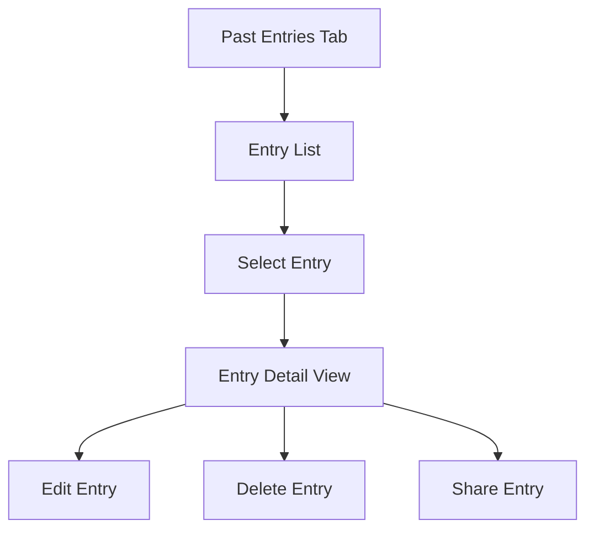

## 🎯 Onboarding Flow

### First-Time User Experience

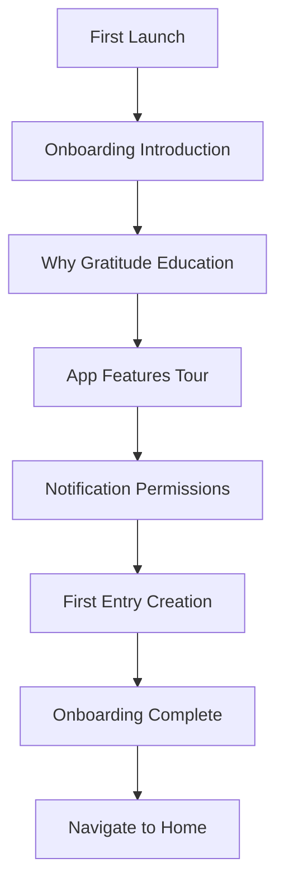

### Onboarding Steps

1. **Welcome**: App introduction and benefits
2. **Education**: Why gratitude matters
3. **Features**: App capabilities overview
4. **Permissions**: Notification setup
5. **First Entry**: Guided entry creation
6. **Completion**: Welcome to main app

## ⚙️ Settings & Configuration Flow

### Settings Navigation

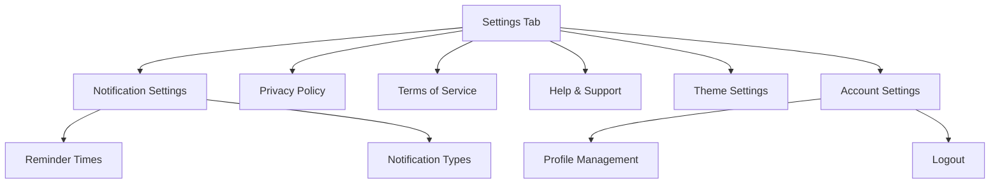

### Notification Settings

- **Daily Reminders**: Customizable reminder times
- **Streak Notifications**: Encouragement and milestone celebrations
- **Weekly Summaries**: Progress reports
- **Permission Management**: Enable/disable notification types

## 🏆 Streak & Progress Flow

### Streak Calculation

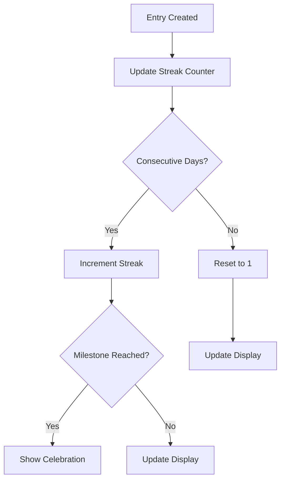

### Progress Tracking

- **Current Streak**: Consecutive days with entries
- **Longest Streak**: Personal best record
- **Total Entries**: Lifetime entry count
- **Monthly Progress**: Current month statistics

## 🔄 Data Sync Flow

### Background Synchronization

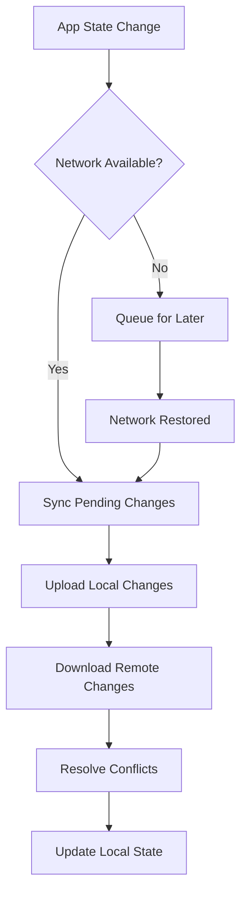

### Offline Support

- **Local Storage**: SQLite for offline entry storage
- **Conflict Resolution**: Last-write-wins with user notification
- **Queue Management**: Pending changes queue for sync
- **Network Detection**: Automatic sync when connectivity restored

## 🔔 Notification Flow

### Notification Types

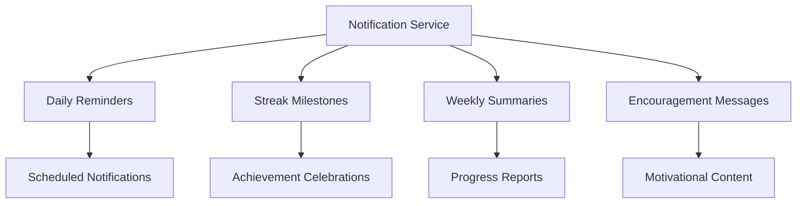

### Notification Scheduling

- **Daily Reminders**: User-configured times
- **Smart Scheduling**: Avoid notification spam
- **Time Zone Handling**: Proper local time calculation
- **Permission Management**: Graceful permission handling

## 🎉 Special Features Flow

### Throwback Memories

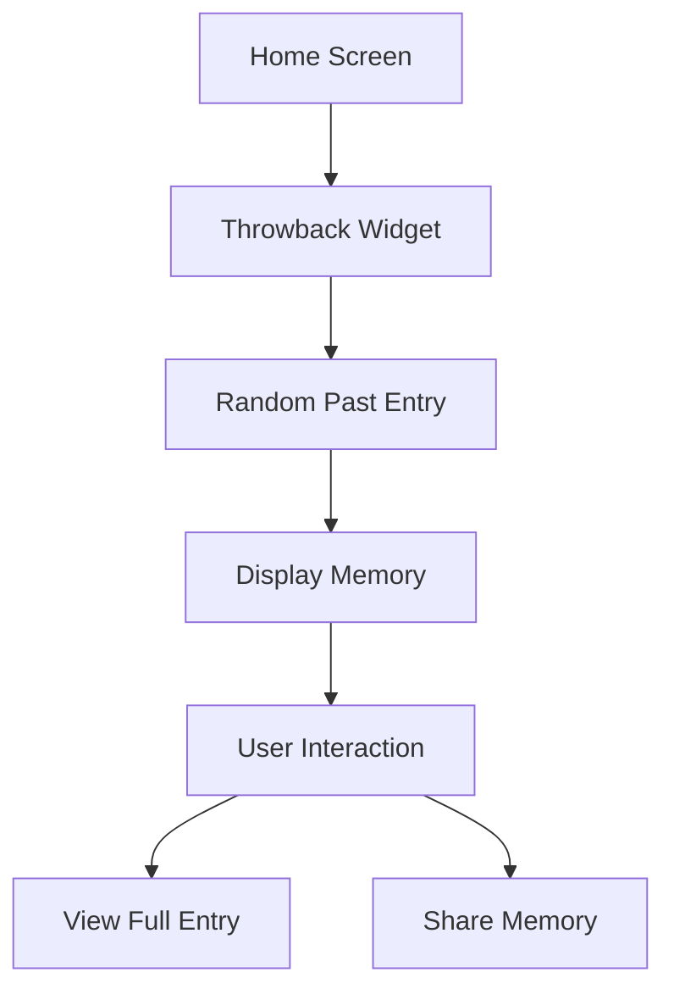

### Why Gratitude Education

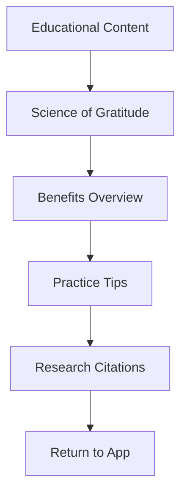

## 🔄 Error Handling Flow

### Error Recovery

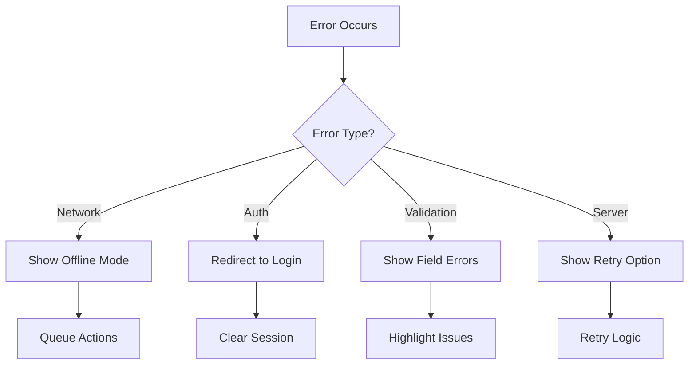

### Error Types

- **Network Errors**: Offline mode activation
- **Authentication Errors**: Session refresh or re-login
- **Validation Errors**: Form field highlighting
- **Server Errors**: Retry mechanisms
- **Client Errors**: Graceful degradation

## 📊 Analytics & Tracking Flow

### Event Tracking

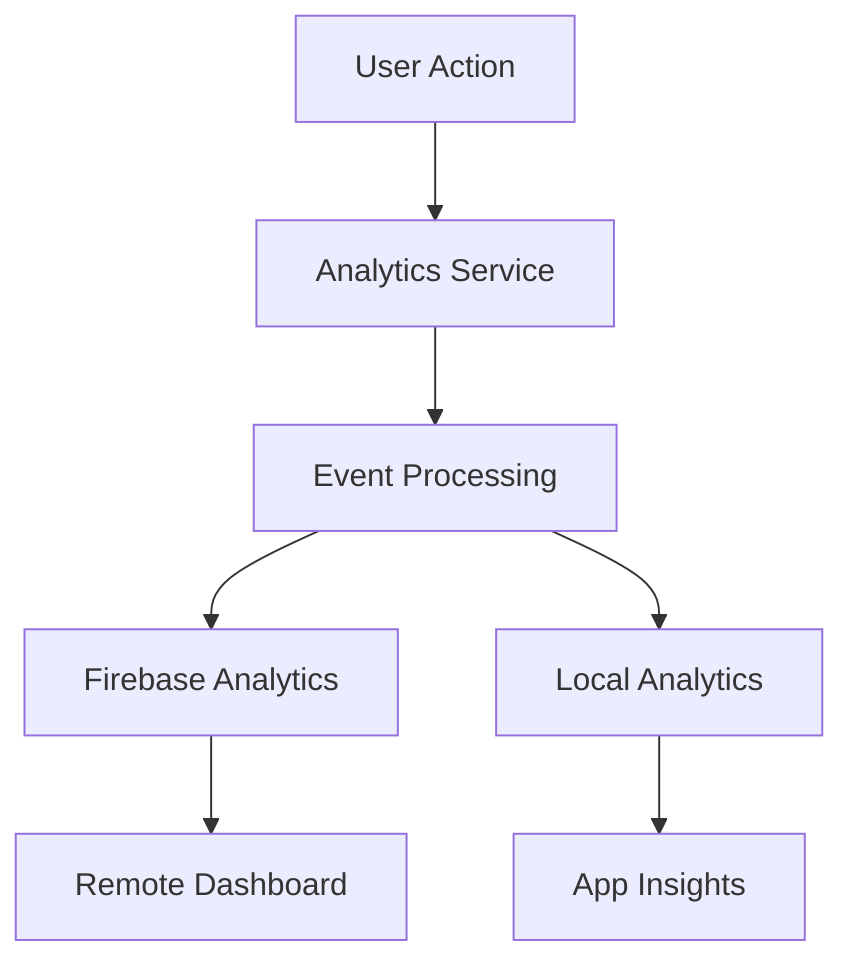

### Tracked Events

- **User Engagement**: Screen views, interaction times
- **Feature Usage**: Entry creation, calendar navigation
- **Performance**: App load times, error rates
- **Business Metrics**: Retention, streak completion

This comprehensive flow documentation covers all major user journeys and system interactions within the Yeser gratitude journaling application.
