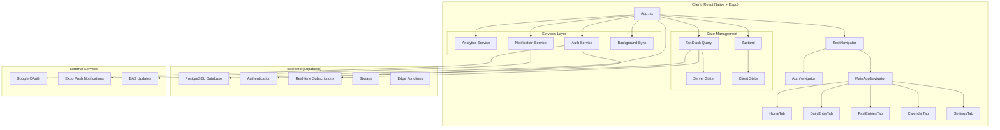
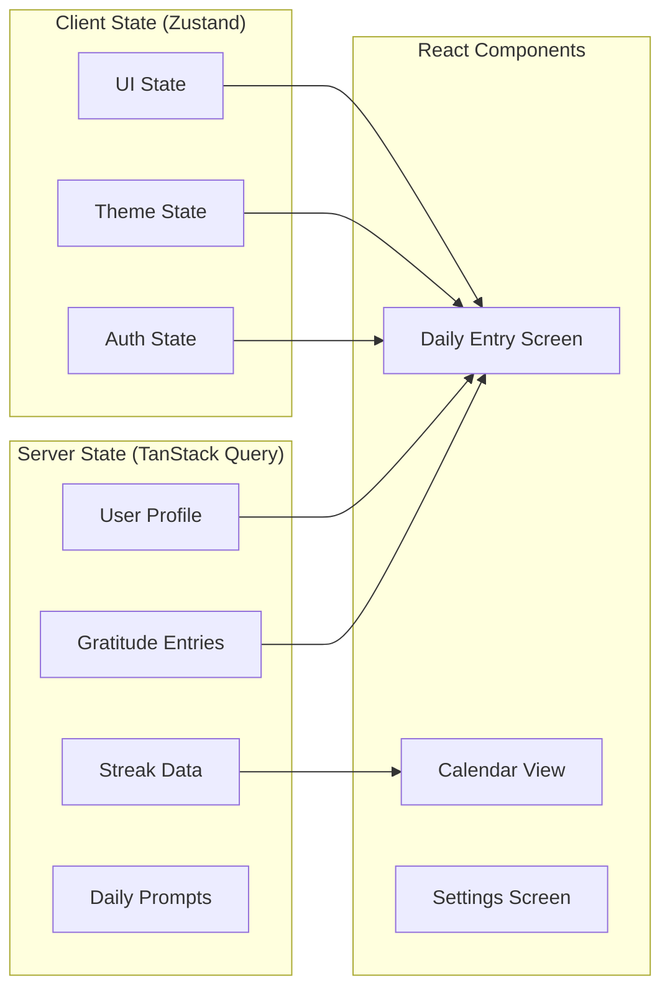
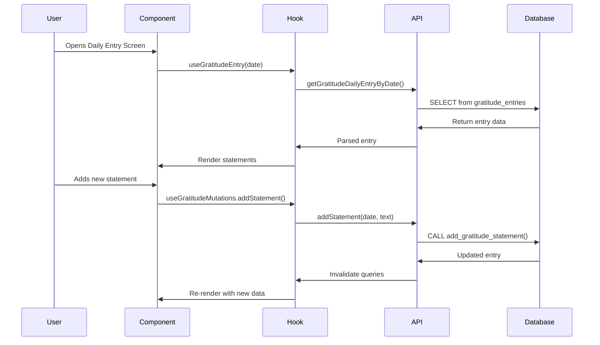
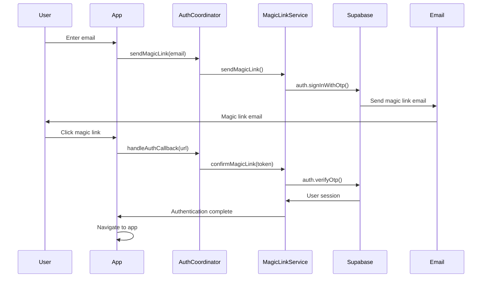

# App Architecture

> **Yeser** follows a modern, scalable React Native architecture with performance-first design principles.

## 🏗 High-Level Architecture



## 📱 Application Layer Structure

### Core Application Flow

```typescript
// App.tsx - Main entry point
App
├── AppProviders (Theme, Toast, Error, etc.)
├── SplashOverlayProvider
└── AppContent
    ├── NavigationContainer
    └── RootNavigator
        ├── AuthNavigator (if not authenticated)
        ├── OnboardingFlow (if not onboarded)
        └── MainAppNavigator (if ready)
```

### Feature-Based Module Structure

```
src/features/
├── auth/                    # Authentication system
│   ├── screens/            # Login, Splash screens
│   ├── services/           # Auth coordinator, magic links, OAuth
│   ├── store/              # Auth state management
│   ├── types/              # Auth-related types
│   └── utils/              # Auth utilities and validation
├── gratitude/              # Core gratitude functionality
│   ├── components/         # Input bar, statement cards, etc.
│   ├── hooks/              # Data fetching and mutations
│   └── screens/            # Daily entry, past entry creation
├── calendar/               # Calendar views and navigation
│   └── screens/            # Calendar view, past entries
├── settings/               # App configuration
│   └── screens/            # Settings, privacy, help
├── onboarding/             # User onboarding flow
│   └── screens/            # Multi-step onboarding
├── home/                   # Dashboard and overview
│   ├── components/         # Action cards, hero section
│   └── screens/            # Home screen
├── streak/                 # Gamification features
│   ├── components/         # Streak milestones, progress
│   └── hooks/              # Streak data management
└── throwback/              # Past entry reminders
    ├── components/         # Throwback modal, teaser
    └── hooks/              # Random entry fetching
```

## 🗄 Database Schema

### Core Tables

```sql
-- Users table (managed by Supabase Auth)
auth.users
├── id (uuid, primary key)
├── email
├── email_confirmed_at
└── created_at

-- User profiles
public.profiles
├── id (uuid, references auth.users.id)
├── username (text, nullable)
├── onboarded (boolean, default false)
├── reminder_enabled (boolean, default false)
├── reminder_time (time, default '09:00:00')
├── throwback_reminder_enabled (boolean, default false)
├── throwback_reminder_frequency (enum: daily/weekly/monthly/disabled)
├── throwback_reminder_time (time, default '19:00:00')
├── daily_gratitude_goal (integer, default 3)
├── use_varied_prompts (boolean, default false)
├── created_at (timestamptz)
└── updated_at (timestamptz)

-- Gratitude entries
public.gratitude_entries
├── id (uuid, primary key)
├── user_id (uuid, references auth.users.id)
├── entry_date (date, not null)
├── statements (jsonb, array of strings)
├── created_at (timestamptz)
└── updated_at (timestamptz)

-- Streaks tracking
public.streaks
├── id (uuid, primary key)
├── user_id (uuid, references auth.users.id, unique)
├── current_streak (integer, default 0)
├── longest_streak (integer, default 0)
├── last_entry_date (date, nullable)
├── created_at (timestamptz)
└── updated_at (timestamptz)

-- Daily prompts
public.daily_prompts
├── id (uuid, primary key)
├── prompt_text_tr (text, not null)
├── prompt_text_en (text, nullable)
└── category (text, nullable)
```

### Database Functions (RPC)

```sql
-- Statement management
add_gratitude_statement(p_entry_date date, p_statement text)
edit_gratitude_statement(p_entry_date date, p_statement_index int, p_updated_statement text)
delete_gratitude_statement(p_entry_date date, p_statement_index int)
delete_gratitude_entry_by_date(p_entry_date date)

-- Data retrieval
get_entry_dates_for_month(p_user_id uuid, p_year int, p_month int)
get_random_gratitude_entry(p_user_id uuid)
get_user_gratitude_entries_count()

-- Streak management
update_user_streak()
calculate_streak_for_user(p_user_id uuid)
```

## 🔄 Data Flow Architecture

### State Management Strategy



#### TanStack Query (Server State)

- **Gratitude data** - Entries, statements, calendar data
- **User profiles** - Settings, preferences, goals
- **Streak information** - Current/longest streaks
- **Prompt data** - Daily inspiration prompts

#### Zustand (Client State)

- **Authentication** - Session, user state, loading states
- **Theme** - Light/dark mode, theme preferences
- **UI State** - Modal visibility, navigation state

### API Layer Pattern

```typescript
// API Layer Structure
src/api/
├── queryClient.ts          # TanStack Query configuration
├── queryKeys.ts           # Centralized query key management
├── queryKeyHelpers.ts     # Query key utilities
├── gratitudeApi.ts        # Core gratitude operations
├── profileApi.ts          # User profile management
├── streakApi.ts           # Streak calculations
├── promptApi.ts           # Daily prompts
└── userDataApi.ts         # User data aggregation

// Query Key Hierarchy
const queryKeys = {
  gratitude: {
    all: ['gratitude'] as const,
    entries: () => [...queryKeys.gratitude.all, 'entries'] as const,
    entry: (date: string) => [...queryKeys.gratitude.entries(), date] as const,
    calendar: (year: number, month: number) =>
      [...queryKeys.gratitude.all, 'calendar', year, month] as const,
    paginated: (page: number, limit: number) =>
      [...queryKeys.gratitude.entries(), 'paginated', page, limit] as const,
  },
  profile: {
    all: ['profile'] as const,
    current: () => [...queryKeys.profile.all, 'current'] as const,
  },
  streaks: {
    all: ['streaks'] as const,
    current: () => [...queryKeys.streaks.all, 'current'] as const,
  },
}
```

## 🎯 Business Logic Flow

### Daily Gratitude Entry Process



### Authentication Flow



## 🏢 Service Layer Architecture

### Core Services

```typescript
// Service Manager Pattern
src/services/
├── ServiceManager.ts      # Centralized service lifecycle management
├── analyticsService.ts    # User behavior tracking
├── authService.ts         # Authentication utilities
├── notificationService.ts # Push notification management
├── backgroundSyncService.ts # Offline sync capabilities
├── cacheService.ts        # Data caching strategies
├── networkMonitorService.ts # Network status monitoring
└── productionLogger.ts    # Production logging service
```

### Service Initialization

```typescript
// ServiceManager - Coordinates all services
export class ServiceManager {
  private services: Map<string, Service> = new Map();

  async initializeCore(): Promise<void> {
    // Initialize critical services first
    await this.register('analytics', analyticsService);
    await this.register('network', networkMonitorService);
    await this.register('logger', productionLogger);
  }

  async initializeUserServices(): Promise<void> {
    // Initialize user-dependent services after auth
    await this.register('notifications', notificationService);
    await this.register('backgroundSync', backgroundSyncService);
    await this.register('cache', cacheService);
  }
}
```

## 🎨 UI Architecture

### Component Hierarchy

```
shared/components/
├── layout/                 # Layout components
│   ├── ScreenLayout.tsx   # Main screen wrapper
│   ├── ScreenHeader.tsx   # Consistent headers
│   ├── ScreenContent.tsx  # Content areas
│   └── ErrorBoundary.tsx  # Error boundaries
├── ui/                    # Reusable UI components
│   ├── ThemedButton.tsx   # Consistent buttons
│   ├── ThemedCard.tsx     # Card components
│   ├── ThemedInput.tsx    # Form inputs
│   ├── StatementCard.tsx  # Gratitude statement display
│   └── LoadingSkeleton.tsx # Loading states
└── states/                # State components
    ├── ErrorState.tsx     # Error displays
    └── LoadingState.tsx   # Loading displays
```

### Theme System

```typescript
// Theme Architecture
src/themes/
├── types.ts              # Theme type definitions
├── lightTheme.ts         # Light mode theme
├── darkTheme.ts          # Dark mode theme
├── utils.ts              # Theme utilities
└── animations.ts         # Animation constants

// Theme Provider Pattern
const ThemeProvider: React.FC = ({ children }) => {
  const [colorMode, setColorMode] = useState<'light' | 'dark'>('light');
  const theme = colorMode === 'dark' ? darkTheme : lightTheme;

  return (
    <ThemeContext.Provider value={{ theme, colorMode, setColorMode }}>
      {children}
    </ThemeContext.Provider>
  );
};
```

## 🔧 Performance Architecture

### Optimization Strategies

1. **Memoization Pattern**

   ```typescript
   // Component memoization
   const Component = React.memo(({ data, onPress }) => {
     const processedData = useMemo(() =>
       data.filter(item => item.isActive), [data]
     );

     const handlePress = useCallback((id: string) =>
       onPress(id), [onPress]
     );

     return <View>{/* Render */}</View>;
   });
   ```

2. **Query Optimization**

   ```typescript
   // Efficient query patterns
   const { data, isLoading } = useQuery({
     queryKey: queryKeys.gratitude.entry(date),
     queryFn: () => gratitudeApi.getEntry(date),
     staleTime: 5 * 60 * 1000, // 5 minutes
     cacheTime: 10 * 60 * 1000, // 10 minutes
     enabled: !!date, // Conditional fetching
   });
   ```

3. **Bundle Optimization**
   - Import organization following 72% bundle impact rules
   - Eliminated unused imports across codebase
   - StyleSheet.create() usage (15% render performance gain)

### Memory Management

```typescript
// Cleanup patterns
useEffect(() => {
  const cleanup = () => {
    // Clear timers, subscriptions, etc.
    timeoutRefs.forEach((ref) => clearTimeout(ref));
    animationRefs.forEach((ref) => ref.stop());
  };

  return cleanup;
}, []);
```

## 🔐 Security Architecture

### Authentication Security

- **Magic Link Flow** - Secure, passwordless authentication
- **Token Management** - Automatic refresh with secure storage
- **Session Validation** - Continuous session verification
- **Deep Link Security** - Protected auth callback handling

### Data Security

- **Row Level Security (RLS)** - Database-level user isolation
- **Input Validation** - Zod schemas for runtime validation
- **API Security** - Supabase authentication on all endpoints
- **Local Storage** - Secure token storage via Expo SecureStore

## 📱 Platform Integration

### React Native Integration

- **Expo Managed Workflow** - Simplified development and deployment
- **Native Modules** - Calendar, notifications, haptic feedback
- **Platform Adaptation** - iOS/Android specific optimizations
- **Deep Linking** - Universal links and custom URL schemes

### Third-Party Services

- **Supabase Integration** - Complete backend as a service
- **Google OAuth** - Social authentication option
- **Expo Notifications** - Cross-platform push notifications
- **EAS Build** - Cloud-based native app compilation

## 🔄 Development Workflow

### Code Organization Principles

1. **Feature-First Structure** - Related code grouped by business domain
2. **Separation of Concerns** - Clear boundaries between layers
3. **Dependency Injection** - Services injected rather than imported
4. **Type Safety First** - TypeScript strict mode with zero `any` types
5. **Performance by Default** - Optimizations built into patterns

### Testing Strategy

```typescript
// Testing pyramid
Unit Tests (70%)
├── Utility functions
├── Custom hooks
├── API functions
└── Component logic

Integration Tests (20%)
├── Feature workflows
├── API integration
└── Navigation flows

E2E Tests (10%)
├── Critical user paths
├── Authentication flow
└── Core gratitude workflow
```

This architecture ensures scalability, maintainability, and performance while following React Native best practices and providing an excellent user experience.
