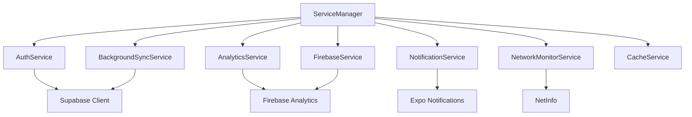

# App Architecture

## 🏗️ Overall Architecture

Yeser follows a **feature-based modular architecture** with clear separation of concerns, modern React Native patterns, and performance optimizations.

## 📁 Directory Structure

```
src/
├── App.tsx                     # App entry point with initialization
├── api/                        # API layer and query configurations
├── assets/                     # Static assets (animations, sounds, images)
├── components/                 # Shared UI components
├── config/                     # App configuration
├── features/                   # Feature-based modules
│   ├── auth/                   # Authentication feature
│   ├── calendar/               # Calendar view feature
│   ├── gratitude/              # Gratitude entries feature
│   ├── home/                   # Home dashboard feature
│   ├── onboarding/             # User onboarding feature
│   ├── profile/                # User profile feature
│   ├── settings/               # App settings feature
│   ├── streak/                 # Streak tracking feature
│   ├── throwback/              # Memory throwback feature
│   └── whyGratitude/           # Educational content feature
├── hooks/                      # Global custom hooks
├── navigation/                 # Navigation configuration
├── providers/                  # React context providers
├── schemas/                    # Zod validation schemas
├── services/                   # Core services layer
├── shared/                     # Shared utilities and components
├── store/                      # Global Zustand stores
├── themes/                     # Theme system
├── types/                      # TypeScript type definitions
└── utils/                      # Utility functions
```

## 🎯 Architectural Principles

### 1. Feature-Based Organization

Each feature is self-contained with its own:

- **Components**: Feature-specific UI components
- **Hooks**: Feature-specific business logic
- **Screens**: Feature navigation screens
- **Services**: Feature API interactions
- **Store**: Feature state management
- **Types**: Feature-specific TypeScript types

### 2. Separation of Concerns

- **Presentation Layer**: React components and screens
- **Business Logic Layer**: Custom hooks and services
- **Data Layer**: Zustand stores and TanStack Query
- **API Layer**: Supabase integration and API wrappers

### 3. Performance-First Design

- **Memoization**: Extensive use of `React.memo`, `useMemo`, `useCallback`
- **Code Splitting**: Feature-based module organization
- **Lazy Loading**: Dynamic imports where applicable
- **Bundle Optimization**: Strict unused import elimination

## 🔧 Core Technologies

### Frontend Framework

- **React Native 0.79.3**: Latest stable version
- **Expo 53**: Managed workflow with custom development builds
- **TypeScript**: Strict type safety (zero `any` types allowed)

### State Management

- **Zustand**: Client-side state management
- **TanStack Query v5**: Server state management and caching
- **React Context**: Theme and provider state

### Backend & Database

- **Supabase**: Backend-as-a-Service
  - PostgreSQL database
  - Authentication
  - Real-time subscriptions
  - File storage

### Development Tools

- **ESLint**: Code quality enforcement
- **Prettier**: Code formatting
- **Husky**: Git hooks
- **TypeScript**: Static type checking

## 🏛️ Service Architecture

### Core Services

1. **ServiceManager**: 4-stage initialization orchestrator
2. **AuthService**: Authentication operations
3. **AnalyticsService**: Event tracking and analytics
4. **NotificationService**: Push notification handling
5. **BackgroundSyncService**: Offline data synchronization
6. **NetworkMonitorService**: Connectivity monitoring
7. **FirebaseService**: Firebase integration
8. **CacheService**: Application caching

### Service Dependencies



## 🔄 Data Flow Architecture

### Client State (Zustand)

- **Theme Store**: UI theme and appearance settings
- **Auth Store**: Authentication state and actions
- **Feature Stores**: Feature-specific client state

### Server State (TanStack Query)

- **Query Keys**: Hierarchical cache key structure
- **Custom Hooks**: Feature-specific data fetching
- **Optimistic Updates**: Enhanced UX for mutations
- **Background Sync**: Automatic data synchronization

### Data Flow Pattern

1. **UI Component** triggers action
2. **Custom Hook** handles business logic
3. **Service Layer** processes requests
4. **API Layer** communicates with backend
5. **State Management** updates application state
6. **UI Re-renders** with new data

## 🎨 Theme Architecture

### Theme System

```typescript
interface AppTheme {
  colors: {
    primary: string;
    surface: string;
    background: string;
    // ... comprehensive color palette
  };
  spacing: {
    xs: number;
    sm: number;
    md: number;
    // ... consistent spacing scale
  };
  typography: {
    // Font definitions
  };
  borderRadius: {
    // Border radius scale
  };
}
```

### Theme Provider

- **ThemeProvider**: React context for theme state
- **ThemeStore**: Zustand store for theme persistence
- **Theme Utils**: Helper functions for styling

## 🔐 Security Architecture

### Authentication Security

- **Magic Link Authentication**: Secure email-based auth
- **Google OAuth**: Social authentication (disabled during refactor)
- **JWT Tokens**: Automatic token management
- **Session Persistence**: Secure token storage

### Data Security

- **Row Level Security**: Supabase RLS policies
- **Type Validation**: Zod schema validation
- **Input Sanitization**: Comprehensive input validation
- **Environment Variables**: Secure configuration management

## 📱 Platform Architecture

### Cross-Platform Strategy

- **Shared Codebase**: 95%+ code sharing between iOS/Android
- **Platform-Specific Code**: Platform.select() for differences
- **Native Modules**: Expo modules for native functionality
- **Performance Optimization**: Platform-specific optimizations

### Build Configuration

- **Development**: Local development with Expo Go
- **Preview**: Internal testing builds
- **Production**: Optimized release builds
- **EAS Build**: Cloud build service

## 🔄 Update Strategy

### Code Updates

- **Over-the-Air Updates**: Expo Updates for JavaScript changes
- **Binary Updates**: App Store/Play Store for native changes
- **Rollback Capability**: Safe update deployment

### Database Migrations

- **Supabase Migrations**: Version-controlled schema changes
- **Backward Compatibility**: Graceful migration handling
- **Data Validation**: Pre/post-migration validation

## 📊 Performance Architecture

### Bundle Optimization

- **Tree Shaking**: Elimination of unused code
- **Code Splitting**: Feature-based chunks
- **Import Analysis**: Strict unused import removal
- **Bundle Analysis**: Regular bundle size monitoring

### Runtime Performance

- **Memoization Strategy**: Strategic component memoization
- **Lazy Loading**: Deferred loading of non-critical features
- **Image Optimization**: Efficient image loading and caching
- **Memory Management**: Proper cleanup and garbage collection

### Cold Start Optimization

- **4-Stage Initialization**: Progressive app startup
- **Critical Path Loading**: Priority-based resource loading
- **Background Initialization**: Non-blocking service startup
- **Splash Screen Management**: Optimized splash screen handling

This architecture provides a scalable, maintainable, and performant foundation for the Yeser gratitude journaling application.
