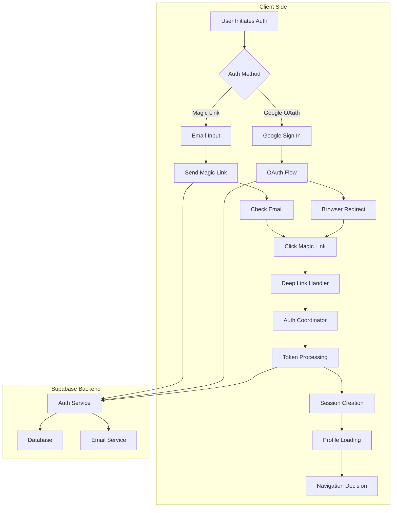
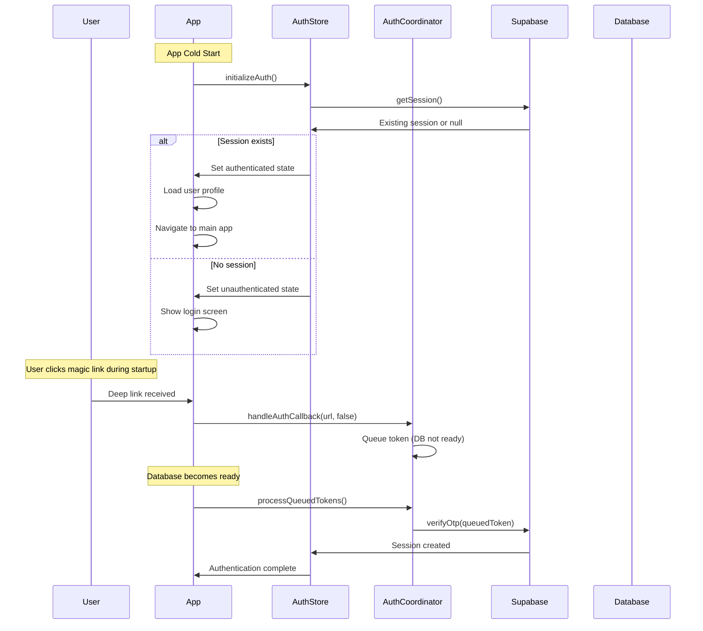
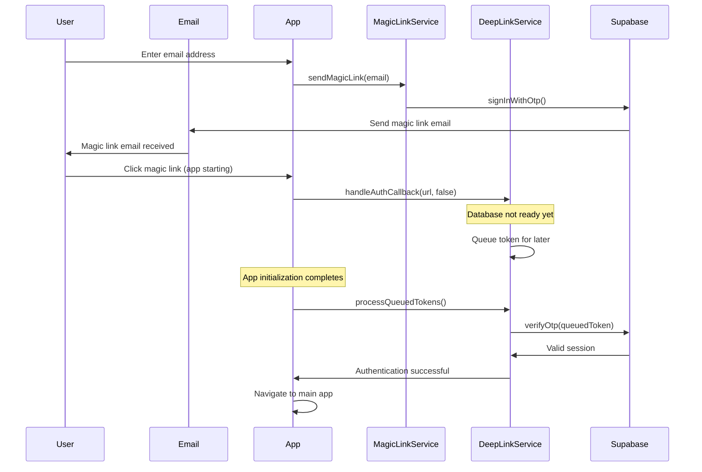
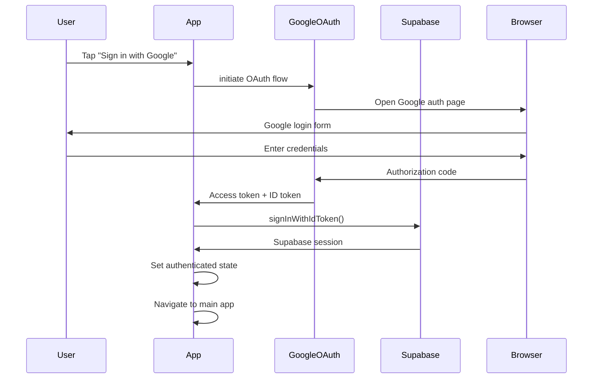

# Authentication Flow

> Comprehensive guide to Yeser's sophisticated authentication system supporting magic links, Google OAuth, and complex deep link handling.

## 🔐 Overview

Yeser implements a multi-layered authentication system built on Supabase Auth with support for:

- **Magic Link Authentication** - Passwordless email-based login
- **Google OAuth** - Social authentication with Google
- **Deep Link Handling** - Secure auth callback processing
- **Token Queue Management** - Handling authentication during app startup
- **Session Management** - Persistent sessions with automatic refresh

## 🏗 Authentication Architecture



## 🧩 Core Components

### 1. Auth Coordinator Service

The central orchestrator for all authentication flows:

```typescript
// src/features/auth/services/authCoordinator.ts
export class AuthCoordinator {
  /**
   * Send magic link with rate limiting and error handling
   */
  async sendMagicLink(credentials: MagicLinkCredentials, callbacks: AuthCallbacks): Promise<void> {
    logger.debug('Auth coordinator: Initiating magic link send');

    return magicLinkService.sendMagicLink(
      credentials,
      callbacks.onSuccess,
      callbacks.onError,
      callbacks.setLoading,
      callbacks.setMagicLinkSent
    );
  }

  /**
   * Handle auth callbacks from deep links
   */
  async handleAuthCallback(url: string, databaseReady: boolean = false): Promise<void> {
    logger.debug('Auth coordinator: Handling auth callback', { url, databaseReady });
    return deepLinkService.handleAuthCallback(url, databaseReady);
  }

  /**
   * Process queued tokens when database becomes ready
   */
  async processQueuedTokens(): Promise<void> {
    logger.debug('Auth coordinator: Processing queued tokens');
    return deepLinkService.processQueuedTokens();
  }
}
```

### 2. Magic Link Service

Handles passwordless authentication via email:

```typescript
// src/features/auth/services/magicLinkService.ts
class MagicLinkService {
  private requestQueue: Map<string, MagicLinkRequest> = new Map();
  private rateLimitMap: Map<string, number> = new Map();
  private readonly RATE_LIMIT_MINUTES = 1;

  async sendMagicLink(
    credentials: MagicLinkCredentials,
    onSuccess: (message: string) => void,
    onError: (error: Error) => void,
    setLoading: (loading: boolean) => void,
    setMagicLinkSent: (sent: boolean) => void
  ): Promise<void> {
    const { email } = credentials;

    // Rate limiting check
    if (!this.canSendMagicLink(email)) {
      const remainingTime = this.getMagicLinkCooldownRemaining(email);
      throw new Error(`Please wait ${remainingTime} seconds before requesting another link.`);
    }

    setLoading(true);

    try {
      const { error } = await supabase.auth.signInWithOtp({
        email,
        options: {
          emailRedirectTo: this.getRedirectUrl(),
          shouldCreateUser: true,
        },
      });

      if (error) throw error;

      // Set rate limit
      this.rateLimitMap.set(email, Date.now());

      setMagicLinkSent(true);
      onSuccess('Magic link sent! Check your email.');

      logger.debug('Magic link sent successfully', { email: email.charAt(0) + '***' });
    } catch (error) {
      logger.error('Magic link send failed:', error);
      onError(error as Error);
    } finally {
      setLoading(false);
    }
  }

  private getRedirectUrl(): string {
    const env = config.app.environment;
    const scheme = config.app.scheme;

    if (env === 'development') {
      return `${scheme}-dev://auth/callback`;
    } else if (env === 'preview') {
      return `${scheme}-preview://auth/callback`;
    }
    return `${scheme}://auth/callback`;
  }
}
```

### 3. Deep Link Service

Manages authentication callbacks and token processing:

```typescript
// src/features/auth/services/deepLinkService.ts
class DeepLinkService {
  private otpTokenQueue: Array<QueuedOTPToken> = [];
  private isProcessing = false;

  async handleAuthCallback(url: string, databaseReady: boolean): Promise<void> {
    const parsedUrl = new URL(url);

    // Extract tokens from URL
    const tokens = this.extractTokensFromUrl(parsedUrl);

    if (tokens.type === 'oauth') {
      await this.handleOAuthTokens(tokens, databaseReady);
    } else if (tokens.type === 'magic_link') {
      await this.handleMagicLinkTokens(tokens, databaseReady);
    }
  }

  private async handleOAuthTokens(tokens: OAuthTokens, databaseReady: boolean): Promise<void> {
    if (databaseReady) {
      logger.debug('OAuth tokens found, processing immediately');

      const authStore = useAuthStore.getState();
      await authStore.setSessionFromTokens(tokens.accessToken, tokens.refreshToken);

      analyticsService.logEvent('oauth_tokens_processed');
    } else {
      // Queue tokens for later processing
      this.queueOAuthTokens(tokens);
    }
  }

  private async handleMagicLinkTokens(
    tokens: MagicLinkTokens,
    databaseReady: boolean
  ): Promise<void> {
    if (databaseReady) {
      await this.processMagicLinkToken(tokens.tokenHash, tokens.type);
    } else {
      // Queue for later processing
      this.queueOTPToken(tokens);
    }
  }

  async processQueuedTokens(): Promise<void> {
    if (this.isProcessing || this.otpTokenQueue.length === 0) return;

    this.isProcessing = true;
    logger.debug(`Processing ${this.otpTokenQueue.length} queued tokens`);

    try {
      const tokensCopy = [...this.otpTokenQueue];
      this.otpTokenQueue = [];

      for (const queuedToken of tokensCopy) {
        await this.processMagicLinkToken(queuedToken.tokenHash, queuedToken.type);
      }
    } catch (error) {
      logger.error('Error processing queued tokens:', error);
    } finally {
      this.isProcessing = false;
    }
  }
}
```

### 4. Google OAuth Service

Handles Google social authentication:

```typescript
// src/features/auth/services/expoGoogleOAuthService.ts
class ExpoGoogleOAuthService {
  async signInWithGoogle(): Promise<AuthResult> {
    try {
      // Get platform-specific client ID
      const clientId = this.getClientId();

      if (!clientId) {
        throw new Error('Google OAuth not configured for this platform');
      }

      // Initiate Google authentication
      const result = await Google.logInAsync({
        clientId,
        scopes: ['profile', 'email'],
        redirectUrl: config.google.redirectUri,
      });

      if (result.type === 'success') {
        // Exchange Google token for Supabase session
        const { data, error } = await supabase.auth.signInWithIdToken({
          provider: 'google',
          token: result.idToken!,
          access_token: result.accessToken!,
        });

        if (error) throw error;

        return {
          success: true,
          user: data.user,
          session: data.session,
        };
      }

      return { success: false, error: 'Google sign-in cancelled' };
    } catch (error) {
      logger.error('Google OAuth failed:', error);
      return {
        success: false,
        error: error instanceof Error ? error.message : 'Unknown error',
      };
    }
  }

  private getClientId(): string | undefined {
    if (Platform.OS === 'ios') {
      return config.google.clientIdIOS;
    } else if (Platform.OS === 'android') {
      return config.google.clientIdAndroid;
    }
    return config.google.clientIdWeb;
  }
}
```

## 🔄 Authentication State Management

### Zustand Auth Store

```typescript
// src/store/authStore.ts
interface AuthState {
  isAuthenticated: boolean;
  isLoading: boolean;
  magicLinkSent: boolean;
  user: User | null;
  session: Session | null;

  // Actions
  initializeAuth: () => Promise<void>;
  setSessionFromTokens: (accessToken: string, refreshToken: string) => Promise<void>;
  signOut: () => Promise<void>;
  resetMagicLinkSent: () => void;
}

const useAuthStore = create<AuthState>((set, get) => ({
  isAuthenticated: false,
  isLoading: true,
  magicLinkSent: false,
  user: null,
  session: null,

  initializeAuth: async () => {
    try {
      set({ isLoading: true });

      // Get existing session
      const {
        data: { session },
        error,
      } = await supabase.auth.getSession();

      if (error) {
        logger.error('Session recovery failed:', error);
        set({ isAuthenticated: false, isLoading: false });
        return;
      }

      if (session) {
        set({
          isAuthenticated: true,
          user: session.user,
          session,
          isLoading: false,
        });

        // Set up auth state change listener
        supabase.auth.onAuthStateChange((event, session) => {
          logger.debug('Auth state changed:', event);

          if (event === 'SIGNED_IN' && session) {
            set({
              isAuthenticated: true,
              user: session.user,
              session,
            });
          } else if (event === 'SIGNED_OUT') {
            set({
              isAuthenticated: false,
              user: null,
              session: null,
              magicLinkSent: false,
            });
          }
        });
      } else {
        set({ isAuthenticated: false, isLoading: false });
      }
    } catch (error) {
      logger.error('Auth initialization failed:', error);
      set({ isAuthenticated: false, isLoading: false });
    }
  },

  setSessionFromTokens: async (accessToken: string, refreshToken: string) => {
    try {
      const { data, error } = await supabase.auth.setSession({
        access_token: accessToken,
        refresh_token: refreshToken,
      });

      if (error) throw error;

      set({
        isAuthenticated: true,
        user: data.user,
        session: data.session,
        magicLinkSent: false,
      });

      logger.debug('Session set from tokens successfully');
    } catch (error) {
      logger.error('Failed to set session from tokens:', error);
      throw error;
    }
  },

  signOut: async () => {
    try {
      await supabase.auth.signOut();
      set({
        isAuthenticated: false,
        user: null,
        session: null,
        magicLinkSent: false,
      });
    } catch (error) {
      logger.error('Sign out failed:', error);
      throw error;
    }
  },
}));
```

## 🔗 Deep Link Handling

### URL Processing & Security

```typescript
// App.tsx - Deep link handling
const handleDeepLink = async (url: string, databaseReady: boolean = false) => {
  try {
    logger.debug('Deep link received:', { url, databaseReady });

    // Race condition protection
    if (!atomicUrlProcessingCheck(url)) {
      return;
    }

    const parsedUrl = new URL(url);

    // Check for auth callback paths
    const authPaths = ['/auth/callback', '/auth/confirm', '/confirm', '/callback'];
    const isAuthCallback = authPaths.includes(parsedUrl.pathname);

    if (isAuthCallback) {
      logger.debug('Auth callback detected');

      // Extract tokens from URL
      const fragment = parsedUrl.hash.substring(1);
      const fragmentParams = new URLSearchParams(fragment);
      const queryParams = parsedUrl.searchParams;

      // OAuth tokens (access_token + refresh_token)
      const accessToken = fragmentParams.get('access_token') || queryParams.get('access_token');
      const refreshToken = fragmentParams.get('refresh_token') || queryParams.get('refresh_token');

      // Magic link tokens
      const tokenHash =
        fragmentParams.get('token_hash') ||
        fragmentParams.get('token') ||
        queryParams.get('token_hash') ||
        queryParams.get('token');

      if (accessToken && refreshToken) {
        await handleOAuthTokens(accessToken, refreshToken, databaseReady);
      } else if (tokenHash) {
        await handleMagicLinkToken(tokenHash, databaseReady);
      } else {
        logger.error('No valid tokens found in auth callback URL');
      }
    }
  } catch (error) {
    logger.error('Deep link processing failed:', error);
  } finally {
    markUrlProcessingCompleted(url);
  }
};

// Race condition prevention
const atomicUrlProcessingCheck = (url: string): boolean => {
  const existingState = urlProcessingMap.get(url);
  const now = Date.now();

  // Check if URL is currently being processed
  if (existingState?.status === 'processing') {
    logger.debug('URL already being processed, ignoring duplicate:', { url });
    return false;
  }

  // Check if URL was recently completed (within 30 seconds)
  if (existingState?.status === 'completed' && now - existingState.timestamp < 30000) {
    logger.debug('URL recently processed, ignoring duplicate:', { url });
    return false;
  }

  // Mark URL as being processed atomically
  urlProcessingMap.set(url, { status: 'processing', timestamp: now });
  return true;
};
```

## 🔄 Complex Authentication Flows

### Cold Start Authentication



### Magic Link Flow with Queueing



### Google OAuth Flow



## 🛡️ Security Considerations

### Token Security

1. **Secure Storage**

   ```typescript
   // Tokens stored securely via Supabase client
   // No manual token storage in AsyncStorage
   const { data, error } = await supabase.auth.getSession();
   ```

2. **Token Validation**

   ```typescript
   // All API calls automatically include auth headers
   // RLS policies enforce user isolation
   const { data } = await supabase.from('gratitude_entries').select('*').eq('user_id', user.id); // Enforced by RLS
   ```

3. **Deep Link Validation**

   ```typescript
   // Validate redirect URLs
   const allowedOrigins = [
     'yeser://auth/callback',
     'yeser-dev://auth/callback',
     'yeser-preview://auth/callback',
   ];

   if (!allowedOrigins.includes(redirectUrl)) {
     throw new Error('Invalid redirect URL');
   }
   ```

### Rate Limiting

```typescript
// Magic link rate limiting
class RateLimiter {
  private attempts: Map<string, number[]> = new Map();
  private readonly WINDOW_MS = 60 * 1000; // 1 minute
  private readonly MAX_ATTEMPTS = 3;

  canMakeRequest(email: string): boolean {
    const now = Date.now();
    const userAttempts = this.attempts.get(email) || [];

    // Remove old attempts outside window
    const validAttempts = userAttempts.filter((attempt) => now - attempt < this.WINDOW_MS);

    return validAttempts.length < this.MAX_ATTEMPTS;
  }

  recordAttempt(email: string): void {
    const now = Date.now();
    const userAttempts = this.attempts.get(email) || [];
    userAttempts.push(now);
    this.attempts.set(email, userAttempts);
  }
}
```

## 📊 Authentication Analytics

### Event Tracking

```typescript
// Authentication analytics
const authAnalytics = {
  loginAttempt: (method: 'magic_link' | 'google_oauth') => {
    analyticsService.logEvent('auth_login_attempt', { method });
  },

  loginSuccess: (method: string, timeToComplete: number) => {
    analyticsService.logEvent('auth_login_success', {
      method,
      time_to_complete: timeToComplete,
    });
  },

  loginError: (method: string, error: string) => {
    analyticsService.logEvent('auth_login_error', { method, error });
  },

  deepLinkProcessed: (type: string, queuedTime?: number) => {
    analyticsService.logEvent('auth_deep_link_processed', {
      type,
      queued_time: queuedTime,
    });
  },
};
```

## 🔧 Development & Testing

### Auth Testing Utilities

```typescript
// Test utilities for authentication
export const authTestUtils = {
  // Mock successful authentication
  mockAuthSuccess: () => {
    const mockUser = { id: 'test-user', email: 'test@example.com' };
    const mockSession = { user: mockUser, access_token: 'mock-token' };

    useAuthStore.setState({
      isAuthenticated: true,
      user: mockUser,
      session: mockSession,
      isLoading: false,
    });
  },

  // Reset auth state
  resetAuthState: () => {
    useAuthStore.setState({
      isAuthenticated: false,
      user: null,
      session: null,
      isLoading: false,
      magicLinkSent: false,
    });
  },

  // Mock deep link processing
  mockDeepLink: (url: string) => {
    return handleDeepLink(url, true);
  },
};
```

This authentication system provides robust, secure, and user-friendly authentication while handling complex edge cases like cold start authentication, token queueing, and race condition prevention.
