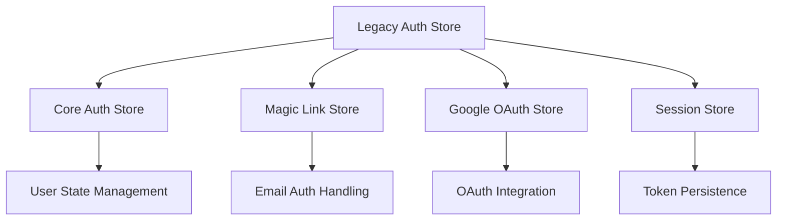
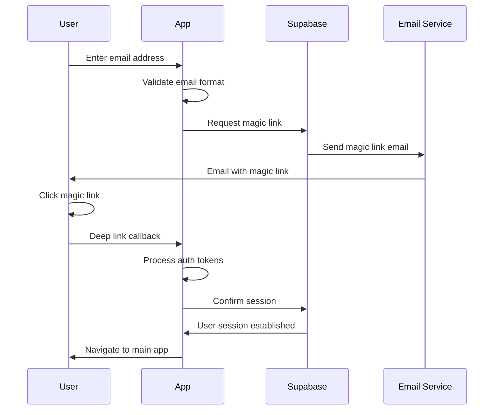
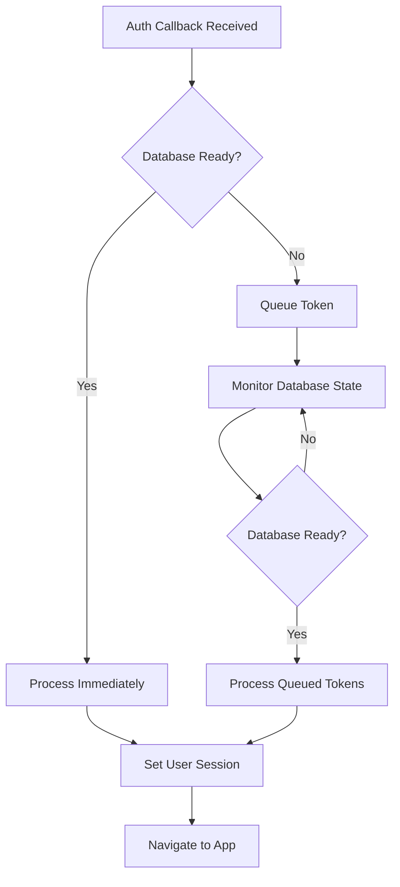
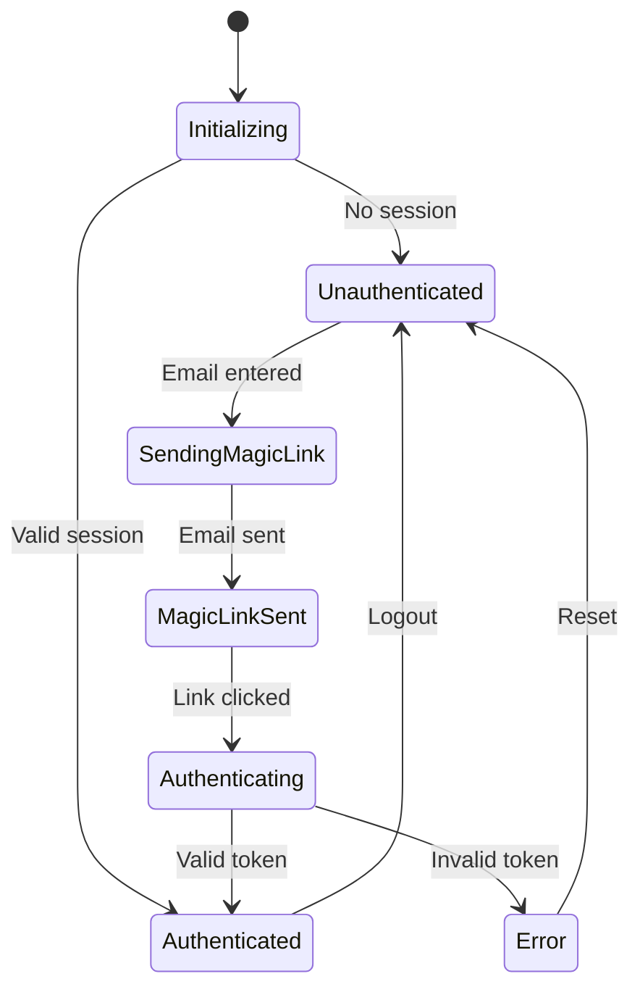

# Authentication Flow

## 🔐 Comprehensive Authentication System

The Yeser app implements a modular, secure authentication system supporting magic link authentication with a sophisticated token handling mechanism designed for production reliability.

## 🏗️ Authentication Architecture

### Modular Store System

The authentication system uses a modular approach with specialized stores:



### Store Responsibilities

1. **Core Auth Store**: User state, session management, initialization
2. **Magic Link Store**: Email authentication, rate limiting, token processing
3. **Google OAuth Store**: Social authentication (currently disabled during refactor)
4. **Session Store**: Token persistence and session restoration
5. **Legacy Auth Store**: Backward compatibility wrapper

## 🎯 Authentication Flow Overview

### Primary Authentication Method: Magic Links



## 🔄 Deep Link Authentication

### URL Pattern Recognition

The app handles multiple auth callback patterns:

- `/auth/callback`
- `/auth/confirm`
- `/confirm`
- `/callback`

### Token Extraction Process

```typescript
// Extract tokens from URL fragment or query parameters
const fragment = parsedUrl.hash.substring(1);
const fragmentParams = new URLSearchParams(fragment);
const queryParams = parsedUrl.searchParams;

// Check for OTP-style tokens (magic links)
const tokenHash =
  fragmentParams.get('token_hash') ||
  fragmentParams.get('token') ||
  queryParams.get('token_hash') ||
  queryParams.get('token');
```

### Race Condition Prevention

```typescript
// Atomic URL processing state management
const atomicUrlProcessingCheck = (url: string): boolean => {
  const existingState = urlProcessingMap.get(url);
  const now = Date.now();

  // Check if URL is currently being processed
  if (existingState?.status === 'processing') {
    return false; // Prevent duplicate processing
  }

  // Check if URL was recently completed (within 30 seconds)
  if (existingState?.status === 'completed' && now - existingState.timestamp < 30000) {
    return false; // Prevent recent duplicates
  }

  // Mark URL as being processed atomically
  urlProcessingMap.set(url, { status: 'processing', timestamp: now });
  return true;
};
```

## 🔑 Token Queueing System

### Problem Solved

Handles the race condition where authentication callbacks arrive before the database is ready during cold starts.

### Implementation



### Auth Coordinator Integration

```typescript
// Delegate to the new auth coordinator
await authCoordinator.handleAuthCallback(url, databaseReady);

// Process queued tokens when database becomes ready
const processQueuedTokens = async (): Promise<void> => {
  const confirmMagicLink = useAuthStore.getState().confirmMagicLink;
  await authCoordinator.processQueuedTokens(confirmMagicLink);
};
```

## 📧 Magic Link Authentication

### Email Validation & Rate Limiting

```typescript
// Magic Link Store Implementation
interface MagicLinkState {
  isLoading: boolean;
  lastSentEmail: string | null;
  lastSentAt: number | null;
  rateLimitUntil: number | null;
  error: string | null;
}

// Rate limiting logic
const canSendMagicLink = (email: string): boolean => {
  const now = Date.now();

  // Global rate limit check
  if (rateLimitUntil && now < rateLimitUntil) {
    return false;
  }

  // Per-email rate limit (5 minutes)
  if (lastSentEmail === email && lastSentAt && now - lastSentAt < 300000) {
    return false;
  }

  return true;
};
```

### Magic Link Generation

```typescript
const sendMagicLink = async (credentials: MagicLinkCredentials) => {
  // Validate input
  if (!credentials.email || !isValidEmail(credentials.email)) {
    throw new Error('Valid email address is required');
  }

  // Check rate limits
  if (!canSendMagicLink(credentials.email)) {
    throw new Error('Please wait before requesting another magic link');
  }

  // Send magic link via Supabase
  const { error } = await supabase.auth.signInWithOtp({
    email: credentials.email,
    options: {
      emailRedirectTo: getAuthRedirectUrl(),
      shouldCreateUser: true,
    },
  });

  if (error) throw error;

  // Update state
  set({
    lastSentEmail: credentials.email,
    lastSentAt: Date.now(),
    isLoading: false,
  });
};
```

### Token Confirmation

```typescript
const confirmMagicLink = async (tokenHash: string, type?: string) => {
  try {
    const { data, error } = await supabase.auth.verifyOtp({
      token_hash: tokenHash,
      type: (type as any) || 'email',
    });

    if (error) throw error;

    if (data.user && data.session) {
      // Update core auth state
      useCoreAuthStore.getState().setUser(data.user);

      // Persist session
      await useSessionStore.getState().persistSession(data.session);

      // Reset magic link state
      reset();
    }
  } catch (error) {
    throw new Error(`Magic link confirmation failed: ${error.message}`);
  }
};
```

## 🔄 Session Management

### Session Persistence

```typescript
interface SessionState {
  session: Session | null;
  isRestoring: boolean;

  persistSession: (session: Session) => Promise<void>;
  restoreSession: () => Promise<Session | null>;
  clearPersistedSession: () => Promise<void>;
}

// Secure token storage
const persistSession = async (session: Session) => {
  try {
    await AsyncStorage.setItem(
      SESSION_STORAGE_KEY,
      JSON.stringify({
        access_token: session.access_token,
        refresh_token: session.refresh_token,
        expires_at: session.expires_at,
        user: session.user,
      })
    );
  } catch (error) {
    logger.error('Failed to persist session:', error);
  }
};
```

### Session Restoration

```typescript
const restoreSession = async (): Promise<Session | null> => {
  try {
    const stored = await AsyncStorage.getItem(SESSION_STORAGE_KEY);
    if (!stored) return null;

    const sessionData = JSON.parse(stored);

    // Check expiration
    if (sessionData.expires_at && Date.now() / 1000 > sessionData.expires_at) {
      await clearPersistedSession();
      return null;
    }

    // Restore session in Supabase
    const { data, error } = await supabase.auth.setSession({
      access_token: sessionData.access_token,
      refresh_token: sessionData.refresh_token,
    });

    if (error || !data.session) {
      await clearPersistedSession();
      return null;
    }

    return data.session;
  } catch (error) {
    logger.error('Failed to restore session:', error);
    return null;
  }
};
```

## 🎮 Authentication States

### Core Authentication States

```typescript
interface CoreAuthState {
  isAuthenticated: boolean;
  user: User | null;
  isLoading: boolean;
  isInitialized: boolean;
  error: string | null;
}
```

### State Transitions



## 🔧 Authentication Initialization

### Startup Authentication Check

```typescript
const initializeAuth = async (): Promise<void> => {
  set({ isLoading: true });

  try {
    // First, try to restore persisted session
    const persistedSession = await useSessionStore.getState().restoreSession();

    if (persistedSession) {
      setUser(persistedSession.user);
      set({ isAuthenticated: true });
      return;
    }

    // If no persisted session, check Supabase session
    const {
      data: { session },
    } = await supabase.auth.getSession();

    if (session?.user) {
      setUser(session.user);
      await useSessionStore.getState().persistSession(session);
      set({ isAuthenticated: true });
    } else {
      set({ isAuthenticated: false, user: null });
    }
  } catch (error) {
    logger.error('Auth initialization failed:', error);
    set({
      isAuthenticated: false,
      user: null,
      error: 'Authentication initialization failed',
    });
  } finally {
    set({ isLoading: false, isInitialized: true });
  }
};
```

## 🚨 Error Handling

### Authentication Error Types

1. **Network Errors**: Connection issues during auth
2. **Invalid Tokens**: Malformed or expired tokens
3. **Rate Limiting**: Too many auth attempts
4. **Validation Errors**: Invalid email format
5. **Session Errors**: Session restoration failures

### Error Recovery Strategies

```typescript
// Global error handler integration
const handleStoreError = (error: unknown, fallbackMessage?: string): void => {
  const message = safeErrorDisplay(error) || fallbackMessage || 'An error occurred';

  if (globalErrorHandlers) {
    globalErrorHandlers.showError(message);
  } else {
    logger.warn('No global error handlers registered', { message });
  }
};
```

## 🔒 Security Considerations

### Token Security

- **Secure Storage**: AsyncStorage for token persistence
- **Token Expiration**: Automatic cleanup of expired tokens
- **Refresh Tokens**: Automatic session renewal
- **HTTPS Only**: All auth communication over HTTPS

### Rate Limiting

- **Global Rate Limiting**: Prevent auth spam
- **Per-Email Limiting**: 5-minute cooldown per email
- **Exponential Backoff**: Progressive delays for repeated failures

### Deep Link Security

- **URL Validation**: Strict pattern matching for auth URLs
- **Token Verification**: Server-side token validation
- **Race Condition Prevention**: Atomic URL processing
- **Duplicate Prevention**: 30-second duplicate protection window

## 📊 Authentication Analytics

### Tracked Events

```typescript
// Magic link sent
analyticsService.logEvent('magic_link_sent', { email_domain });

// Authentication success
analyticsService.logEvent('auth_success', { method: 'magic_link' });

// Authentication failure
analyticsService.logEvent('auth_failure', { error: error.message });

// Token processing
analyticsService.logEvent('token_processing', { type: 'otp' });
```

### Performance Monitoring

- **Auth Flow Duration**: Time from email to successful login
- **Token Processing Time**: Deep link handling performance
- **Error Rates**: Authentication failure tracking
- **Rate Limit Hits**: Rate limiting effectiveness

This authentication system provides secure, reliable user authentication with comprehensive error handling and production-ready race condition prevention.
