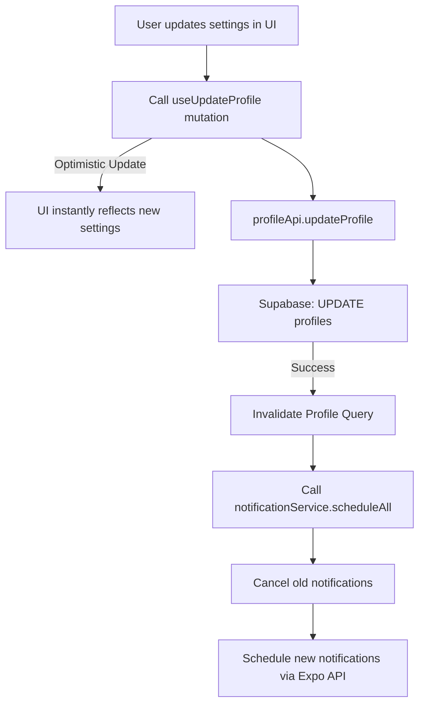

# 01: Application Architecture

Yeşer is built on a modern, hybrid architecture designed for performance, scalability, and maintainability. It strictly separates concerns between server state and client state, which is the cornerstone of its robust and efficient design.

## 1. Architectural Philosophy

- **Performance First**: Every architectural choice is weighed against its performance implications. We leverage intelligent caching, memoization, and optimized components to ensure a fluid user experience.
- **Separation of Concerns**: A clear distinction between UI, client state, and server state simplifies development, testing, and debugging.
- **Developer Experience**: A clean, well-organized codebase with strong typing and clear patterns allows developers to build features quickly and confidently.

## 2. High-Level System Design

The application is structured in layers, each with a distinct responsibility.

```mermaid
graph TD
    subgraph Presentation Layer
        A[Screens & Components]
    end

    subgraph State Management Layer
        B[TanStack Query (Server State)]
        C[Zustand (Client State)]
    end

    subgraph Business Logic Layer
        D[Hooks & Services]
    end

    subgraph Data Access Layer
        E[API Wrappers]
        F[Supabase Client]
    end

    subgraph Backend
        G[Supabase Backend]
        H[PostgreSQL Database]
        I[Firebase Analytics]
    end

    A --> D
    D --> B
    D --> C
    B --> E
    E --> F
    F --> G
    G --> H
    D --> I
```

## 3. Core Architectural Patterns

### Hybrid State Management

This is the most critical architectural pattern in Yeşer.

- **TanStack Query (Server State)**: Manages all asynchronous data from our Supabase backend. This includes gratitude entries, user profiles, streaks, and prompts. It handles caching, background refetching, and optimistic updates automatically, eliminating vast amounts of boilerplate code and providing a resilient, offline-first experience.
- **Zustand (Client State)**: Manages a small subset of synchronous, global client-side state. Its primary responsibilities are managing the authentication session (user object, auth status) and the current UI theme. It's simple, fast, and unopinionated.

This hybrid model provides the best of both worlds: the power and intelligence of TanStack Query for complex server state and the simplicity of Zustand for straightforward client state.

### Detailed Project Structure

```
src/
├── api/          # Supabase API wrappers (gratitudeApi.ts, profileApi.ts, etc.)
├── features/     # Feature-based modules
│   ├── auth/
│   │   ├── components/
│   │   ├── hooks/
│   │   └── screens/
│   └── gratitude/
│       ├── components/
│       ├── hooks/      # (useGratitudeQueries.ts, useGratitudeMutations.ts)
│       └── screens/
├── providers/    # Global context providers (QueryProvider, ThemeProvider, etc.)
├── services/     # Business logic (notificationService.ts, etc.)
├── shared/       # Reusable, non-feature-specific code
│   ├── components/
│   └── hooks/
├── store/        # Zustand client state stores (authStore.ts, themeStore.ts)
├── themes/       # Theme definitions
└── utils/        # Utility functions
```

### Feature-Based Code Organization

The `src/features` directory organizes the codebase by domain (e.g., `gratitude`, `auth`, `settings`). Each feature folder is a self-contained module containing its own screens, components, hooks, and types. This makes the codebase easy to navigate and allows features to be developed in isolation.

### Dependency Injection via Hooks

Instead of prop-drilling, we use custom hooks to provide dependencies and state to the components that need them. For example, a component that needs user data will call the `useUserProfile` hook directly, rather than receiving the profile as a prop. This co-locates data dependencies with the components that use them, making refactoring and reuse significantly easier.

## 4. Data Flow

Yeşer follows a strict unidirectional data flow, which makes application state predictable and easy to reason about.

### Read Operations (Queries)

1.  A component calls a custom TanStack Query hook (e.g., `useGratitudeEntries`).
2.  The hook checks the TanStack Query cache for valid data.
3.  **Cache Hit**: If fresh data exists, it's returned instantly. If stale data exists, it's returned instantly while a background refetch is triggered.
4.  **Cache Miss**: TanStack Query calls our API wrapper function.
5.  The API wrapper communicates with the Supabase backend.
6.  Data is returned, populated into the cache, and delivered to the component.
7.  The component re-renders with the data.

### Write Operations (Mutations)

1.  A user performs an action (e.g., adds a new gratitude statement).
2.  An event handler calls a TanStack Query mutation hook (e.g., `useAddStatement`).
3.  **Optimistic Update**: The mutation immediately updates the local cache with the new (assumed successful) state. The UI re-renders instantly, providing immediate feedback.
4.  The mutation hook calls our API wrapper function, which sends the request to the Supabase backend.
5.  **Success**: The backend confirms the write. The local cache is invalidated and refetched from the server to ensure consistency.
6.  **Failure**: The optimistic update is automatically rolled back, and the cache is restored to its previous state. The 7-layer error protection system catches the error and displays a user-friendly message.

## 5. Notification Architecture

The notification system is a key engagement feature, designed to be robust and user-configurable.

- **Configuration**: All settings (`reminderEnabled`, `reminderTime`, `throwbackReminderFrequency`, etc.) are stored in the user's record in the `profiles` table.
- **State Management**: The `SettingsScreen` uses TanStack Query mutations to update the profile. This provides optimistic UI updates for a snappy feel.
- **Scheduling Logic**: A dedicated `notificationService.ts` contains all the logic for interacting with `Expo Notifications`. When the user's profile is successfully updated, this service is called to cancel all pre-existing notifications and schedule new ones based on the latest settings. This ensures perfect sync between user preferences and scheduled reminders.



This architecture ensures a highly responsive, resilient, and maintainable application that can be extended with new features for years to come.
