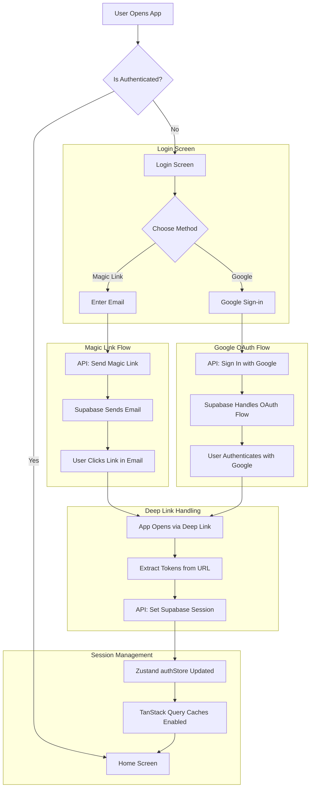

# 02: Authentication

Yeşer uses a secure, modern, and passwordless authentication system powered by Supabase. This approach enhances security by removing the need for users to create and remember passwords, and it provides a seamless, one-click login experience.

## 1. Authentication Strategy

- **Passwordless First**: Our primary authentication method is email-based **Magic Links**.
- **Social Login**: **Google OAuth** is provided as a convenient alternative.
- **Secure Session Management**: Supabase Auth securely manages JWTs and refresh tokens. The application state is managed by our Zustand `authStore`.
- **Deep Linking**: A custom URL scheme (`yeser://auth/callback`) handles the magic link and OAuth redirects, bringing the user back into the app seamlessly.

## 2. Authentication Flow

The authentication process is designed to be as smooth as possible, whether the user chooses Magic Link or Google OAuth.

## 3. Core Components

### `authApi.ts`

Located in `src/api/`, this file contains the core functions for interacting with Supabase Auth.

- `sendMagicLink(email)`: Sends the magic link email. Includes validation and rate-limiting error handling.
- `signInWithGoogle()`: Initiates the Google OAuth flow.
- `signOut()`: Signs the current user out and clears the session.
- `confirmMagicLink(accessToken, refreshToken)`: (Now handled by Supabase client) The logic to set the session is part of the deep link handler.

### `authStore.ts`

This Zustand store (`src/store/authStore.ts`) is the single source of truth for the user's authentication status on the client.

- **State**: `isAuthenticated` (boolean), `user` (User object or null), `isLoading` (boolean).
- **Actions**:
  - `initializeAuth()`: Sets up a listener to Supabase's `onAuthStateChange` to automatically update the store whenever the user's session changes. This is the key to keeping the app's state in sync with Supabase.
  - `setUser()`: Updates the user and authentication status.
  - `logout()`: Calls the `signOut` API and clears the local state.

### Deep Link Handling

A listener is set up using Expo's `Linking` module in the root of the application.

1.  When the app is opened via the `yeser://auth/callback` URL, the handler is triggered.
2.  It extracts the `access_token` and `refresh_token` from the URL's fragment (`#`).
3.  Supabase's client automatically handles these tokens to establish a session.
4.  The `onAuthStateChange` listener fires, updating the `authStore`.
5.  The entire application reactively updates to the new authenticated state.

## 4. Security Considerations

- **Row Level Security (RLS)**: The database is protected by RLS policies. All queries are made in the context of the authenticated user, ensuring a user can only ever access their own data.
- **Token Management**: Tokens are handled securely by the Supabase client library and stored in `AsyncStorage`. They are never exposed or managed manually.
- **State Invalidation**: On login or logout, the entire TanStack Query cache is invalidated to ensure that no stale data from a previous session is ever displayed. This is handled automatically by observing the `isAuthenticated` state from the `authStore`.
- **Error Handling**: The 7-layer error protection system translates any authentication errors (e.g., expired magic link, OAuth failure) into user-friendly, Turkish messages.
