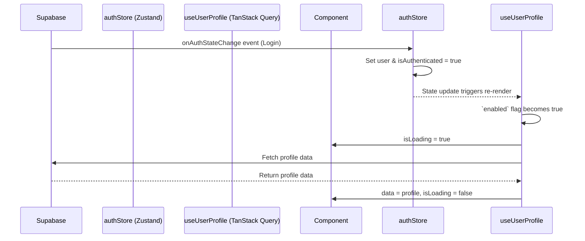

# 04: State Management

Yeşer employs a modern **hybrid state management** model that is central to its performance and developer experience. We make a clear and deliberate distinction between **Server State** and **Client State**.

## 1. The Two Types of State

### Server State

This is data that is persisted on our Supabase backend. It is asynchronous, shared between multiple users (though secured by RLS), and can become stale.

- **Examples**: User profile, gratitude entries, streaks, daily prompts.
- **Managed by**: **TanStack Query**.

### Client State

This is data that exists only on the device. It is synchronous, not persisted remotely, and is generally temporary.

- **Examples**: Authentication status (`isAuthenticated`, `user` object), current theme (`'light' | 'dark'`), form inputs, modal visibility.
- **Managed by**: **Zustand**.

## 2. TanStack Query (Server State)

TanStack Query is far more than a data-fetching library; it is a full-fledged server-state management solution. We use it to handle all interactions with our Supabase backend.

### Key Responsibilities & Benefits

- **Caching**: Aggressively caches server data in memory. This makes navigating the app feel instant, as data for previously visited screens is available immediately.
- **Automatic Refetching**: Intelligently refetches data in the background when it becomes stale (e.g., on app focus or reconnect), ensuring the user always sees up-to-date information without manual intervention.
- **Optimistic Updates**: Provides instant UI feedback for mutations. When a user adds a statement, the UI updates _before_ the server confirms the write. If an error occurs, the change is automatically rolled back.
- **Loading & Error States**: Automatically manages loading and error states for every query and mutation, drastically reducing boilerplate.
- **Offline Support**: Cached data is available even when the device is offline, providing a robust read-only experience.

### Implementation Pattern

We do not use `useQuery` or `useMutation` directly in our components. Instead, we create custom hooks for each feature.

```typescript
// src/features/gratitude/hooks/useGratitudeQueries.ts

import { useQuery } from '@tanstack/react-query';
import { queryKeys } from '@/api/queryKeys';
import { gratitudeApi } from '@/api/gratitudeApi';
import { useAuthStore } from '@/store/authStore';

// Custom hook to fetch the entry for a specific date
export const useGratitudeEntryForDate = (entryDate: string) => {
  const userId = useAuthStore((s) => s.user?.id);

  return useQuery({
    // Uses the hierarchical key factory
    queryKey: queryKeys.gratitudeEntry(userId, entryDate),
    // Calls the type-safe API wrapper
    queryFn: () => gratitudeApi.getGratitudeDailyEntryByDate(entryDate),
    // The query will not run until the userId is available
    enabled: !!userId,
  });
};
```

This pattern encapsulates data-fetching logic, keeps components clean, and makes the code highly reusable and testable.

## 3. Zustand (Client State)

Zustand is used for its simplicity and minimal API. It's the perfect tool for the small amount of global client state that Yeşer needs.

### `authStore.ts`

This is the most important client store. It listens to Supabase's `onAuthStateChange` event and holds the current session information.

- It is the **single source of truth** for whether a user is logged in.
- TanStack Query hooks use the `userId` from this store to enable or disable themselves. This creates a reactive chain: when the `authStore` updates, all relevant queries automatically refetch for the new user.
- On logout, it clears the session, which in turn disables all user-specific queries.

### `themeStore.ts`

A simple store that holds the active theme name (`'light'` or `'dark'`). It uses Zustand's `persist` middleware to save the user's preference to `AsyncStorage`.

## 4. How They Work Together

TanStack Query and Zustand work in perfect harmony.

1.  **App Start**: `authStore` initializes and checks for a session from `AsyncStorage`.
2.  **Login**: User logs in. Supabase client fires an auth event.
3.  **Auth Sync**: `authStore` listener catches the event and updates its state with the new `user` and `isAuthenticated: true`.
4.  **Reactive Data Fetch**: Custom hooks across the app that were previously disabled (`enabled: false`) now see a `userId` from `authStore`. They automatically enable and fetch the necessary data for the newly logged-in user.
5.  **Logout**: User logs out. `authStore` state is cleared (`user: null`, `isAuthenticated: false`). All user-specific queries are automatically disabled and their data is cleared, preventing any data leaks from a previous session.



This clean separation and reactive interplay create a robust, predictable, and highly performant state management system.
