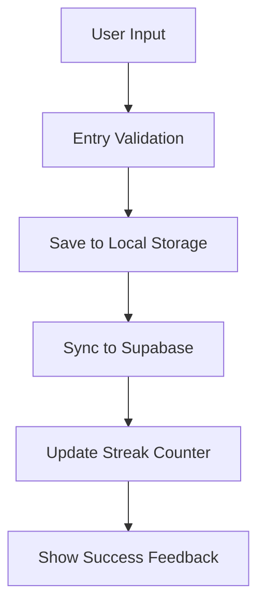
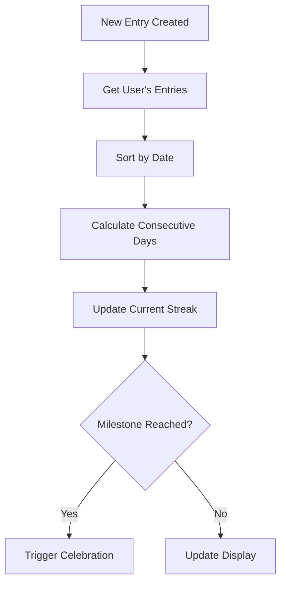

# Feature Modules

## 🎯 Feature-Based Architecture Overview

Yeser is organized using a feature-based modular architecture where each feature is self-contained with its own components, hooks, screens, services, and state management.

## 📁 Feature Structure

Each feature follows a consistent directory structure:

```
features/[feature-name]/
├── components/          # Feature-specific UI components
├── hooks/              # Feature-specific business logic hooks
├── screens/            # Navigation screens for the feature
├── services/           # API and business logic services
├── store/              # Feature-specific state management
├── utils/              # Feature-specific utilities
├── types/              # Feature-specific TypeScript types
└── index.ts            # Feature exports and public API
```

## 🔐 Authentication Feature (`/features/auth`)

### Purpose

Handles all authentication-related functionality including magic link authentication, session management, and user state.

### Key Components

- **LoginScreen**: Primary authentication interface
- **SplashScreen**: Loading screen during app initialization

### Core Services

- **authService**: Authentication operations
- **authCoordinator**: Token queueing and race condition handling

### Store Architecture

- **Core Auth Store**: User state and session management
- **Magic Link Store**: Email authentication handling
- **Google OAuth Store**: Social authentication (disabled during refactor)
- **Session Store**: Token persistence and restoration

### Key Features

- Magic link email authentication
- Token queueing system for cold start race conditions
- Secure session persistence
- Rate limiting for authentication attempts

## 🏠 Home Feature (`/features/home`)

### Purpose

Main dashboard providing overview of user's gratitude journey, streaks, and quick access to app features.

### Key Screens

- **HomeScreen**: Main dashboard with widgets and quick actions

### Dashboard Components

- Streak counter and progress indicators
- Quick entry creation shortcuts
- Recent entries preview
- Motivational content and tips
- Throwback memories integration

### Analytics Integration

- User engagement tracking
- Feature usage analytics
- Streak milestone celebrations

## ✍️ Gratitude Feature (`/features/gratitude`)

### Purpose

Core gratitude entry functionality including creation, editing, and management of gratitude entries.

### Key Screens

- **DailyEntryScreen**: Create today's gratitude entry
- **EntryDetailScreen**: View and edit specific entries
- **PastEntryCreationScreen**: Create entries for past dates

### Entry Management

- Rich text entry creation
- Entry validation and saving
- Edit and delete functionality
- Share entries capability

### Data Flow



## 📅 Calendar Feature (`/features/calendar`)

### Purpose

Calendar view of gratitude entries with date-based navigation and entry management.

### Key Screens

- **CalendarViewScreen**: Monthly calendar with entry indicators
- **PastEntriesScreen**: List view of historical entries

### Calendar Functionality

- Monthly/yearly calendar navigation
- Entry indicators on dates with entries
- Quick entry creation for empty dates
- Filter and search capabilities

### Calendar Integration

- React Native Calendars library
- Custom styling and theming
- Performance optimization for large date ranges

## 🎯 Onboarding Feature (`/features/onboarding`)

### Purpose

First-time user experience introducing app features and guiding initial setup.

### Key Screens

- **EnhancedOnboardingFlowScreen**: Main onboarding flow container

### Onboarding Steps

Located in `/screens/steps/`:

- Welcome and app introduction
- Benefits of gratitude education
- Feature tour and capabilities
- Notification permission requests
- First entry creation guidance

### User Experience

- Progressive disclosure of features
- Interactive tutorials
- Skip and navigation options
- Completion tracking and analytics

## ⚙️ Settings Feature (`/features/settings`)

### Purpose

App configuration, user preferences, and account management.

### Key Screens

- **SettingsScreen**: Main settings menu
- **ReminderSettingsScreen**: Notification configuration
- **HelpScreen**: Support and help documentation
- **PrivacyPolicyScreen**: Privacy policy display
- **TermsOfServiceScreen**: Terms of service display

### Settings Categories

- **Notifications**: Reminder times and types
- **Account**: Profile and authentication settings
- **Preferences**: App behavior customization
- **Legal**: Privacy policy and terms
- **Support**: Help and contact information

## 🏆 Streak Feature (`/features/streak`)

### Purpose

Track and celebrate consecutive days of gratitude entries.

### Streak Calculation



### Components

- Streak counter widgets
- Progress visualization
- Milestone celebrations
- Streak recovery encouragement

### Analytics

- Streak completion rates
- Milestone achievements
- Drop-off analysis
- Recovery patterns

## 🎉 Throwback Feature (`/features/throwback`)

### Purpose

Show random past entries to create moments of reflection and nostalgia.

### Functionality

- Random entry selection algorithm
- "On this day" historical entries
- Seasonal/anniversary throwbacks
- Share and reflect options

### Implementation

```typescript
// Throwback algorithm
const getThrowbackEntry = async () => {
  // Get entries from 30+ days ago
  const eligibleEntries = await getEntriesOlderThan(30);

  // Prioritize anniversaries and special dates
  const anniversaryEntries = filterAnniversaryEntries(eligibleEntries);

  // Select random entry with weighted preference for anniversaries
  return selectWeightedRandom(anniversaryEntries, eligibleEntries);
};
```

## 📚 Why Gratitude Feature (`/features/whyGratitude`)

### Purpose

Educational content about the science and benefits of gratitude practice.

### Content Sections

- Scientific research on gratitude
- Psychological and physical benefits
- Tips for effective gratitude practice
- Success stories and testimonials

### Educational Strategy

- Bite-sized, digestible content
- Evidence-based information
- Practical application tips
- Regular content updates

## 👤 Profile Feature (`/features/profile`)

### Purpose

User profile management and personal statistics.

### Profile Information

- User settings and preferences
- Personal gratitude statistics
- Achievement badges and milestones
- Export and backup options

### Statistics Dashboard

- Total entries count
- Longest streak achieved
- Most active months
- Personal insights and trends

## 🎨 Feature Integration Patterns

### Shared Components

Features utilize shared components from `/shared/components/`:

- Common UI elements
- Layout components
- Form components
- Loading and error states

### Cross-Feature Communication

```typescript
// Event-driven communication
eventBus.emit('entryCreated', { entryId, date });
eventBus.on('streakUpdated', handleStreakUpdate);

// Shared state management
const streakData = useStreakStore((state) => state.currentStreak);
const updateStreak = useStreakActions();
```

### Navigation Integration

Features integrate with the root navigation system:

```typescript
// Feature screens registered in RootNavigator
<Stack.Screen
  name="DailyEntry"
  component={DailyEntryScreen}
  options={{ title: 'Minnet Ekle' }}
/>
```

## 🔄 Feature Lifecycle

### Development Workflow

1. **Feature Planning**: Define scope and requirements
2. **Structure Setup**: Create feature directory structure
3. **Component Development**: Build UI components
4. **Business Logic**: Implement hooks and services
5. **State Management**: Add feature-specific stores
6. **Integration**: Connect to navigation and shared systems
7. **Testing**: Unit and integration testing
8. **Documentation**: Update feature documentation

### Maintenance Pattern

- Regular dependency updates
- Performance monitoring
- User feedback integration
- Analytics-driven improvements
- Accessibility enhancements

## 📊 Feature Analytics

### Tracked Metrics Per Feature

- **Usage Frequency**: How often features are accessed
- **Completion Rates**: Task completion within features
- **Error Rates**: Feature-specific error tracking
- **Performance**: Load times and responsiveness
- **User Satisfaction**: Feedback and ratings

### Analytics Implementation

```typescript
// Feature usage tracking
analyticsService.logEvent('feature_accessed', {
  feature: 'gratitude',
  screen: 'daily_entry',
  timestamp: Date.now(),
});

// Feature completion tracking
analyticsService.logEvent('feature_completed', {
  feature: 'onboarding',
  steps_completed: 5,
  total_steps: 6,
});
```

## 🚀 Future Feature Expansion

### Planned Features

- **Community**: Social sharing and community features
- **Insights**: AI-powered insights and trends
- **Challenges**: Guided gratitude challenges
- **Export**: Advanced data export options
- **Integrations**: Third-party app integrations

### Expansion Strategy

- Modular development approach
- Feature flag implementation
- A/B testing for new features
- Gradual rollout strategy
- User feedback integration

This feature-based architecture provides clear separation of concerns, maintainable code organization, and scalable development patterns for the Yeser gratitude journaling application.
