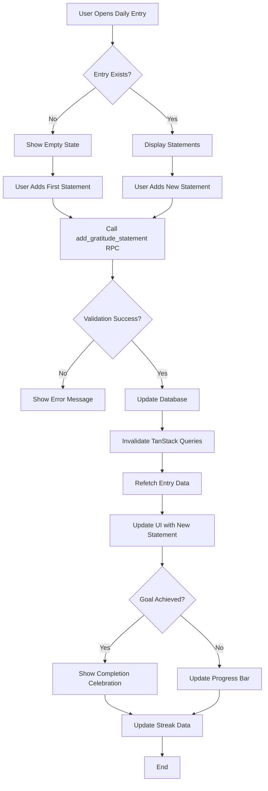

# Gratitude System

> The core business logic powering Yeser's gratitude journaling experience.

## 📝 Overview

The Gratitude System is the heart of Yeser, enabling users to create, manage, and reflect on their daily gratitude entries. The system supports multiple gratitude statements per day, goal tracking, and seamless editing capabilities.

## 🎯 Core Concepts

### Gratitude Entries

- **Definition**: A collection of gratitude statements for a specific date
- **Structure**: Each entry contains multiple text-based statements
- **Scope**: One entry per user per date (YYYY-MM-DD format)
- **Persistence**: Stored in PostgreSQL with JSONB for statements array

### Gratitude Statements

- **Definition**: Individual text expressions of gratitude within an entry
- **Validation**: Minimum 1 character, validated with Zod schemas
- **Management**: Add, edit, delete individual statements without affecting others
- **Order**: Maintained by array index in database

### Daily Goals

- **Purpose**: Encourage consistent gratitude practice
- **Default**: 3 statements per day (configurable per user)
- **Tracking**: Visual progress bar and completion celebrations
- **Gamification**: Streak tracking based on goal completion

## 🏗 Data Architecture

### Database Schema

```sql
-- Gratitude entries table
CREATE TABLE public.gratitude_entries (
    id UUID PRIMARY KEY DEFAULT uuid_generate_v4(),
    user_id UUID NOT NULL REFERENCES auth.users(id) ON DELETE CASCADE,
    entry_date DATE NOT NULL,
    statements JSONB NOT NULL DEFAULT '[]'::jsonb,
    created_at TIMESTAMPTZ DEFAULT NOW(),
    updated_at TIMESTAMPTZ DEFAULT NOW(),

    -- Ensure one entry per user per date
    UNIQUE(user_id, entry_date)
);

-- Row Level Security (RLS)
ALTER TABLE public.gratitude_entries ENABLE ROW LEVEL SECURITY;

CREATE POLICY "Users can only access their own entries"
ON public.gratitude_entries
FOR ALL
USING (auth.uid() = user_id);
```

### TypeScript Schemas

```typescript
// Core schemas using Zod
export const gratitudeEntrySchema = z.object({
  id: z.string().uuid(),
  user_id: z.string().uuid(),
  entry_date: z.string().regex(/^\d{4}-\d{2}-\d{2}$/),
  statements: z.array(z.string().min(1)).min(1),
  created_at: z.string().datetime({ offset: true }),
  updated_at: z.string().datetime({ offset: true }),
});

export const addStatementPayloadSchema = z.object({
  entry_date: z.string().regex(/^\d{4}-\d{2}-\d{2}$/),
  statement: z.string().min(1, 'Statement cannot be empty'),
});

export const editStatementPayloadSchema = z.object({
  entry_date: z.string().regex(/^\d{4}-\d{2}-\d{2}$/),
  statement_index: z.number().int().min(0),
  updated_statement: z.string().min(1),
});
```

## 🔄 Business Logic Flow

### Statement Management Workflow



### Database RPC Functions

The system uses PostgreSQL RPC functions for atomic operations:

```sql
-- Add a new gratitude statement
CREATE OR REPLACE FUNCTION add_gratitude_statement(
    p_entry_date DATE,
    p_statement TEXT
) RETURNS VOID AS $$
DECLARE
    current_user_id UUID;
BEGIN
    -- Get current authenticated user
    current_user_id := auth.uid();
    IF current_user_id IS NULL THEN
        RAISE EXCEPTION 'User not authenticated';
    END IF;

    -- Insert or update entry with new statement
    INSERT INTO public.gratitude_entries (user_id, entry_date, statements)
    VALUES (current_user_id, p_entry_date, jsonb_build_array(p_statement))
    ON CONFLICT (user_id, entry_date)
    DO UPDATE SET
        statements = gratitude_entries.statements || jsonb_build_array(p_statement),
        updated_at = NOW();

    -- Update user streak
    PERFORM update_user_streak();
END;
$$ LANGUAGE plpgsql SECURITY DEFINER;

-- Edit existing statement
CREATE OR REPLACE FUNCTION edit_gratitude_statement(
    p_entry_date DATE,
    p_statement_index INTEGER,
    p_updated_statement TEXT
) RETURNS VOID AS $$
DECLARE
    current_user_id UUID;
    current_statements JSONB;
    updated_statements JSONB;
BEGIN
    current_user_id := auth.uid();
    IF current_user_id IS NULL THEN
        RAISE EXCEPTION 'User not authenticated';
    END IF;

    -- Get current statements
    SELECT statements INTO current_statements
    FROM public.gratitude_entries
    WHERE user_id = current_user_id AND entry_date = p_entry_date;

    IF current_statements IS NULL THEN
        RAISE EXCEPTION 'Entry not found';
    END IF;

    -- Update specific statement by index
    updated_statements := jsonb_set(
        current_statements,
        ARRAY[p_statement_index::text],
        to_jsonb(p_updated_statement)
    );

    -- Update database
    UPDATE public.gratitude_entries
    SET statements = updated_statements, updated_at = NOW()
    WHERE user_id = current_user_id AND entry_date = p_entry_date;
END;
$$ LANGUAGE plpgsql SECURITY DEFINER;

-- Delete statement
CREATE OR REPLACE FUNCTION delete_gratitude_statement(
    p_entry_date DATE,
    p_statement_index INTEGER
) RETURNS VOID AS $$
DECLARE
    current_user_id UUID;
    current_statements JSONB;
    updated_statements JSONB;
BEGIN
    current_user_id := auth.uid();
    IF current_user_id IS NULL THEN
        RAISE EXCEPTION 'User not authenticated';
    END IF;

    -- Get current statements
    SELECT statements INTO current_statements
    FROM public.gratitude_entries
    WHERE user_id = current_user_id AND entry_date = p_entry_date;

    -- Remove statement at index
    updated_statements := current_statements - p_statement_index;

    -- If no statements left, delete entire entry
    IF jsonb_array_length(updated_statements) = 0 THEN
        DELETE FROM public.gratitude_entries
        WHERE user_id = current_user_id AND entry_date = p_entry_date;
    ELSE
        UPDATE public.gratitude_entries
        SET statements = updated_statements, updated_at = NOW()
        WHERE user_id = current_user_id AND entry_date = p_entry_date;
    END IF;

    -- Update streak (might break streak if no entries)
    PERFORM update_user_streak();
END;
$$ LANGUAGE plpgsql SECURITY DEFINER;
```

## 🎨 User Interface Components

### Daily Entry Screen Architecture

```typescript
// Enhanced Daily Entry Screen Structure
const DailyEntryScreen: React.FC = () => {
  // State management
  const [manualDate, setManualDate] = useState<Date | null>(null);
  const [editingStatementIndex, setEditingStatementIndex] = useState<number | null>(null);

  // Data fetching
  const { data: currentEntry, isLoading, refetch } = useGratitudeEntry(dateString);
  const { addStatement, editStatement, deleteStatement } = useGratitudeMutations();
  const { profile } = useUserProfile();

  // Computed values
  const statements = currentEntry?.statements || [];
  const dailyGoal = profile?.daily_gratitude_goal || 3;
  const progressPercentage = (statements.length / dailyGoal) * 100;
  const isGoalComplete = statements.length >= dailyGoal;

  return (
    <ScreenLayout>
      <DateSelector date={effectiveDate} onDateChange={setManualDate} />
      <ProgressIndicator progress={progressPercentage} goal={dailyGoal} />
      <GratitudeInputBar onSubmit={handleAddStatement} />
      <StatementList
        statements={statements}
        onEdit={handleEditStatement}
        onDelete={handleDeleteStatement}
      />
    </ScreenLayout>
  );
};
```

### Component Breakdown

#### 1. GratitudeInputBar

```typescript
// Multi-purpose input component
interface GratitudeInputBarProps {
  onSubmit: (statement: string) => void;
  disabled?: boolean;
  promptText?: string;
  showPrompt?: boolean;
  onRefreshPrompt?: () => void;
}

const GratitudeInputBar = React.memo<GratitudeInputBarProps>(({
  onSubmit,
  disabled = false,
  promptText,
  showPrompt = false,
  onRefreshPrompt,
}) => {
  const [text, setText] = useState('');
  const [isExpanded, setIsExpanded] = useState(false);

  const handleSubmit = useCallback(() => {
    if (text.trim()) {
      onSubmit(text.trim());
      setText('');
      setIsExpanded(false);
    }
  }, [text, onSubmit]);

  return (
    <View style={styles.container}>
      {showPrompt && promptText && (
        <PromptDisplay text={promptText} onRefresh={onRefreshPrompt} />
      )}
      <TextInput
        value={text}
        onChangeText={setText}
        placeholder="Bugün neye minnettarsın?"
        onFocus={() => setIsExpanded(true)}
        multiline={isExpanded}
        style={[styles.input, isExpanded && styles.expandedInput]}
      />
      <SubmitButton onPress={handleSubmit} disabled={!text.trim() || disabled} />
    </View>
  );
});
```

#### 2. StatementCard

```typescript
// Individual statement display and editing
interface StatementCardProps {
  statement: string;
  index: number;
  isEditing: boolean;
  onEdit: () => void;
  onSave: (text: string) => void;
  onCancel: () => void;
  onDelete: () => void;
}

const StatementCard = React.memo<StatementCardProps>(({
  statement,
  isEditing,
  onEdit,
  onSave,
  onCancel,
  onDelete,
}) => {
  const [editText, setEditText] = useState(statement);

  useEffect(() => {
    if (isEditing) setEditText(statement);
  }, [isEditing, statement]);

  if (isEditing) {
    return (
      <EditingCard
        text={editText}
        onTextChange={setEditText}
        onSave={() => onSave(editText)}
        onCancel={onCancel}
      />
    );
  }

  return (
    <DisplayCard
      statement={statement}
      onEdit={onEdit}
      onDelete={onDelete}
    />
  );
});
```

## 🔄 State Management

### TanStack Query Integration

```typescript
// Custom hooks for gratitude data management
export const useGratitudeEntry = (date: string) => {
  return useQuery({
    queryKey: queryKeys.gratitude.entry(date),
    queryFn: () => gratitudeApi.getGratitudeDailyEntryByDate(date),
    staleTime: 5 * 60 * 1000, // 5 minutes
    cacheTime: 10 * 60 * 1000, // 10 minutes
    enabled: !!date,
  });
};

export const useGratitudeMutations = () => {
  const queryClient = useQueryClient();

  const addStatement = useMutation({
    mutationFn: ({ entryDate, statement }: AddStatementParams) =>
      gratitudeApi.addStatement(entryDate, statement),
    onSuccess: (data, variables) => {
      // Invalidate related queries
      queryClient.invalidateQueries(queryKeys.gratitude.entry(variables.entryDate));
      queryClient.invalidateQueries(queryKeys.gratitude.entries());
      queryClient.invalidateQueries(queryKeys.streaks.current());

      // Optimistic update for immediate UI feedback
      if (data) {
        queryClient.setQueryData(queryKeys.gratitude.entry(variables.entryDate), data);
      }
    },
  });

  return { addStatement, editStatement, deleteStatement };
};
```

### Query Key Management

```typescript
// Hierarchical query keys for efficient invalidation
export const queryKeys = {
  gratitude: {
    all: ['gratitude'] as const,
    entries: () => [...queryKeys.gratitude.all, 'entries'] as const,
    entry: (date: string) => [...queryKeys.gratitude.entries(), date] as const,
    calendar: (year: number, month: number) =>
      [...queryKeys.gratitude.all, 'calendar', year, month] as const,
    random: () => [...queryKeys.gratitude.all, 'random'] as const,
    count: () => [...queryKeys.gratitude.all, 'count'] as const,
  },
} as const;
```

## 🎯 Goal Tracking & Progress

### Progress Calculation

```typescript
// Progress tracking logic
interface ProgressState {
  currentCount: number;
  goalCount: number;
  percentage: number;
  isComplete: boolean;
  milestoneReached: string | null;
}

const calculateProgress = (statements: string[], dailyGoal: number): ProgressState => {
  const currentCount = statements.length;
  const percentage = Math.min((currentCount / dailyGoal) * 100, 100);
  const isComplete = currentCount >= dailyGoal;

  // Milestone detection
  let milestoneReached: string | null = null;
  if (percentage >= 50 && percentage < 80) {
    milestoneReached = 'halfway';
  } else if (percentage >= 80 && percentage < 100) {
    milestoneReached = 'almost_complete';
  } else if (percentage >= 100) {
    milestoneReached = 'complete';
  }

  return {
    currentCount,
    goalCount: dailyGoal,
    percentage,
    isComplete,
    milestoneReached,
  };
};
```

### Visual Progress Indicators

```typescript
// Progress bar component
const ProgressIndicator: React.FC<ProgressProps> = ({
  progress,
  goal,
  currentCount
}) => {
  const theme = useTheme();
  const progressColor = progress >= 100 ? theme.colors.success : theme.colors.primary;

  return (
    <View style={styles.progressContainer}>
      <View style={styles.progressHeader}>
        <Text style={styles.progressTitle}>Günlük İlerleme</Text>
        <Badge text={`${currentCount}/${goal}`} />
      </View>

      <View style={styles.progressTrack}>
        <Animated.View
          style={[
            styles.progressFill,
            {
              width: `${progress}%`,
              backgroundColor: progressColor,
            }
          ]}
        />
      </View>

      <Text style={styles.progressText}>
        {Math.round(progress)}% tamamlandı
      </Text>

      {progress >= 100 && (
        <CompletionBadge text="Günlük hedef tamamlandı! 🎉" />
      )}
    </View>
  );
};
```

## 💡 Prompt System

### Prompt Architecture

```typescript
// Prompt management system
interface DailyPrompt {
  id: string;
  prompt_text_tr: string;
  prompt_text_en?: string;
  category?: string;
}

// Prompt fetching hook
export const usePromptText = () => {
  const { profile } = useUserProfile();
  const useVariedPrompts = profile?.useVariedPrompts ?? false;

  const promptQuery = useQuery({
    queryKey: queryKeys.prompts.current(),
    queryFn: promptApi.getCurrentPrompt,
    enabled: useVariedPrompts,
    staleTime: 30 * 60 * 1000, // 30 minutes
    cacheTime: 60 * 60 * 1000, // 1 hour
  });

  // Fallback prompts for users who don't use varied prompts
  const staticPrompts = [
    'Bugün yaşadığın güzel bir anı düşün...',
    'Hayatındaki hangi kişiye minnettarsın?',
    'Bugün seni mutlu eden küçük bir şey neydi?',
    'Hangi deneyimin için şükrediyorsun?',
  ];

  const promptText = useVariedPrompts
    ? promptQuery.data?.prompt_text_tr
    : staticPrompts[Math.floor(Math.random() * staticPrompts.length)];

  return {
    promptText,
    isLoading: useVariedPrompts ? promptQuery.isLoading : false,
    error: useVariedPrompts ? promptQuery.error : null,
  };
};
```

## 📊 Analytics & Insights

### Event Tracking

```typescript
// Analytics events for gratitude system
const gratitudeAnalytics = {
  statementAdded: (context: {
    entryDate: string;
    isToday: boolean;
    statementCount: number;
    dailyGoal: number;
    progressPercentage: number;
  }) => {
    analyticsService.logEvent('statement_added', {
      entry_date: context.entryDate,
      is_today: context.isToday,
      new_count: context.statementCount,
      daily_goal: context.dailyGoal,
      progress_percentage: Math.round(context.progressPercentage),
    });
  },

  goalCompleted: (context: {
    entryDate: string;
    completionTime: string;
    statementCount: number;
  }) => {
    analyticsService.logEvent('daily_goal_completed', {
      entry_date: context.entryDate,
      completion_time: context.completionTime,
      statements_count: context.statementCount,
    });
  },

  milestoneReached: (milestone: string, context: object) => {
    analyticsService.logEvent('progress_milestone_reached', {
      milestone,
      ...context,
    });
  },
};
```

## 🔒 Data Validation & Security

### Input Validation

```typescript
// Statement validation schema
export const gratitudeStatementSchema = z
  .string()
  .min(1, 'Minnet ifadesi boş olamaz')
  .max(500, 'Minnet ifadesi 500 karakterden uzun olamaz')
  .trim()
  .refine((text) => text.length > 0, 'Minnet ifadesi en az bir karakter içermelidir');

// Date validation
export const entryDateSchema = z
  .string()
  .regex(/^\d{4}-\d{2}-\d{2}$/, 'Geçersiz tarih formatı')
  .refine((date) => new Date(date) <= new Date(), 'Gelecek tarihler için giriş yapılamaz');
```

### Security Measures

1. **Row Level Security (RLS)** - Users can only access their own entries
2. **Input Sanitization** - All text inputs validated and sanitized
3. **Authentication Checks** - All RPC functions verify user authentication
4. **Rate Limiting** - Prevent excessive API calls
5. **Data Encryption** - Sensitive data encrypted at rest

## 🚀 Performance Optimizations

### Efficient Data Loading

```typescript
// Pagination for large datasets
export const useGratitudeEntriesPaginated = (page: number = 0, limit: number = 20) => {
  return useInfiniteQuery({
    queryKey: queryKeys.gratitude.paginated(page, limit),
    queryFn: ({ pageParam = 0 }) =>
      gratitudeApi.getGratitudeDailyEntriesPaginated(pageParam, limit),
    getNextPageParam: (lastPage) => (lastPage.hasMore ? lastPage.currentPage + 1 : undefined),
    staleTime: 5 * 60 * 1000,
  });
};

// Optimistic updates for immediate feedback
const optimisticAddStatement = useMutation({
  mutationFn: addStatementApi,
  onMutate: async (newStatement) => {
    // Cancel outgoing refetches
    await queryClient.cancelQueries(queryKeys.gratitude.entry(date));

    // Snapshot previous value
    const previousEntry = queryClient.getQueryData(queryKeys.gratitude.entry(date));

    // Optimistically update
    queryClient.setQueryData(
      queryKeys.gratitude.entry(date),
      (old: GratitudeEntry | undefined) => ({
        ...old,
        statements: [...(old?.statements || []), newStatement.statement],
      })
    );

    return { previousEntry };
  },
  onError: (err, newStatement, context) => {
    // Rollback on error
    queryClient.setQueryData(queryKeys.gratitude.entry(date), context?.previousEntry);
  },
});
```

This comprehensive gratitude system provides a robust, scalable foundation for the core journaling experience while maintaining excellent performance and user experience.
