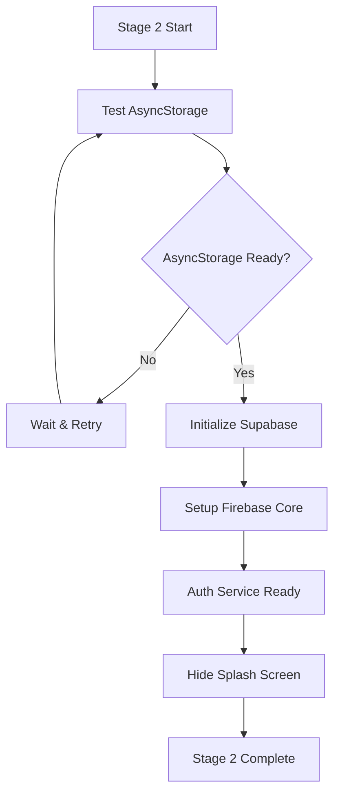

# Initialization System

## 🚀 4-Stage Cold Start Initialization

The Yeser app implements a sophisticated 4-stage initialization system designed to optimize cold start performance and prevent AsyncStorage deadlocks while ensuring optimal user experience.

## 🎯 Design Goals

1. **Instant UI Response**: Get the UI interactive immediately
2. **Progressive Loading**: Load features based on priority
3. **Database Safety**: Prevent AsyncStorage race conditions
4. **Performance Optimization**: Minimize time to first interaction
5. **Error Recovery**: Graceful handling of initialization failures

## 📊 Initialization Timeline



```mermaid
gantt
    title Cold Start Initialization Timeline
    dateFormat X
    axisFormat %Lms

    section Stage 1
    UI Ready           :done, s1, 0, 0

    section Stage 2
    Core Services      :done, s2, 500, 1000
    Database Ready     :done, db, 500, 1000
    Splash Hidden      :milestone, splash, 1000, 0

    section Stage 3
    Background Sync    :done, s3, 2000, 3000
    Notifications      :done, notif, 2000, 3000

    section Stage 4
    Analytics          :done, s4, 5000, 6000
    Optimizations      :done, opt, 5000, 6000
```

## 🏗️ Architecture Overview

### ServiceManager Class

The `ServiceManager` orchestrates the entire initialization process:

```typescript
class ServiceManager {
  private state: InitializationState = {
    stage1Complete: boolean;
    stage2Complete: boolean;
    stage3Complete: boolean;
    stage4Complete: boolean;
    isFullyInitialized: boolean;
    databaseConnected: boolean;
    databaseSyncComplete: boolean;
    asyncStorageReady: boolean;
    services: ServiceStates;
    errors: Record<string, Error>;
    currentStage: InitializationStage;
  };
}
```

### useInitialization Hook

Custom hook that manages initialization state in React components:

```typescript
export const useInitialization = () => {
  const [initState, setInitState] = useState<InitializationState>();

  // Returns initialization progress and state
  return {
    stage: number;
    isComplete: boolean;
    isError: boolean;
    error: Error | null;
    progress: number;
    databaseReady: boolean;
    asyncStorageReady: boolean;
    isStageComplete: (stage: InitializationStage) => boolean;
    summary: InitializationSummary;
  };
};
```

## 🎬 Stage 1: Immediate UI (0ms)

### Purpose

Get the UI responsive instantly with minimal overhead.

### Components Initialized

- **React Providers**: Theme, context providers
- **Navigation Shell**: Basic navigation structure
- **Splash Screen**: Keep splash visible during loading

### Implementation

```typescript
async initializeStage1(): Promise<void> {
  // Stage 1 only sets up providers - no AsyncStorage operations
  this.state.stage1Complete = true;
  this.state.currentStage = 2;
}
```

### Success Criteria

- UI renders and responds to touch
- Navigation structure is available
- No blocking operations

## 🛠️ Stage 2: Core Services + Database (500ms)

### Purpose

Initialize essential services and establish database connectivity.

### Critical Components

1. **AsyncStorage Readiness Test**
2. **Supabase Client Initialization**
3. **Firebase Core Setup**
4. **Authentication Service**

### Implementation Flow



### AsyncStorage Safety

```typescript
private async ensureAsyncStorageReady(): Promise<void> {
  const testKey = '@yeser_init_test';
  const testValue = Date.now().toString();

  try {
    await AsyncStorage.setItem(testKey, testValue);
    const retrieved = await AsyncStorage.getItem(testKey);

    if (retrieved !== testValue) {
      throw new Error('AsyncStorage read/write mismatch');
    }

    await AsyncStorage.removeItem(testKey);
    this.state.asyncStorageReady = true;
  } catch (error) {
    throw new Error(`AsyncStorage not ready: ${error.message}`);
  }
}
```

### Success Criteria

- Database connection established
- AsyncStorage operations reliable
- Authentication service ready
- Splash screen hidden

## 🔄 Stage 3: Background Services (2000ms)

### Purpose

Initialize non-critical services and enable background functionality.

### Services Initialized

1. **Background Sync Service**: Offline data synchronization
2. **Network Monitor Service**: Connectivity tracking
3. **Notification Service**: Push notification setup
4. **Database Sync State**: Restore previous sync state

### Implementation Details

```typescript
async initializeStage3(): Promise<void> {
  if (!this.state.databaseConnected) {
    throw new Error('Database connection required for Stage 3');
  }

  // Initialize background services concurrently
  await Promise.allSettled([
    this.initializeBackgroundSync(),
    this.initializeNetworkMonitoring(),
    this.initializeNotificationService(),
    this.restoreDatabaseSyncState()
  ]);
}
```

### Error Handling

Stage 3 failures don't prevent app usage - they degrade functionality gracefully:

```typescript
} catch (error) {
  logger.error('[COLD START] Stage 3 failed:', error);
  this.state.errors.stage3 = error;
  // Don't throw - app should continue with limited features
}
```

### Success Criteria

- Background sync operational
- Network monitoring active
- Notifications configured
- Database sync state restored

## ⚡ Stage 4: Enhancements (5000ms)

### Purpose

Enable analytics, performance monitoring, and advanced optimizations.

### Enhanced Features

1. **Firebase Analytics**: Event tracking and user analytics
2. **Performance Monitoring**: App performance tracking
3. **Database Optimizations**: Connection pooling and caching
4. **Advanced Features**: Secondary functionality

### Implementation

```typescript
async initializeStage4(): Promise<void> {
  // All enhancements are optional and non-blocking
  await Promise.allSettled([
    this.initializeFirebaseAnalytics(),
    this.optimizeDatabaseConnections(),
    this.startPerformanceMonitoring()
  ]);

  this.state.stage4Complete = true;
  this.state.isFullyInitialized = true;
}
```

### Success Criteria

- Analytics tracking active
- Performance monitoring enabled
- Database optimizations applied
- App fully initialized

## 🔍 Progress Tracking

### Progress Calculation

```typescript
getProgress(): number {
  const weights = { stage1: 25, stage2: 25, stage3: 25, stage4: 25 };
  let progress = 0;

  if (this.state.stage1Complete) progress += weights.stage1;
  if (this.state.stage2Complete) progress += weights.stage2;
  if (this.state.stage3Complete) progress += weights.stage3;
  if (this.state.stage4Complete) progress += weights.stage4;

  return progress;
}
```

### State Summary

```typescript
getSummary(): InitializationSummary {
  return {
    progress: this.getProgress(),
    currentStage: this.state.currentStage,
    isComplete: this.state.isFullyInitialized,
    errors: Object.keys(this.state.errors),
    services: this.getServiceStatuses()
  };
}
```

## 🚨 Error Handling & Recovery

### Error Types

1. **Stage 1 Errors**: UI provider failures (critical)
2. **Stage 2 Errors**: Database/auth failures (critical)
3. **Stage 3 Errors**: Background service failures (non-critical)
4. **Stage 4 Errors**: Enhancement failures (non-critical)

### Recovery Strategies

```typescript
// Stage 2 failure - show error screen but hide splash
if (error && stage === 2) {
  await SplashScreen.hideAsync();
  this.showErrorScreen(error);
}

// Stage 3/4 failures - continue with limited functionality
if (error && stage >= 3) {
  this.logNonCriticalError(error);
  this.continueWithLimitedFeatures();
}
```

### User Experience

- **Critical Failures**: Error screen with retry option
- **Non-Critical Failures**: Silent degradation with logging
- **Timeout Handling**: Progressive timeouts for each stage
- **Graceful Degradation**: App remains functional with reduced features

## 📋 Integration Points

### App.tsx Integration

```typescript
const App: React.FC = () => {
  const { stage, isComplete, databaseReady } = useInitialization();

  return (
    <AppProviders>
      {stage >= 2 && databaseReady ? (
        <NavigationContainer>
          <RootNavigator />
        </NavigationContainer>
      ) : (
        <SplashScreen progress={getProgress()} />
      )}
    </AppProviders>
  );
};
```

### Authentication Coordination

```typescript
// OAuth Token Queueing System
const processQueuedTokens = async (): Promise<void> => {
  if (stage >= 2 && databaseReady) {
    await authCoordinator.processQueuedTokens();
  }
};
```

## 📈 Performance Metrics

### Measured Improvements

- **Time to Interactive**: Stage 1 completes at 0ms
- **Database Ready**: Stage 2 completes by 500ms
- **Full Functionality**: Stage 3 completes by 2000ms
- **Complete Initialization**: Stage 4 completes by 5000ms

### Monitoring

- **Stage Duration Tracking**: Each stage completion time logged
- **Error Rate Monitoring**: Initialization failure tracking
- **Performance Analytics**: Real-world performance data
- **User Experience Metrics**: Time to first interaction

This initialization system ensures optimal cold start performance while maintaining reliability and providing comprehensive error handling for production use.
