Of course. I have integrated all the suggestions into your original document to create an even more robust and actionable roadmap. The new additions are designed to be seamless and are highlighted with **bold text** where a new concept is introduced.

Here is the complete, updated `.md` file.

---

# 🚀 Yeşer Premium App Deployment Roadmap (Enhanced Version)

## Overview

**Target**: Launch Yeşer as a premium app at **39.99 TRY** on iOS App Store and Google Play Store
**Timeline**: ~80 days total development to launch
**Current Status**: Production-ready codebase with performance optimization complete

---

## 📊 Deployment Timeline

```mermaid
graph TD
    A["Phase 1: Payment Integration<br/>⏱️ 15 days"] --> B["Phase 2: Legal & Business<br/>⏱️ 10 days"]
    A --> C["Phase 3: App Store Prep<br/>⏱️ 12 days"]
    B --> D["Phase 4: Quality Assurance<br/>⏱️ 15 days"]
    C --> D
    D --> E["Phase 5: Marketing Prep<br/>⏱️ 10 days"]
    E --> F["Phase 6: Deployment<br/>⏱️ 18 days"]
    F --> G["Phase 7: Post-Launch<br/>⏱️ Ongoing"]
```



---

## 📋 Phase 1: Payment Integration (Days 1-15)

### 🍎 iOS StoreKit 2 Implementation

- [ ] **Native Module Development** (5 days)

  - Create StoreKit 2 native module with TypeScript interfaces
  - Implement purchase flow handling
  - Add receipt validation and security

- [ ] **App Store Connect Configuration** (2 days)

  - Configure In-App Purchase product (39.99 TRY)
  - Set up product metadata and descriptions
  - Configure tax and pricing for Turkish market

- [ ] **Purchase Flow Implementation** (3 days)
  ```typescript
  interface PurchaseResult {
    success: boolean;
    transactionId?: string;
    error?: string;
  }
  ```

### 🤖 Android Play Billing Implementation

- [ ] **Native Module Development** (5 days)

  - Implement Google Play Billing Library v5
  - Create TypeScript interfaces matching iOS
  - Add purchase verification and acknowledgment

- [ ] **Google Play Console Setup** (2 days)

  - Configure managed product (39.99 TRY)
  - Set up product details and pricing
  - Configure billing settings

- [ ] **Unified Payment API** (3 days)
  - Create platform-agnostic payment service
  - Implement error handling and retry logic
  - **Implement user-friendly error messages for common failures (e.g., insufficient funds, network issues)**
  - Add restore purchases functionality

### 🧪 Payment Testing & Security (Days 11-15)

- [ ] Sandbox testing on both platforms
- [ ] Payment flow edge case testing
- [ ] Security audit of payment implementation
- [ ] Receipt validation testing

---

## 📝 Phase 2: Legal & Business Setup (Days 5-15)

### 🏢 Turkish Business Requirements

- [ ] **Sole Proprietorship Registration**

  - **Consult with a financial advisor (Mali Müşavir) to understand tax obligations**
  - **Register a sole proprietorship (Şahıs Şirketi) to legally receive and report revenue**
  - Obtain a tax identification number

- [ ] **Tax Compliance Setup**
  - Set up KDV (VAT) reporting for digital products
  - Configure international payment receiving
  - Establish accounting system for app store revenue

### ⚖️ Legal Documentation

- [ ] **Privacy Policy** (KVKK Compliant)

  ```
  ✅ Supabase data processing agreements
  ✅ User data collection and usage
  ✅ Cross-border data transfer notifications
  ✅ User rights and data access procedures
  ```

- [ ] **Terms of Service**
  - Premium app usage terms
  - Payment and refund policies
  - User content and data policies
  - Turkish consumer protection compliance

### 🏦 Financial Setup

- [ ] Bank account for international payments
- [ ] Currency conversion handling
- [ ] App store commission planning (30% Apple, 15-30% Google)

---

## 🏪 Phase 3: App Store Preparation (Days 10-22)

### 📱 iOS App Store Connect

- [ ] **App Information Setup**

  - App name: "Yeşer - Şükür Günlüğü Premium"
  - Category: Health & Fitness / Lifestyle
  - Age rating and content warnings
  - Keywords: şükür, mindfullness, günlük, gratitude

- [ ] **App Store Listing**

  ```
  App Title: Yeşer - Premium Şükür Günlüğü
  Subtitle: Kişiselleştirilmiş şükür deneyimi
  Price: 39.99 TRY
  ```

- [ ] **Visual Assets**
  - App icon (1024x1024)
  - Screenshots (6.7", 6.5", 5.5" displays)
  - App preview video (30 seconds)

### 🤖 Google Play Console

- [ ] **App Information Setup**

  - App title and description in Turkish
  - Category: Health & Fitness
  - Content rating questionnaire
  - Target audience configuration

- [ ] **Store Listing**
  - Feature graphic (1024x500)
  - Screenshots for different screen sizes
  - Promotional video upload

### 🎨 Marketing Assets Creation

- [ ] Professional screenshots showcasing premium features
- [ ] App preview video highlighting value proposition
- [ ] Feature graphics emphasizing quality and security
- [ ] Compelling app descriptions justifying 39.99 TRY price
- [ ] **Prepare a digital Press/Media Kit (logos, screenshots, app description) for easy sharing**

### ✍️ Update Planning

- [ ] **Draft 'What's New' text templates for future updates to showcase continuous improvement**

---

## 🔍 Phase 4: Quality Assurance (Days 25-40)

### 💳 Payment Flow Testing (Critical)

- [ ] **iOS Testing**

  - Sandbox environment testing
  - Purchase flow validation
  - Restore purchases testing
  - Error handling validation (e.g., clear messages for declined cards, no internet)

- [ ] **Android Testing**
  - Google Play Billing testing
  - Purchase acknowledgment testing
  - Refund handling testing
  - Edge case scenario testing (e.g., interrupted purchases)

### 🔒 Security Audit

- [ ] Payment security validation
- [ ] Supabase RLS policy verification
- [ ] Authentication flow security testing
- [ ] Data encryption verification
- [ ] API endpoint security testing

### 📱 Device & Platform Testing

- [ ] iOS compatibility testing (iOS 13+)
- [ ] Android compatibility testing (Android 8+)
- [ ] Various device size testing
- [ ] Performance testing under load
- [ ] Memory leak detection

### 🌐 User Experience Testing

- [ ] Turkish localization accuracy
- [ ] Premium onboarding flow
- [ ] Feature accessibility after purchase
- [ ] Offline functionality testing
- [ ] Cross-device sync testing
- [ ] **Ensure "Restore Purchases" is easily discoverable to prevent support tickets**

---

## 📢 Phase 5: Marketing Preparation (Days 30-40)

### 🎯 App Store Optimization (ASO)

- [ ] **Keyword Research**

  - Primary: şükür günlüğü, mindfulness, meditasyon
  - Secondary: kişisel gelişim, mental sağlık, günlük
  - Long-tail: şükür pratiği, farkındalık uygulaması

- [ ] **Value Proposition Development**
  ```
  🌟 Premium Features Highlight:
  ✅ No ads, no subscriptions - one-time payment
  ✅ Advanced analytics and insights
  ✅ Unlimited throwback memories
  ✅ Varied prompts system
  ✅ Premium themes and customization
  ✅ Priority customer support
  ```

### 📱 Pre-Launch Marketing

- [ ] **Social Media Presence**

  - Instagram account for wellness content
  - LinkedIn articles about gratitude benefits
  - Twitter engagement with mindfulness community

- [ ] **Content Strategy**

  - Blog posts about gratitude practice
  - User testimonials and case studies
  - Comparison with free alternatives

- [ ] **Beta Testing Program**
  - Recruit 50-100 beta testers
  - Collect feedback and testimonials
  - Refine app based on feedback
  - **Build launch day advocates to secure initial positive reviews**

---

## 🚀 Phase 6: Deployment (Days 55-73)

### 📋 Pre-Submission Checklist

- [ ] **Technical Validation**
      ✅ Payment flows working perfectly
      ✅ All features tested and validated
      ✅ Performance metrics meeting standards
      ✅ Security audit completed
      ✅ Legal documentation integrated

- [ ] **App Store Compliance**
      ✅ iOS App Review Guidelines compliance
      ✅ Google Play Developer Policy compliance
      ✅ Content rating appropriate
      ✅ Age restrictions properly set

### 📤 Store Submissions

- [ ] **iOS App Store Submission** (Day 55)

  - Upload app binary to App Store Connect
  - Complete metadata and descriptions
  - Submit for review
  - Monitor review status daily

- [ ] **Google Play Store Submission** (Day 56)
  - Upload APK/AAB to Play Console
  - Complete store listing
  - Submit for review
  - Track review progress

### ⏳ Review Management (Days 58-70)

- [ ] **Apple Review Process** (7-14 days typical)

  - Respond to review feedback within 24 hours
  - Address any rejection reasons immediately
  - Maintain communication with review team

- [ ] **Google Review Process** (3-7 days typical)
  - Monitor Play Console for updates
  - Address any policy violations quickly
  - Prepare for potential re-submissions

### 🎊 Launch Coordination (Day 73)

- [ ] **Do not announce a public launch date until both stores have approved the app.**
- [ ] Coordinate simultaneous release on both platforms
- [ ] Execute launch day marketing campaign
- [ ] Monitor initial downloads and reviews
- [ ] Activate customer support systems

---

## 📊 Phase 7: Post-Launch Operations (Ongoing)

### 📈 Monitoring & Analytics

- [ ] **Performance Tracking**

  ```
  Key Metrics to Monitor:
  📊 Download rates and conversion
  💰 Revenue and payment success rates
  ⭐ App store ratings and reviews
  📱 User engagement and retention
  🔄 Daily/weekly active users
  💸 Refund requests and reasons
  ```

- [ ] **Technical Monitoring**
  - Crash reporting and resolution
  - Payment failure rate monitoring
  - API performance tracking
  - User feedback analysis

### 🎧 Customer Support System

- [ ] **Support Channels**

  - In-app support system
  - Email support (support@yeser.app)
  - FAQ section and help documentation
  - App store review response strategy

- [ ] **Premium Support Features**
  - Priority response for premium users
  - Personalized onboarding assistance
  - Feature request collection system
  - Bug report fast-track resolution

### 🔄 Continuous Improvement

- [ ] **Regular Updates** (Monthly)

  - Bug fixes and performance improvements
  - New features based on user feedback
  - OS compatibility updates
  - Security patches and updates

- [ ] **Feature Roadmap**
  - User-requested feature implementation
  - Premium feature expansion
  - Analytics and insights enhancement
  - Social features consideration

### 💰 Business Growth Strategy

- [ ] **Revenue Optimization**

  - Pricing strategy evaluation
  - Market expansion analysis
  - Competition monitoring
  - User retention improvement

- [ ] **Market Expansion**
  - English localization consideration
  - Other language market research
  - International marketing strategy
  - Partnership opportunity exploration

---

## 💰 Financial Projections

### Revenue Model

- **Price**: 39.99 TRY per purchase
- **Platform Fees**: 30% (Apple) / 15-30% (Google)
- **Net Revenue**: ~28 TRY per sale (average)

### Break-Even Analysis

```
Development Investment: ~2 months development time
Marketing Budget: 5,000-10,000 TRY
Break-even Point: ~500 sales (14,000 TRY revenue)
Monthly Operating Costs: ~2,000 TRY (hosting, support)
```

### **Pessimistic Scenario Analysis**

```
Worst-case Target: 50% of Year 1 Target (1,000 sales)
Revenue: ~28,000 TRY
Covers annual operating costs (~24,000 TRY) and a portion of marketing budget.
Provides a baseline for financial resilience.
```

### Success Metrics

- **Year 1 Target**: 2,000 downloads (56,000 TRY revenue)
- **Monthly Target**: 170 downloads (4,760 TRY monthly revenue)
- **Customer Support**: <24 hour response time
- **App Store Rating**: >4.5 stars maintained

---

## 🎯 Success Factors

### Critical Success Elements

1. **Flawless Payment Experience** - Zero tolerance for payment issues
2. **Premium User Experience** - Justifying the 39.99 TRY price point
3. **Strong Customer Support** - Premium users expect premium service
4. **Regular Updates** - Continuous value delivery
5. **Positive Reviews** - Essential for organic discovery

### Risk Mitigation

- **Payment Issues**: Comprehensive testing and monitoring
- **App Store Rejection**: Careful guideline compliance
- **Low Downloads**: Strong ASO and marketing strategy
- **User Complaints**: Proactive customer support
- **Technical Problems**: Robust monitoring and quick response

---

## 📋 Implementation Checklist

_This checklist remains the same as it is a summary of the detailed phases above._

### Phase 1: Payment Integration

- [ ] iOS StoreKit 2 native module
- [ ] Android Play Billing native module
- [ ] TypeScript payment interfaces
- [ ] Unified payment service API
- [ ] Payment security implementation
- [ ] Sandbox testing completion

### Phase 2: Legal & Business

- [ ] Turkish business registration research
- [ ] Tax compliance setup
- [ ] KVKK-compliant privacy policy
- [ ] Terms of service creation
- [ ] Financial infrastructure setup

### Phase 3: App Store Preparation

- [ ] iOS App Store Connect configuration
- [ ] Google Play Console setup
- [ ] Marketing asset creation
- [ ] App metadata optimization
- [ ] ASO keyword implementation

### Phase 4: Quality Assurance

- [ ] Payment flow testing
- [ ] Security audit completion
- [ ] Device compatibility testing
- [ ] Performance validation
- [ ] User experience testing

### Phase 5: Marketing Preparation

- [ ] ASO strategy implementation
- [ ] Social media presence establishment
- [ ] Beta testing program execution
- [ ] Launch marketing materials

### Phase 6: Deployment

- [ ] Pre-submission validation
- [ ] Store submissions
- [ ] Review process management
- [ ] Launch coordination

### Phase 7: Post-Launch

- [ ] Monitoring system setup
- [ ] Customer support activation
- [ ] Update pipeline establishment
- [ ] Growth strategy implementation

---

**Last Updated**: Enhanced for Yeser Premium App Launch
**Next Review**: After Phase 1 completion
**Owner**: Yeser Development Team

This enhanced roadmap further strengthens the plan, mitigating more risks and adding layers of professionalism to your launch and post-launch strategy.
