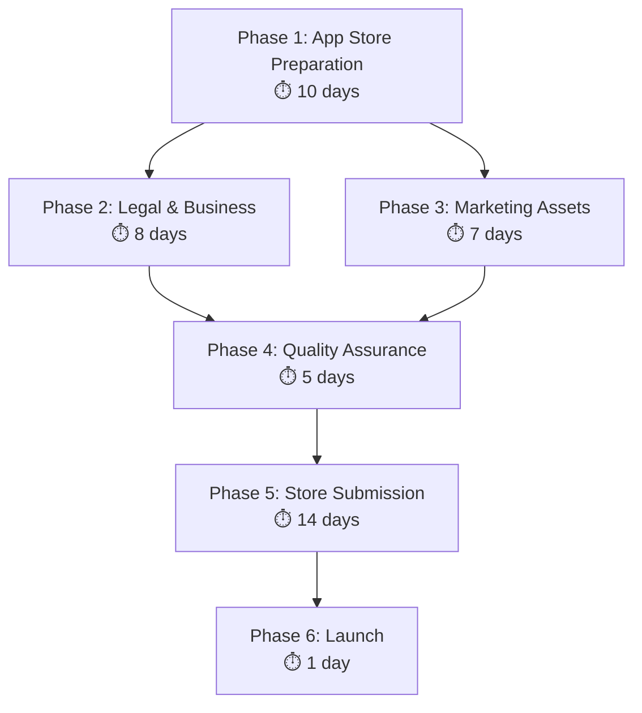

# 🚀 Yeşer Premium App Launch Plan

## Overview

**Strategy**: Launch Yeşer as a premium app (39.99 TRY upfront payment)
**Timeline**: ~30 days to launch (simplified from original 80-day plan)
**Current Status**: Production-ready codebase, performance optimized

---

## 📊 Simplified Launch Timeline



---

## 🏪 Phase 1: App Store Preparation (Days 1-10)

### 📱 iOS App Store Connect Setup

- [ ] **App Information**

  - App Name: "Yeşer - Şükür Günlüğü"
  - Subtitle: "Günlük şükür pratiği ve mindfulness"
  - Category: Health & Fitness
  - Price: 39.99 TRY
  - Keywords: şükür, mindfulness, günlük, meditasyon, farkındalık

- [ ] **App Review Information**
  - Demo account (if needed)
  - Review notes in Turkish
  - App description explaining features

### 🤖 Google Play Console Setup

- [ ] **App Information**

  - Title: "Yeşer - Şükür Günlüğü"
  - Short description: "Günlük şükür pratiği"
  - Full description: Detailed feature list
  - Category: Health & Fitness
  - Price: 39.99 TRY

- [ ] **Content Rating**
  - Complete content rating questionnaire
  - Target audience: Everyone
  - Data safety form

---

## 📝 Phase 2: Legal & Business Setup (Days 5-12)

### 🏢 Turkish Business Requirements

- [ ] **Business Registration Research**

  - Consult with Mali Müşavir (tax advisor)
  - Understand sole proprietorship requirements
  - App store revenue reporting obligations

- [ ] **Tax Compliance**
  - KDV (VAT) requirements for digital products
  - International payment receiving setup
  - Monthly/quarterly reporting requirements

### ⚖️ Legal Documentation

- [ ] **Privacy Policy (KVKK Compliant)**

  ```
  ✅ Data collection transparency (what we collect)
  ✅ Supabase data processing agreements
  ✅ User rights (access, deletion, portability)
  ✅ Cross-border data transfer notifications
  ✅ Contact information for data requests
  ```

- [ ] **Terms of Service**
  - App usage terms and conditions
  - User content policies
  - Service availability disclaimers
  - Turkish consumer protection compliance

---

## 🎨 Phase 3: Marketing Assets (Days 8-14)

### 📱 Visual Assets

- [ ] **App Screenshots** (iOS)

  - 6.7" display: 1290x2796 px (6 screenshots)
  - 6.5" display: 1284x2778 px (6 screenshots)
  - 5.5" display: 1242x2208 px (6 screenshots)

- [ ] **App Screenshots** (Android)

  - Phone: 1080x1920 px minimum (8 screenshots)
  - Tablet: 1200x1920 px (optional)

- [ ] **Feature Graphics**
  - iOS: App preview video (30 seconds)
  - Android: Feature graphic 1024x500 px

### 📝 App Store Descriptions

**iOS App Store Description:**

```
🌿 Yeşer ile Şükür Pratiği

Günlük şükür pratiği ile yaşamınızı dönüştürün. Yeşer, bilimsel araştırmalara dayalı mindfulness teknikleri ile şükür alışkanlığı geliştirmenizi sağlar.

✨ ÖZELLİKLER:
• Günlük şükür girişleri
• Zeki hatırlatma sistemi
• Çeşitli şükür önerileri
• Geçmiş anılar özelliği
• Detaylı analiz ve istatistikler
• Koyu/açık tema desteği
• Veri dışa aktarma

🎯 BİLİMSEL TEMELLER:
• Pozitif psikoloji araştırmaları
• Mindfulness temelli stres azaltma
• Nöroplastisite ve alışkanlık geliştirme

💎 PREMIUM ÖZELLİKLER:
• Reklamsız deneyim
• Sınırsız giriş
• Gelişmiş analitik
• Öncelikli destek
• Tek ödeme, yaşam boyu erişim

Yeşer ile şükür pratiğinizi bugün başlatın!
```

---

## 🔍 Phase 4: Quality Assurance (Days 12-17)

### 📱 Device Testing

- [ ] **iOS Compatibility**

  - iPhone: iOS 13+ (iPhone 8 and newer)
  - iPad: iPadOS 13+ (optional)
  - Various screen sizes and orientations

- [ ] **Android Compatibility**
  - Android 8.0+ (API level 26+)
  - Various device manufacturers (Samsung, Xiaomi, etc.)
  - Different screen densities

### 🔒 Security & Performance

- [ ] **Data Security Audit**

  - Supabase RLS policies verification
  - Authentication flow security
  - KVKK compliance verification

- [ ] **Performance Testing**
  - App startup time optimization
  - Memory usage monitoring
  - Battery consumption testing
  - Offline functionality testing

---

## 🚀 Phase 5: Store Submission (Days 18-31)

### 📤 Submission Process

- [ ] **iOS App Store** (Day 18)

  - Upload app binary via Xcode/App Store Connect
  - Complete metadata and descriptions
  - Submit for review (7-14 days typical)

- [ ] **Google Play Store** (Day 19)
  - Upload AAB via Play Console
  - Complete store listing
  - Submit for review (3-7 days typical)

### ⏳ Review Management

- [ ] **Monitor Review Status**
  - Respond to review feedback within 24 hours
  - Address any rejection reasons immediately
  - Prepare for potential re-submissions

---

## 📈 Phase 6: Launch Day (Day 32)

### 🎊 Launch Coordination

- [ ] **Final Checks**

  - Both apps approved and live
  - All metadata correct
  - Pricing set correctly (39.99 TRY)

- [ ] **Launch Activities**
  - Social media announcement
  - Website update with store links
  - Initial user acquisition campaigns

---

## 💰 Business Model Summary

### Revenue Structure

- **Price**: 39.99 TRY (one-time purchase)
- **Platform Fees**: 30% (Apple) / 15-30% (Google)
- **Net Revenue**: ~28 TRY per sale
- **Target**: 2,000 downloads in Year 1 = 56,000 TRY revenue

### Key Advantages

✅ **No payment integration complexity**
✅ **No subscription management**  
✅ **Simple revenue model**
✅ **App stores handle all payments**
✅ **Faster to market**
✅ **Lower development cost**

---

## 📋 Implementation Checklist

### Phase 1: App Store Prep

- [ ] iOS App Store Connect configuration
- [ ] Google Play Console setup
- [ ] Product metadata optimization
- [ ] Pricing configuration (39.99 TRY)

### Phase 2: Legal & Business

- [ ] Business registration research
- [ ] Tax compliance consultation
- [ ] Privacy policy creation (KVKK)
- [ ] Terms of service drafting

### Phase 3: Marketing Assets

- [ ] App screenshots creation
- [ ] Feature graphics design
- [ ] App store descriptions writing
- [ ] Preview video production (iOS)

### Phase 4: Quality Assurance

- [ ] Multi-device testing
- [ ] Performance optimization
- [ ] Security audit
- [ ] Legal compliance verification

### Phase 5: Store Submission

- [ ] iOS binary upload & submission
- [ ] Android AAB upload & submission
- [ ] Review process monitoring
- [ ] Rejection handling preparation

### Phase 6: Launch

- [ ] Store approval confirmation
- [ ] Launch day coordination
- [ ] Marketing campaign activation
- [ ] User acquisition monitoring

---

**Next Steps**: Focus on Phase 1 (App Store Preparation) and Phase 2 (Legal setup) in parallel since Yeşer is already production-ready.
