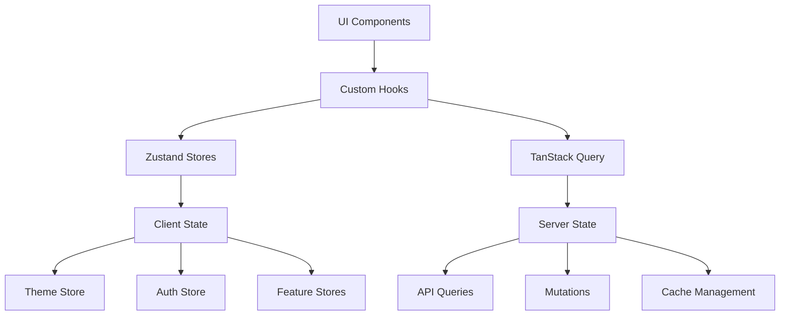

# State Management

## 🏗️ State Management Architecture

Yeser uses a hybrid state management approach combining **Zustand** for client-side state and **TanStack Query v5** for server state management, providing optimal performance and developer experience.

## 📊 State Architecture Overview



## 🔧 Zustand Implementation

### Core Stores

#### Theme Store (`/store/themeStore.ts`)

```typescript
interface ThemeState {
  theme: AppTheme;
  isDark: boolean;

  setTheme: (theme: AppTheme) => void;
  toggleTheme: () => void;
  resetToDefault: () => void;
}

export const useThemeStore = create<ThemeState>()(
  persist(
    (set, get) => ({
      theme: lightTheme,
      isDark: false,

      setTheme: (theme) => set({ theme, isDark: theme.name === 'dark' }),
      toggleTheme: () => {
        const { isDark } = get();
        const newTheme = isDark ? lightTheme : darkTheme;
        set({ theme: newTheme, isDark: !isDark });
      },
      resetToDefault: () => set({ theme: lightTheme, isDark: false }),
    }),
    {
      name: 'yeser-theme-storage',
      storage: createJSONStorage(() => AsyncStorage),
    }
  )
);
```

#### Auth Store (`/store/authStore.ts`)

Legacy wrapper providing backward compatibility while delegating to modular auth stores:

```typescript
interface AuthState {
  isAuthenticated: boolean;
  user: SupabaseUser | null;
  isLoading: boolean;
  magicLinkSent: boolean;

  // Actions
  initializeAuth: () => Promise<void>;
  loginWithMagicLink: (credentials: MagicLinkCredentials) => Promise<void>;
  confirmMagicLink: (tokenHash: string, type?: string) => Promise<void>;
  logout: () => Promise<void>;
}

// Delegates to modular stores under the hood
export const useAuthStore = create<AuthState>((set) => {
  // Subscribe to modular store changes
  useCoreAuthStore.subscribe((coreState) => {
    set((state) => ({
      ...state,
      isAuthenticated: coreState.isAuthenticated,
      user: coreState.user,
      isLoading: coreState.isLoading,
    }));
  });

  return {
    // Implementation delegates to feature stores
  };
});
```

### Modular Auth Stores (`/features/auth/store/`)

#### Core Auth Store

```typescript
interface CoreAuthState {
  isAuthenticated: boolean;
  user: User | null;
  isLoading: boolean;
  isInitialized: boolean;
  error: string | null;

  setUser: (user: User | null) => void;
  setLoading: (loading: boolean) => void;
  initializeAuth: () => Promise<void>;
  logout: () => Promise<void>;
}

export const useCoreAuthStore = create<CoreAuthState>((set, get) => ({
  isAuthenticated: false,
  user: null,
  isLoading: false,
  isInitialized: false,
  error: null,

  setUser: (user) =>
    set({
      user,
      isAuthenticated: !!user,
      error: null,
    }),

  // Implementation details...
}));
```

#### Magic Link Store

```typescript
interface MagicLinkState {
  isLoading: boolean;
  lastSentEmail: string | null;
  lastSentAt: number | null;
  rateLimitUntil: number | null;
  error: string | null;

  sendMagicLink: (credentials: MagicLinkCredentials) => Promise<void>;
  confirmMagicLink: (tokenHash: string, type?: string) => Promise<void>;
  canSendMagicLink: (email: string) => boolean;
  reset: () => void;
}

export const useMagicLinkStore = create<MagicLinkState>((set, get) => ({
  // Rate limiting and email auth implementation
}));
```

#### Session Store

```typescript
interface SessionState {
  session: Session | null;
  isRestoring: boolean;

  persistSession: (session: Session) => Promise<void>;
  restoreSession: () => Promise<Session | null>;
  clearPersistedSession: () => Promise<void>;
}

export const useSessionStore = create<SessionState>((set) => ({
  // Secure session persistence implementation
}));
```

### Store Best Practices

#### 1. Selector Usage

```typescript
// ✅ Use selectors to prevent unnecessary re-renders
const theme = useThemeStore((state) => state.theme);
const isDark = useThemeStore((state) => state.isDark);

// ❌ Avoid subscribing to entire store
const themeStore = useThemeStore(); // Re-renders on any change
```

#### 2. Action Organization

```typescript
// ✅ Group related actions
const themeActions = useThemeStore((state) => ({
  setTheme: state.setTheme,
  toggleTheme: state.toggleTheme,
  resetToDefault: state.resetToDefault,
}));

// ✅ Use actions in event handlers
const handleThemeToggle = useCallback(() => {
  themeActions.toggleTheme();
  analyticsService.logEvent('theme_toggled');
}, [themeActions]);
```

#### 3. Persistence Configuration

```typescript
export const usePersistedStore = create<State>()(
  persist(
    (set, get) => ({
      // Store implementation
    }),
    {
      name: 'yeser-store-name',
      storage: createJSONStorage(() => AsyncStorage),
      partialize: (state) => ({
        // Only persist specific fields
        theme: state.theme,
        preferences: state.preferences,
      }),
      onRehydrateStorage: () => (state) => {
        // Post-rehydration logic
        if (state) {
          state.initialize?.();
        }
      },
    }
  )
);
```

## 🌐 TanStack Query Implementation

### Query Configuration

#### Query Keys Factory (`/api/queryKeys.ts`)

```typescript
export const queryKeys = {
  // User queries
  user: {
    all: ['users'] as const,
    profile: (userId: string) => [...queryKeys.user.all, 'profile', userId] as const,
    preferences: (userId: string) => [...queryKeys.user.all, 'preferences', userId] as const,
  },

  // Gratitude entries
  gratitude: {
    all: ['gratitude'] as const,
    entries: (userId: string) => [...queryKeys.gratitude.all, 'entries', userId] as const,
    entry: (entryId: string) => [...queryKeys.gratitude.all, 'entry', entryId] as const,
    calendar: (userId: string, month: string) =>
      [...queryKeys.gratitude.entries(userId), 'calendar', month] as const,
  },

  // Streaks
  streaks: {
    all: ['streaks'] as const,
    current: (userId: string) => [...queryKeys.streaks.all, 'current', userId] as const,
    history: (userId: string) => [...queryKeys.streaks.all, 'history', userId] as const,
  },
} as const;
```

#### Query Client Setup (`/providers/AppProviders.tsx`)

```typescript
const queryClient = new QueryClient({
  defaultOptions: {
    queries: {
      staleTime: 5 * 60 * 1000, // 5 minutes
      cacheTime: 10 * 60 * 1000, // 10 minutes
      retry: (failureCount, error) => {
        // Custom retry logic
        if (error?.status === 404) return false;
        return failureCount < 3;
      },
      refetchOnWindowFocus: false,
      refetchOnReconnect: true,
    },
    mutations: {
      retry: 1,
      onError: (error) => {
        // Global error handling
        logger.error('Mutation error:', error);
      },
    },
  },
});
```

### Custom Hooks Pattern

#### Data Fetching Hooks (`/hooks/`)

```typescript
// User profile hook
export const useUserProfile = (userId: string) => {
  return useQuery({
    queryKey: queryKeys.user.profile(userId),
    queryFn: () => profileApi.getProfile(userId),
    enabled: !!userId,
    staleTime: 5 * 60 * 1000,
    select: (data) => ({
      ...data,
      displayName: data.firstName + ' ' + data.lastName,
    }),
  });
};

// Gratitude entries hook
export const useGratitudeEntries = (
  userId: string,
  options?: {
    month?: string;
    limit?: number;
  }
) => {
  const queryKey = options?.month
    ? queryKeys.gratitude.calendar(userId, options.month)
    : queryKeys.gratitude.entries(userId);

  return useQuery({
    queryKey,
    queryFn: () => gratitudeApi.getEntries(userId, options),
    enabled: !!userId,
    select: (data) =>
      data.sort((a, b) => new Date(b.createdAt).getTime() - new Date(a.createdAt).getTime()),
  });
};
```

#### Mutation Hooks

```typescript
export const useGratitudeMutations = () => {
  const queryClient = useQueryClient();

  const createEntry = useMutation({
    mutationFn: gratitudeApi.createEntry,
    onMutate: async (newEntry) => {
      // Optimistic update
      await queryClient.cancelQueries({
        queryKey: queryKeys.gratitude.entries(newEntry.userId),
      });

      const previousEntries = queryClient.getQueryData(
        queryKeys.gratitude.entries(newEntry.userId)
      );

      queryClient.setQueryData(
        queryKeys.gratitude.entries(newEntry.userId),
        (old: GratitudeEntry[]) => [{ ...newEntry, id: 'temp-' + Date.now() }, ...(old || [])]
      );

      return { previousEntries };
    },
    onError: (error, variables, context) => {
      // Rollback optimistic update
      if (context?.previousEntries) {
        queryClient.setQueryData(
          queryKeys.gratitude.entries(variables.userId),
          context.previousEntries
        );
      }
    },
    onSuccess: (data, variables) => {
      // Invalidate related queries
      queryClient.invalidateQueries({
        queryKey: queryKeys.gratitude.entries(variables.userId),
      });
      queryClient.invalidateQueries({
        queryKey: queryKeys.streaks.current(variables.userId),
      });
    },
  });

  return { createEntry };
};
```

### Background Sync Integration

#### Offline-First Pattern

```typescript
export const useOfflineSync = () => {
  const queryClient = useQueryClient();
  const isOnline = useNetworkState();

  useEffect(() => {
    if (isOnline) {
      // Sync when coming back online
      queryClient.refetchQueries({
        predicate: (query) => query.state.status === 'error',
      });
    }
  }, [isOnline, queryClient]);

  const syncPendingMutations = useCallback(async () => {
    const pendingMutations = await getPendingMutations();

    for (const mutation of pendingMutations) {
      try {
        await queryClient.executeMutation(mutation);
        await removePendingMutation(mutation.id);
      } catch (error) {
        logger.error('Sync mutation failed:', error);
      }
    }
  }, [queryClient]);

  return { syncPendingMutations };
};
```

## 🔄 State Flow Patterns

### Component Integration

```typescript
const GratitudeEntryScreen: React.FC = () => {
  // Server state
  const { data: entries, isLoading, error } = useGratitudeEntries(userId);
  const { createEntry } = useGratitudeMutations();

  // Client state
  const theme = useThemeStore(state => state.theme);
  const user = useAuthStore(state => state.user);

  // Local component state
  const [entryText, setEntryText] = useState('');

  const handleSubmit = useCallback(async () => {
    try {
      await createEntry.mutateAsync({
        userId: user.id,
        content: entryText,
        date: new Date().toISOString(),
      });

      setEntryText('');
      // Navigation or success feedback
    } catch (error) {
      // Error handling
    }
  }, [createEntry, user.id, entryText]);

  // Render with proper loading and error states
  if (isLoading) return <LoadingState />;
  if (error) return <ErrorState error={error} />;

  return (
    <View style={[styles.container, { backgroundColor: theme.colors.background }]}>
      {/* Component implementation */}
    </View>
  );
};
```

### State Synchronization

```typescript
// Sync between different state layers
useEffect(() => {
  const unsubscribe = useAuthStore.subscribe((authState) => {
    if (authState.isAuthenticated) {
      // Enable queries when authenticated
      setShouldEnableQueries(true);
    } else {
      // Clear queries when logged out
      queryClient.clear();
      setShouldEnableQueries(false);
    }
  });

  return unsubscribe;
}, [queryClient]);
```

## 📊 Performance Optimizations

### Query Optimization

```typescript
// Prefetch related data
const prefetchUserData = useCallback(
  async (userId: string) => {
    await Promise.all([
      queryClient.prefetchQuery({
        queryKey: queryKeys.user.profile(userId),
        queryFn: () => profileApi.getProfile(userId),
      }),
      queryClient.prefetchQuery({
        queryKey: queryKeys.gratitude.entries(userId),
        queryFn: () => gratitudeApi.getEntries(userId),
      }),
    ]);
  },
  [queryClient]
);

// Background refetch
const { data } = useQuery({
  queryKey: queryKeys.gratitude.entries(userId),
  queryFn: () => gratitudeApi.getEntries(userId),
  refetchInterval: 5 * 60 * 1000, // 5 minutes background refresh
  refetchIntervalInBackground: false,
});
```

### Store Optimization

```typescript
// Memoized selectors
const createThemeSelector = () => {
  let lastTheme: AppTheme;
  let lastResult: ThemeSelectionResult;

  return (state: ThemeState): ThemeSelectionResult => {
    if (state.theme === lastTheme) {
      return lastResult;
    }

    lastTheme = state.theme;
    lastResult = {
      colors: state.theme.colors,
      spacing: state.theme.spacing,
      typography: state.theme.typography,
    };

    return lastResult;
  };
};

const themeSelector = createThemeSelector();
const theme = useThemeStore(themeSelector);
```

## 🚨 Error Handling

### Query Error Boundaries

```typescript
const QueryErrorBoundary: React.FC<{ children: React.ReactNode }> = ({ children }) => {
  return (
    <ErrorBoundary
      FallbackComponent={({ error, resetErrorBoundary }) => (
        <ErrorScreen
          error={error}
          onRetry={resetErrorBoundary}
        />
      )}
      onError={(error, errorInfo) => {
        logger.error('Query error boundary:', { error, errorInfo });
        analyticsService.logEvent('query_error', {
          error: error.message,
          stack: error.stack
        });
      }}
    >
      {children}
    </ErrorBoundary>
  );
};
```

### Store Error Handling

```typescript
const createErrorStore = <T>(initialState: T, storeName: string) =>
  create<T & ErrorState>((set, get) => ({
    ...initialState,
    error: null,

    setError: (error: Error | string) => {
      const errorMessage = typeof error === 'string' ? error : error.message;
      set({ error: errorMessage });
      logger.error(`${storeName} error:`, error);
    },

    clearError: () => set({ error: null }),
  }));
```

This state management architecture provides a robust, performant, and maintainable foundation for the Yeser app, with clear separation between client and server state, comprehensive error handling, and optimization strategies.
